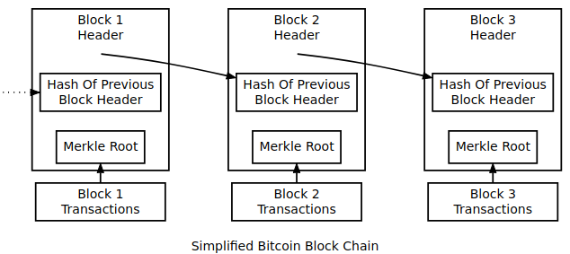
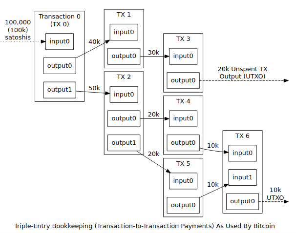
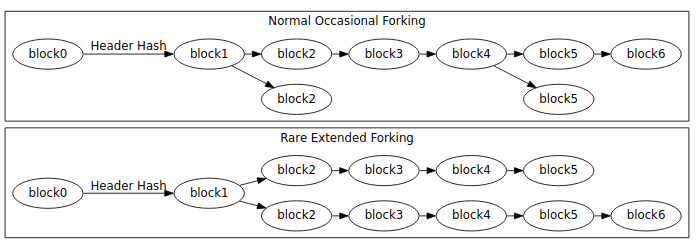
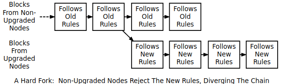
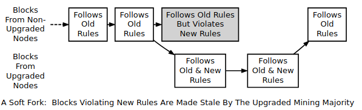

# 区块链  

## 名词

Block Chain：区块链
UTXO: Unspent Transaction Output, 未花费的交易输出
Genesis Block: 创世块, 也就是区块 0
SPV: Simplified Payment Verification, 简单支付验证
BIP: Bitcoin Improvement Proposal, 比特币改进提案
Proof Of Work: 工作量证明

## 区块链

区块链提供了比特币的公共帐本 - 一个有序的带时间戳的交易(transaction)记录。区块链可以防止重复花费(双花 
double spending) 和修改先前的交易记录。  

Bitcoin 网络中的每个全节点(full node) 独立地保存一个区块链, 这个区块链中仅包含由该节点验证过的区块。当多个节点在其区块链中都具有相同的区块时,则称这些节点是共识的。而这些节点遵循的用于维持共识的验证规则被称为共识规则。本节将介绍 Bitcoin Core 使用的许多共识规则。   
 
### 区块链概述
------------

  
 
上图简单描述了区块链模型。一个区块的交易数据 (transaction data) 部分中保存的是一个或多个新交易的记录。每个交易数据的副本将被哈希, 这些哈希值两两配对,再被 hash,直到得到最顶层 (single TODO) 的一个 hash 值,也就是一棵 merkle 树的根 (root)。

merkle root 存储在这个区块头中。该区块还存储着先前区块头的哈希值,通过区块头的 hash 值将区块链接在一起。这样可以确保在"不修改记录该交易的区块和所有后续区块"的情况下无法修改这笔交易。  

交易也被链接在一起。比特币钱包软件给人的感觉是从钱包发送或接收多少聪 (satoshi,单位) 的比特币, 但实际上真的比特币是在交易中流转。每个交易输出的花费的比特币是之前一个或多个较早交易中接收到的比特币, 因此一个交易的输入是先前交易的输出。  

  

单笔入账交易可以供之后的多笔出账交易,就像发送到多个地址时的情况一样,但是特定交易的每个输出只能是在区块链中用作输入一次。任何后续的引用都禁止重复花费 - 即花费两次相同的比特币。

输出绑定到交易标识符 (TXID) 上,这是验证过的交易的哈希值。TXID: 用于唯一确定一笔交易的标识符, 使用 sha256d hash 值. 

因为特定交易的"输出"只允许花费一次, 因此所有区块链上的交易输出就只能是: (1) 未花费的交易输出(UTXOs) 或 (2) 已花费的交易输出。 一个有效的付款只能使用未花费的交易输出 UTXOs 作为输入。  

若一个交易的输出超过交易的输入, 这个交易将会被拒绝 -- 但是若是输入超出输出, 输入输出的差值可以作为交易费奖励给创建这个区块的 Bitcoin 矿工。例如,在上图中,每个交易相比它相关的交易输入花费了10,000 聪,实际上就是支付了 10,000 聪的交易费。 
 
### 工作量证明   
-----------

每个链接到比特币网络的节点称为 peer.   

区块链是有由网络中所有的匿名节点 (peer) 共同维护的,所以 Bitcoin 要求每个区块需要一定的工作量投入, 这样可以确保想篡改历史区块的不诚实节点比想在区块链上创建新区块的诚实节点需要付出更大代价。  

将区块链接在一起使得要修改此区块中包含的交易就必须修改其所有后面的区块。因此,在整个区块链中添加一个新区块就会增加修改某个区块的成本,也因此放大了"工作量证明"的效果。  

Bitcoin 中使用的工作量证明利用了加密哈希 (cryptographic hashes) 的显式随机特性。 一个好的加密哈希算法将任意数据转换成看似随机的数字。如果以任何方式修改了数据, 那么会重新执行加密哈希算法产生一个新的随机数, 因此没有一种修改方法使得这个 hash 值可被预测。  

为了证明你在创建一个区块时做了一些额外的工作, 你必须为这个区块头创建一个不超过某个固定值的 hash 值。 例如,如果最大可能的哈希值为 2^256-1,则可以证明通过两两组合可以生成小于 2^255 的哈希值。  

在上面给出的例子中,平均每个其他尝试都会产生一个成功的 hash 值。甚至可以估计出对于一个给定的 hash 值, 生成低于目标阈值的数字所需要尝试的概率。 比特币假设一个线性概率: 即越小的目标阈值会需要越多的哈希尝试 (on average)。  

仅当计算出的哈希难度至少与共识协议所期望的难度值相当时, 新的区块才会被添加到区块链中。每 2016 个块, 比特币网络会使用存储在每个区块头中的时间戳来计算生成上一个 2016 个块的第一个区块和最后一个区块之间所经历的时间 (秒), 这个时间的理想值为 1209600 秒 (两周) 。  

* 如果生成 2016 个块需要不到两周的时间, 则预期的难度值将按比例增加 (高达 300％) . 这样可以保证在 hash 检查速率不变的情况下, 以便接下来的2016块应该恰好需要两个星期来生成。  
* 如果生成块需要两个多星期,因为相同的原因,预期的难度值会按比例降低 (75％) 。  

 (注意：Bitcoin Core 代码实现中的一个时间戳错误导致每 2016 块更新难度值仅计算了 2015 块, 因此时间上产生细微的偏移) 。

因为每个区块头必须哈希到低于目标阈值的值, 并且因为每个区块链接到前一个区块, 因此, 扩散 (propagate) 一个修改过的区块需要的哈希算力与整个 Bitcoin 网络在初始块的创建时间和当前时间之间所消耗的一样多。 只有获得了 Bitcoin 网络的大部分哈希算力 (a majority of the network’s hashing power), 才可以根据交易历史可靠地执行这种 51％ 的攻击 (尽管如此,应该注意的是,即使小于 50% 的哈希算力仍然有很好的机会进行这种攻击) 。  

区块头提供了几个易于修改的字段,例如专用的 nonce 字段,因此获取新的 hash 值就不需要等待新的交易到来。 此外,只有区块头 (80 字节) 会被散列以用于"工作量证明", 因此在区块中包含大量的交易数据并不会因为这些额外的 I/O减慢哈希的速度, 另外添加交易新的数据时, 只需要重新计算 merkle 树中的祖先 hash 值。  

### 块高和分支
----------

任何 Bitcoin 矿工只要算出某个区块头的 hash 值低于目标阈值, 他就可以将这整个区块添加到区块链上 (假设区块有效) 。 通常用这些区块的高 (block height) 来定位区块本身. 区块的高就是它们与第一个比特币区块之间的块数量 (块 0, 最通常称为创世块) 。例如块 2016 是可以首先调整难度值的地方。 

  

多个区块可能有相同的区块高度. 有这样一种很常见的情况: 当 2 个或多个矿工在大致相同时间内生成新区块, 这就在块链中产生了一个明显的分支,如上图所示。    

当不同的矿工同时在区块链尾部生成了新区块, 每个节点独立选择接受哪个区块。 在没有其他考虑的情况下,如下所述,节点通常使用他们看到的第一个块。  

最终,一个矿工生成了另一个新的区块, 然后它链接在一个同时开采的竞争性的多个区块的某个分支上。这使得分支的一侧比另一侧更强。 假设一个分支仅包含有效区块, 正常节点通常紧接着最难的链来增长, 抛弃那些属于短分支的过期区块, 如上图所示(Normal Occasional Forking)。(过期块有时也称为孤儿或孤儿块, 但是这些术语也用于没有已知父块的真孤儿块.)   

如果不同的矿工工作在相反的目的,例如一些矿工努力扩展区块链, 同时其他矿工正在尝试发起 51％ 的攻击来修改交易历史, 则可能产生长期分支。   

由于在区块链的分支中, 多个区块可以具有相同的高度, 区块高度不应该被用作全局唯一标识符。反而,通常使用它们的区块头的 hash 值  (通常为逆向字节序,十六进制形式)  来引用该区块。  
 
### 交易数据
---------

每个块必须包含一个或多个交易。这些交易中的第一个必须是一个币基交易 (coinbase transaction),也称为生成交易 (generation transaction),它应该收集并花费区块的奖励 (奖励包括:区块补贴和区块内的交易费用) 。  

币基交易的未花费的交易输出 (UTXO) 有一个特殊的条件, 它至少需要 100 个区块产生之后才能花费 (用作输入) , 这个条件可以暂时阻止矿工花费在一个以后可能被淘汰的区块 (同时币基交易也被删除) 上获得的交易费和区块奖励, 而这种区块通常是在区块链分支上。 

区块中并不是必须包含任何"非币基交易" (non-coinbase transactions), 但是矿工为了从一个区块中获得交易费, 他们几乎总是会在区块中包含额外的交易。  

包括"币基交易"在内的所有交易都以二进制原始交易格式 (raw transaction format) 编码入块。   

原始交易格式被散列以生成交易标识符 (txid)。 通过将每个 txid 与另一个 txid 配对, 然后将它们组合在 hash 化后构成 merkle 树。 如果有奇数个txids,那么没有合作伙伴的 txid 会使用自己的副本进行散列。  


所有这些产生的 hash 值本身每个都与另一个 hash 值配对, 并且散列在一起。没有伙伴的 hash 值会和自身组合后求 hash 值。重复该过程,直到只剩下一个散列,这就是 merkle 树的 root。   

例如,如果只是将交易合并 (而不是求 hash 值) ,那么一个具有五笔交易的 merkle 树如下图所示：    

```
    ABCDEEEE ....... Merkle root
      /        \
   ABCD        EEEE
  /    \      /
 AB    CD    EE ....... E is paired with itself
/  \  /  \  /
A  B  C  D  E ......... Transactions
```

根据在简单支付验证 (SPV) 这一节 (在下文部分) 的讨论, 对于某个区块中的一笔交易, merkle 树允许客户端使用从该区块一个的区块头和一个全节点 (full peer) 的一系列中间 hash 值得到的 merkle 根来验证这笔交易。 这个全节点不需要被信任：因为伪造区块头的代价是昂贵的, 并且中间 hash 值不能被伪造, 因此会验证失败。   

例如, 为了验证被添加到区块的交易 D, SPV 客户端除了 merkle 根之外只需要 C, AB 和 EEEE hash 值的副本, 除此之外, 客户端不需要知道任何其他交易。 考虑一种极端情况, 如果这个区块中的五笔交易都占用最大的空间, 那么下载整个块将需要超过 500,000 个字节, 但是下载三个 hash 值加上块头只需要 140 个字节。  

注意： 如果在相同的区块中找到相同的 txids, 则一种可能性是: 由于复制了孤岛 hash 值而导致的 merkle 树实现失衡, 需要移除其中一些或所有的重复项. 这么做可能会导致这个区块的 merkle 树与另一个区块冲突. 因为使用相同的 txids 的单独交易是不切实际的, 所以这不会对诚实软件造成负担, 但是必须检查该区块的无效状态是否被缓存下来； 否则, 删除重复项的有效区块可以具有相同的 merkle 根和区块 hash 值, 但被缓存的无效结果拒绝, 最终导致一个安全漏洞. 如 CVE-2012-2459。  
 
### 共识规则更改 
-----------

为了维护共识, 所有"全节点"使用相同的共识规则来验证区块。 然而,有时需要改变共识规则以引入新功能或阻止网络被滥用。 当新规则实施时, 可能会在一段时间内未升级的节点遵循旧规则, 已升级节点遵循新规则, 最终导致两种可能的方式打破共识共识规则：   

* 遵循新共识规则的区块被已升级的节点接受, 但被未升级的节点拒绝。 例如, 在块中使用新的交易功能： 已升级的节点了解该功能并接受该功能, 但未升级的节点拒绝因为它违反了旧的规则。  
* 违反新共识规则的区块被已升级的节点拒绝, 但被未升级的节点接受。 例如, 在块中使用了滥用交易功能： 已升级的节点拒绝它, 因为它违反了新规则, 但未升级的节点接受它, 因为它遵循旧的规则。   

第一种情况, 被未升级的节点拒绝, 那些从未升级节点获取区块链数据的挖矿软件拒绝和那些从已升级的节点获取数据的挖矿软件在同一条区块链上创建新区块. 这将创建永久性发散的链 -- 一个分支用于未升级的节点, 另一个分支用于已升级的节点-- 这被称为硬分支。   

  

第二种情况, 违反新共识规则的区块被已升级的节点拒绝, 如果已升级的节点控制着主要的 hash 速率则可阻止区块链永久发散。 这是因为, 在这种情况下,未升级的节点和已升级的节点接受相同数量的有效区块 (non-upgraded nodes will accept as valid all the same blocks as upgraded nodes), 所以已升级的节点可以创建一个更强的区块链, 这条区块链会被未升级的节点当做最有效的区块链而接受。这中情况被称为软分支。  

  

虽然一个分支实际上是区块链的发散, 共识规则的改变经常被描述为它们潜在地创建一个硬分支或者软分支。 例如, "将块的大小增加到 1 MB 以上需要一个硬分支"。 在这个例子中, 一个实际的区块链分支不是必需的 - 但这是一个可能的解决方法。  

共识规则的改变可能会以各种方式激活更改。 在 Bitcoin 刚发布的前两年, 中本聪通过发布立刻强制使用新规则的向后兼容的客户端执行了几次软分支。 已经通过一个标记日 (flag day) 激活了多个软分支, 例如 BIP30, 其中新规则开始在预设时间或块高度强制执行。 通过标记日激活的分支被称为用户激活软分支 (User Activated Soft Forks, UASF), 因为他们取决于足够多的用户节点在标记日之后强制使用新规则。  

之后, 软分支等待一个较高的哈希速率 (hash rate, 通常为 75％ 或 95％) 信号来指示执行新共识规则准备就绪。一旦超过信号阈值, 所有节点将开始执行新规则。 这样的分支被称为矿工活动软分支 ( Miner Activated Soft Forks, MASF), 因为它们依赖于矿工进行激活。  

资源： BIP16, BIP30 和 BIP34 被实现为可能导致软分支的共识规则改变。BIP50 描述了一个意外的硬分支和一个蓄意的硬分支, 意外分支通过临时降级已升级的节点的能力来解决, 而在移除临时降级措施之后形成了蓄意分支  . 来自 Gavin Andresen 的文档概述了[如何实施未来的规则更改](https://gist.github.com/gavinandresen/2355445)。  
 
### 检测分支
------------

未升级的节点可以在两种类型的分支中使用和分发不正确的信息, 从而出现可能导致财务损失的几种情况。 特别地, 未升级的节点可以中继和接受已升级的节点认为无效的交易, 因此永远不会成为普遍认可的最佳区块链的一部分。未升级的节点可能拒绝中继那些已经或者即将添加到最佳区块链里面的区块或交易, 因此为升级的节点提供的信息是不完整的。  

Bitcoin Core 中含有检测硬分支的代码, 通过检查区块链的工作证明检测硬分支。 如果一个未升级的节点接收到的区块链头 (至少 6 个区块) 的工作量比最佳的有效区块链的工作量多, 这个节点就会在 getinfo RPC 里报一个警告, 并在 alertnotify 命令置位的情况下执行 -alertnotify 命令。这会提醒操作者未升级的节点不能切换到可能的最佳区块链。  

全节点(full node) 也可以检查区块和交易的版本号。 如果当前几个区块中的区块或者交易的版本号比这个节点使用的版本号高, 可以假设它没有使用当前的共识规则。 Bitcoin Core 0.10.0 如果设置了会通过 getinfo RPC 和-alertnotify 命令报告此情况。  

如果区块和交易数据来自于一个明显不使用当前共识规则的节点, 无论哪种情况, 它们都不能被信任。  

SPV 客户端通过连接多个全节点并确保他们在同一个区块链上具有相同的块高来检测一个可能的硬分支, 通过加上或减去几个区块来考虑账户传输延和过期的区块。如果存在分歧, 客户端可以从较弱的链上的节点处断开连接。  

SPV 客户端还应该监控区块和交易的版本号的递增, 以确保它们用当前的共识规则处理接收到的交易。  

## 参考资料
---------------------

本文来自 Gamma-Gao 的CSDN 博客 ,全文地址请点击：https://blog.csdn.net/gammag/article/details/74551788?utm_source=copy 