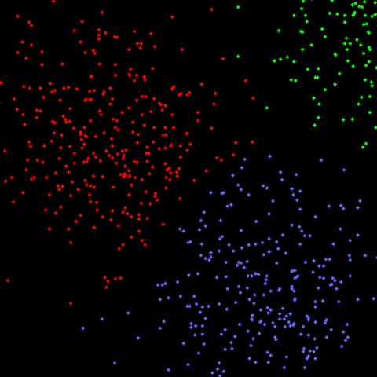
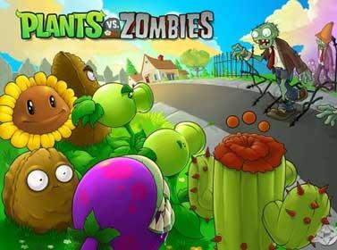
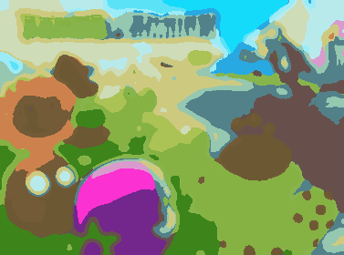

# 浅谈 Kmeans 聚类  

聚类分析是一种静态数据分析方法，常被用于机器学习，模式识别，数据挖掘等领域。聚类是一种无监督式的机器学习方法.   

K-Means算法是基于距离相似性的聚类算法，通过比较样本之间的相似性（欧式距离,马式距离，汉明距离，余弦距离等），将相似的样本划分到同一个类别中.

常用的聚类方法主要有以下四种：  

* Connectivity based clustering （如 hierarchical clustering 层次聚类法)  
* Centroid-based clustering (如 kmeans)  
* Distribution-based clustering  
* Density-based clustering  

## 算法流程  

Kmeans 的计算过程大概表示如下:  

* 随机初始化k个聚类中心  
* 计算每个样本与每个聚类中心之间的相似度，将样本划分到最相似的类别中  
* 计算划分到每个类别中的所有样本特征的均值，并将该均值作为每个类新的聚类中心  
* 重复计算以下过程，直到聚类中心不再改变或满足一定迭代次数  
* 输出最终的聚类中心以及每个样本所属的类别  

## Kmeans 缺点及解决思路   

Kmeans 聚类是一种自下而上的聚类方法，它的优点是简单、速度快；   

缺点是聚类结果与初始中心的选择有关系，且必须提供聚类的数目。  

Kmeans 的第二个缺点是致命的，因为在有些时候，我们不知道样本集将要聚成多少个类别，这种时候 kmeans 是不适合的，推荐使用 hierarchical 或meanshift 来聚类。  

第一个缺点可以通过多次聚类取最佳结果来解决。  

在 K-Means 算法中，需要随机初始化 k 个聚类中心，而 K-Means 算法对初始聚类中心的选取较为敏感，若选择的聚类中心不好，则得到的聚类结果会非常差，因此，对 K-Means 算法提出了很多的改进的方法，如 K-Means++ 算法，在 K-Means++ 算法中，希望初始化的 k 个聚类中心之间的距离尽可能的大， 其具体过程为：   

* 在数据集中随机选择一个样本点作为第一个初始化的聚类中心  
* 选择出其余的聚类中心：   
* 计算样本中的每一个样本点与已经初始化的聚类中心之间的距离，并选择其中最短的距离
* 以概率选择距离最大的样本作为新的聚类中心，重复上述过程，直到 k 个聚类中心都被确定
* 对 k 个初始化的聚类中心，利用 K-Means 算法计算最终的聚类中心。  

## CPP 实现及代码示例   
 
### 1. 随机生机的散点，每个点是一个二维样本.  

直接调用 OpenCV 自带的 cvKMeans2() 接口.   

  

~~~cpp
#include "cxcore.h"
#include "highgui.h"

#define MAX_CLUSTERS 5

int main( int argc, char** argv )
{
    CvScalar color_tab[MAX_CLUSTERS];
    IplImage* img = cvCreateImage( cvSize( 500, 500 ), 8, 3 );
    CvRNG rng = cvRNG(0xffffffff);

    color_tab[0] = CV_RGB(255,0,0);
    color_tab[1] = CV_RGB(0,255,0);
    color_tab[2] = CV_RGB(100,100,255);
    color_tab[3] = CV_RGB(255,0,255);
    color_tab[4] = CV_RGB(255,255,0);

    cvNamedWindow( "clusters", 1 );

    for(;;)
    {
        int k, cluster_count = cvRandInt(&rng)%MAX_CLUSTERS + 1;
        int i, sample_count = cvRandInt(&rng)%1000 + 1;
        CvMat* points = cvCreateMat( sample_count, 1, CV_32FC2 );
        CvMat* clusters = cvCreateMat( sample_count, 1, CV_32SC1 );

        /* generate random sample from multigaussian distribution */
        for( k = 0; k < cluster_count; k++ )
        {
            CvPoint center;
            CvMat point_chunk;
            center.x = cvRandInt(&rng)%img->width;
            center.y = cvRandInt(&rng)%img->height;
            cvGetRows( points, &point_chunk, k*sample_count/cluster_count,
                k == cluster_count - 1 ? sample_count : (k+1)*sample_count/cluster_count );
            cvRandArr( &rng, &point_chunk, CV_RAND_NORMAL,
                cvScalar(center.x,center.y,0,0),
                cvScalar(img->width/6, img->height/6,0,0) );
        }

        /* shuffle samples */
        for( i = 0; i < sample_count/2; i++ )
        {
            CvPoint2D32f* pt1 = (CvPoint2D32f*)points->data.fl + cvRandInt(&rng)%sample_count;
            CvPoint2D32f* pt2 = (CvPoint2D32f*)points->data.fl + cvRandInt(&rng)%sample_count;
            CvPoint2D32f temp;
            CV_SWAP( *pt1, *pt2, temp );
        }
        cvShowImage( "points", points );

        cvKMeans2( points, cluster_count, clusters,
            cvTermCriteria( CV_TERMCRIT_EPS+CV_TERMCRIT_ITER, 10, 1.0 ));

        cvZero( img );

        for( i = 0; i < sample_count; i++ )
        {
            CvPoint2D32f pt = ((CvPoint2D32f*)points->data.fl)[i];
            int cluster_idx = clusters->data.i[i];
            cvCircle( img, cvPointFrom32f(pt), 2, color_tab[cluster_idx], CV_FILLED );
        }

        cvReleaseMat( &points );
        cvReleaseMat( &clusters );

        cvShowImage( "clusters", img );

        int key = cvWaitKey(0);
        if( key == 27 ) // 'ESC'
            break;
    }
}
~~~ 

### 2. 对一张图片的像素点进行聚类  

同样是调用 OpenCV 中现成的 API: cv::kmeans().  

对一张图片（377*280）的像素点进行聚类，每个像素点是一个五维样本(x,y,r,g,b)，聚类结果如下:  

原图； k = 2, 用时 t = 72ms;　  

    
　
k=3, t=93ms   k=4, t= 128ms;　　
    

k=10, t=330ms;　　　k=20, t=676ms
    

从图中某些局部可以看出，并不是 k 越大，细节就越显著（如后两幅图中向日葵的眼睛）， 这是因为 kmean 的初始位置是随机的。相同的样本每次聚类会有不同的结果.   

~~~cpp
#include "stdafx.h"
#include "opencv2/opencv.hpp"
#include <iostream>
#include <string>

using namespace cv;
using namespace std;

// 这是 Kmeans 算法的一个缺点，在聚类之前需要指定类别个数  
const int nClusters = 20;

int main(int argc, char* argv[])
{
    Mat src;    //相当于IplImage

    src = imread("zombie.jpg");        //cvLoadImage
    imshow("original", src);        //cvShowImage

    blur(src, src, Size(11,11));
    imshow("blurred", src);

    // p 是特征矩阵，每行表示一个特征，每个特征对应 src 中每个像素点的(x,y,r,g,b共5维) 
    Mat p = Mat::zeros(src.cols*src.rows, 5, CV_32F);    // 初始化为全 0 矩阵
    Mat bestLabels, centers, clustered;
    vector<Mat> bgr;
    cv::split(src, bgr);    // 分隔出 src 的三个通道

    for(int i = 0; i < src.cols*src.rows; i++) 
    {
        p.at<float>(i,0) = (i/src.cols) / src.rows;        
        p.at<float>(i,1) = (i%src.cols) / src.cols;        
        p.at<float>(i,2) = bgr[0].data[i] / 255.0;
        p.at<float>(i,3) = bgr[1].data[i] / 255.0;
        p.at<float>(i,4) = bgr[2].data[i] / 255.0;
    }

    // 计算时间
    double t = (double)cvGetTickCount();

    // kmeans 聚类，每个样本的标签保存在 bestLabels 中
    cv::kmeans(p, nClusters, bestLabels,
        TermCriteria( CV_TERMCRIT_EPS+CV_TERMCRIT_ITER, 10, 1.0),
        3, KMEANS_PP_CENTERS, centers);

    t = (double)cvGetTickCount() - t;
    float timecost = t/(cvGetTickFrequency()*1000); 

    // 给每个类别赋颜色，其值等于每个类第一个元素的值
    Vec3b    colors[nClusters];
    bool    colormask[nClusters]; memset(colormask, 0, nClusters*sizeof(bool));
    int        count = 0;
    for(int i=0; i<src.cols*src.rows; i++) 
    {
        int clusterindex = bestLabels.at<int>(i,0);
        for (int j=0; j<nClusters; j++)
        {
            if(j == clusterindex && colormask[j] == 0)
            {
                int y = i/src.cols;
                int x = i%src.cols;
                colors[j] = src.at<Vec3b>(y,x);
                colormask[j] = 1;
                count++;
                break;
            }
        }
        if(nClusters == count) break;
    }

    // 显示聚类结果
    clustered = Mat(src.rows, src.cols, CV_8UC3);
    for(int i=0; i<src.cols*src.rows; i++) {
        int y = i/src.cols;
        int x = i%src.cols;
        int clusterindex = bestLabels.at<int>(i,0);
        clustered.at<Vec3b>(y, x) = colors[clusterindex];
    }

    imshow("clustered", clustered);

    cout << "time cost = " << timecost << " ms" << endl;

    // 保存图像
    stringstream s1,s2;
    s1<<timecost;
    s2<<nClusters;
    string name = "n=" + s2.str() + "_timecost=" + s1.str() + ".png";
    imwrite(name, clustered);
    waitKey();
    return 0;
}
~~~

