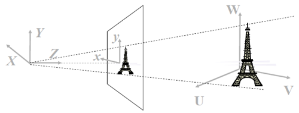
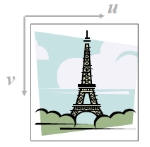
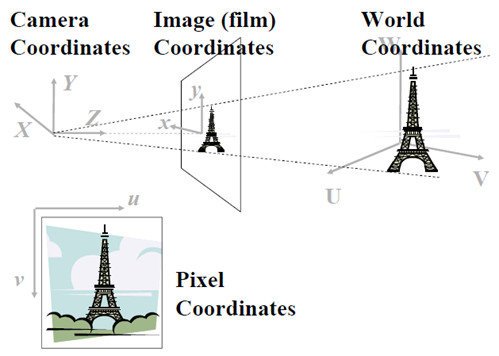
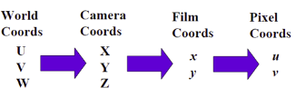
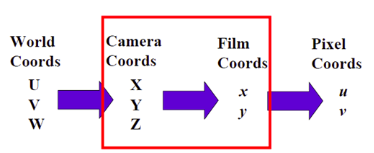
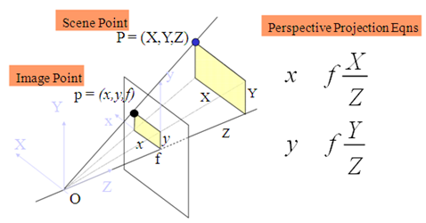
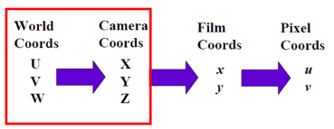
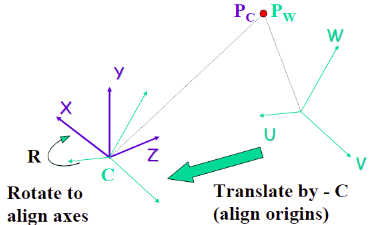
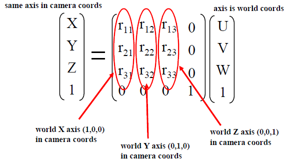
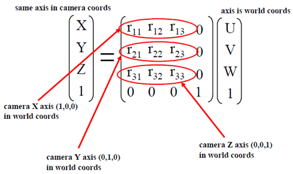

# 计算机视觉基础2 - 相机成像的几何描述   

> TODO: 参考 SLAM 中的讲解进行补充.   

试想像一下，很多游客同时在不同角度拍摄Eiffel Tower(埃菲尔铁塔)，该如何用数学的方法来描述这一过程呢？首先要解决的问题就是定位，或者说坐标选定的问题，埃菲尔铁塔只有一座，如果按经、纬度来刻画，它的坐标是唯一确定的，但游客显然不关系这一点，他(她)只按自己的喜好选择角度和位置，因此，物体(景物)有物体的坐标系统，相机有相机的坐标系统，即便同一个相机，当调整参数时，在同样的位置、相同的角度，也可能得到不同的图像。为了统一描述，有必要引入世界坐标(或物体坐标)、相机坐标和像平面坐标。   

世界坐标用 UVW 表示, 相机坐标用 XYZ 表示。中学物理告诉我们，物体与像是倒立的关系，但作为数学分析，我们采用虚像。像平面用 xoy 表示。   

   

而数字图像用(u,v)来表示，不弄混淆像平面和数字图像这两个概念，同一个像通过平移、拉伸等，可以得到不同的数学图像(u,v)。   

   

总体来看，就是:   

   

我们需要用数学的语言来描述这一过程。  

   

## 相机坐标到图像平面的变换

先看中间部分 - 相机坐标到图像平面的投影变换.   

   

红框标注的部分是 3D 物体到 2D 像平面的透视投影, 即下图所示的透视模型:    

   

显然， 直线 OP 上的任一点的像都是 p(x,y)，为了描述这一关系，需要引入齐次坐标。  

$$
\begin{bmatrix} x \\ y \\  \end{bmatrix}  = \begin{bmatrix} x \\ y \\ 1 \end{bmatrix} = \begin{bmatrix} 2x \\ 2y \\ 2 \end{bmatrix} = \begin{bmatrix} kx \\ ky \\ k \end{bmatrix} 
$$

关于齐次坐标，更详细的介绍可参考高等几何。   

上述透视投影的过程可以描述为:   

$$
\begin{bmatrix} x^{'} \\ y^{'} \\ z^{'} \end{bmatrix}  = 
\begin{bmatrix} f & 0 & 0 & 0  \\ 0 & f & 0 & 0 \\ 0 & 0 & 1 & 0 \end{bmatrix}
\begin{bmatrix} X \\ Y \\ Z \\ 1 \end{bmatrix}
$$

## 世界坐标系到相机坐标系的变换

正如本文开头所言， 不同游客会选择不同的位置和角度拍摄同一物体，因此物体对于相机的关系各不相同，这就是物体到相机坐标变换的问题。  

   
上述红框部分描述的是从物体的坐标(称为世界坐标)到相机坐标变换的过程，它是一种刚体运动，用平移、旋转来描述。  

   

上图表示的是从世界坐标变换到相机坐标： $P_{_C} = R(P_{_W}C)$， 其中,     

- $P_{_W}$ 是 3D 点在世界坐标系中的位置;   
- $P_{_C}$ 是 3D 点在相机坐标系中的位置;   
- $R$ 是相机坐标相对于世界坐标系的旋转矩阵;   
- $C$ 是相机坐标相对于世界坐标系的平移矩阵;   

写成矩阵形式:   

$$
\begin{bmatrix} X \\ Y \\ Z \\ 1 \end{bmatrix} = 
\begin{bmatrix} r_{_{11}} & r_{_{12}} & r_{_{13}} & 0  \\ r_{_{21}} & r_{_{22}} & r_{_{23}} & 0  \\ r_{_{31}} & r_{_{32}} & r_{_{33}} & 0 \\  0 & 0 & 0 & 1 \end{bmatrix}
\begin{bmatrix} 1 & 0 & 0 & -c_x  \\ 0 & 1 & 0 & -c_y \\ 0 & 0 & 1 & -c_z \\  0 & 0 & 0 & 1  \end{bmatrix}
\begin{bmatrix} U \\ V \\ W \\ 1 \end{bmatrix}
$$

平移比较容易理解的，我们先讨论更简单的情形，即假设世界坐标系和相机坐标系的原点重合，则变换只剩下旋转了, $P_{_C} = RP_{_W}$。  

$$
\begin{bmatrix} X \\ Y \\ Z \\ 1 \end{bmatrix} = 
\begin{bmatrix} r_{_{11}} & r_{_{12}} & r_{_{13}} & 0  \\ r_{_{21}} & r_{_{22}} & r_{_{23}} & 0  \\ r_{_{31}} & r_{_{32}} & r_{_{33}} & 0 \\  0 & 0 & 0 & 1 \end{bmatrix}
\begin{bmatrix} U \\ V \\ W \\ 1 \end{bmatrix}
$$

旋转矩阵的元素也很容易确定。试想(U,V,W) = (1,0,0)， 而它在相机坐标系中的坐标是(X,Y,Z)=(a,b,c), 则有：  

$$
\begin{bmatrix} \color{red}a \\ \color{red}b \\ \color{red}c \\ 1 \end{bmatrix} = 
\begin{bmatrix} r_{_{11}} & r_{_{12}} & r_{_{13}} & 0  \\ r_{_{21}} & r_{_{22}} & r_{_{23}} & 0  \\ r_{_{31}} & r_{_{32}} & r_{_{33}} & 0 \\  0 & 0 & 0 & 1 \end{bmatrix}
\begin{bmatrix} 1 \\ 0 \\ 0 \\ 1 \end{bmatrix}= 
\begin{bmatrix} \color{red}a & r_{_{12}} & r_{_{13}} & 0  \\ \color{red}b & r_{_{22}} & r_{_{23}} & 0  \\ \color{red}c & r_{_{32}} & r_{_{33}} & 0 \\  0 & 0 & 0 & 1 \end{bmatrix}
\begin{bmatrix} 1 \\ 0 \\ 0 \\ 1 \end{bmatrix}
$$

因此有：

   

即旋转矩阵的列分别是世界坐标系的各个轴向量的单位向量在相机坐标系内的投影.   

由于该旋转是刚体运动，因此它是正交变换，满足 $R^{^{-1}}=R^{^T}$，所以有：    

$$
P_{_C} = RP_{_W} \quad\Rightarrow\quad R^{^{-1}}P_{_C} = P_{_W} \quad\Rightarrow\quad R^{^{T}}P_{_C} = P_{_W}
$$

可以得到相机坐标系到世界坐标系的转换关系.   

   

相对于相机内部参数而言, 物体的坐标到相机坐标的变换矩阵属于外部参数(External Parameters)，往往写作 R 和 T，即:  

$$
P_{_C} = R(P_{_W}-C) \quad\Rightarrow\quad P_{_C} = RP_{_W}-RC  \quad\Rightarrow\quad P_{_C} = RP_{_W}+T
$$

$$
\begin{bmatrix} X \\ Y \\ Z \\ 1 \end{bmatrix} = 
\begin{bmatrix} r_{_{11}} & r_{_{12}} & r_{_{13}} & 0  \\ r_{_{21}} & r_{_{22}} & r_{_{23}} & 0  \\ r_{_{31}} & r_{_{32}} & r_{_{33}} & 0 \\  0 & 0 & 0 & 1 \end{bmatrix}
\begin{bmatrix} 1 & 0 & 0 & -c_x  \\ 0 & 1 & 0 & -c_y \\ 0 & 0 & 1 & -c_z \\  0 & 0 & 0 & 1  \end{bmatrix}
\begin{bmatrix} U \\ V \\ W \\ 1 \end{bmatrix} = 
\begin{bmatrix} r_{_{11}} & r_{_{12}} & r_{_{13}} & t_x  \\ r_{_{21}} & r_{_{22}} & r_{_{23}} & t_y  \\ r_{_{31}} & r_{_{32}} & r_{_{33}} & t_z \\  0 & 0 & 0 & 1 \end{bmatrix}
\begin{bmatrix} U \\ V \\ W \\ 1 \end{bmatrix} 
$$

本小节讲述了如何将 3D 世界坐标系中的点变换到相机坐标系中，然后经透视投影，变成 2D 像平面上的点(x,y).   
