# 计算机视觉基础3 - 内部参数描述   

在上一节中，我们用旋转矩阵和平移矩阵共同描述了外部参数，即物体的坐标到相机坐标的变换。同时还分析了透视投影，即成像的过程，整个过程就是 (U,V,W)->(X,Y,X)->(x,y).   

本文主要讨论如何从像平面 (x,y) 变换到数字图像 (u,v)，即从像平面(Film Coords)到像素(Pixel Coords)。

## 像平面到像素的变换

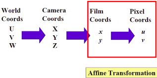

数字图像原点坐标并不在图像的中心, 而是在图像的左上角, 因此根据图像的中心点(也叫主点)将图像从像平面 (x,y) 变换到数字图像 (u,v).  

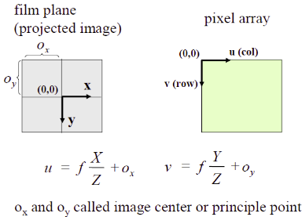

下面描述了相机结合感光器件和像平面生成像素点的过程.  

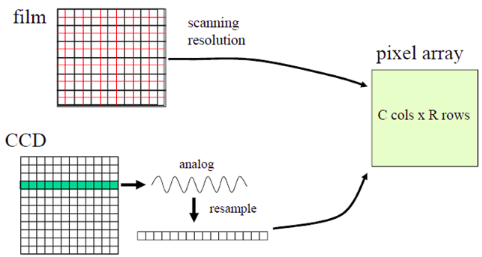

## 世界坐标系到像素的变换

对一幅数字图像，我们可以改变它的宽高比，即作尺度变换。  

$$
u = \frac{1}{s_x}f\frac{X}{Z} + o_x,  \quad  
v = \frac{1}{s_y}f\frac{Y}{Z} + o_y
$$

将尺度变换与透视投影结合，用矩阵表示为:   

$$
\begin{bmatrix} u \\ v \\ w \end{bmatrix}  = 
\begin{bmatrix} x^{'} \\ y^{'} \\ z^{'} \end{bmatrix}  = 
\begin{bmatrix} \dfrac{f}{s_x} & 0 & 0 & o_x  \\ 0 & \dfrac{f}{s_y} & 0 & o_y \\ 0 & 0 & 1 & 0 \end{bmatrix}
\begin{bmatrix} X \\ Y \\ Z \\ 1 \end{bmatrix}
$$

尺度变换是一种仿射变换，因此，将从相机坐标系 (X,Y,X) 到像素 (u,v) 的变换可以写为:   

$$
\begin{bmatrix} u \\ v \\ w \end{bmatrix}  = 
 \underbrace{\begin{bmatrix}a_{_{11}} & a_{_{12}} & a_{_{13}} \\ a_{_{21}} & a_{_{22}} & a_{_{23}}  \\  0 & 0 & 1 \end{bmatrix}}_{\text{M}_\text{aff}}
 \underbrace{\begin{bmatrix} f & 0 & 0 & 0  \\ 0 & f & 0 & 0 \\ 0 & 0 & 1 & 0 \end{bmatrix}}_{\text{M}_\text{proj}}
\begin{bmatrix} X \\ Y \\ Z \\ 1 \end{bmatrix}
$$

简化为,   

$$
\vec{u} = {\text{M}_\text{int}}P_C = {\text{M}_\text{aff}}{\text{M}_\text{proj}}P_C
$$

整个成像过程, 即世界坐标系到像素的变换就是:  

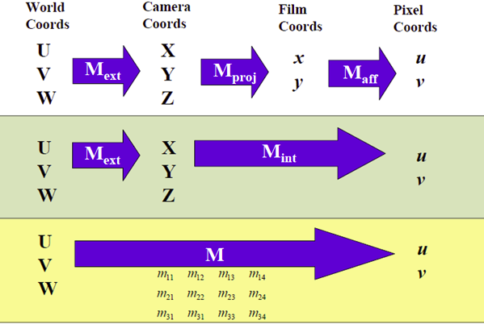

对应的矩阵变换过程为:  

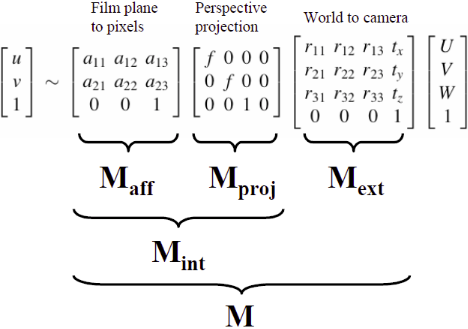

## 补充点高等几何的知识  

### 1. 平移   

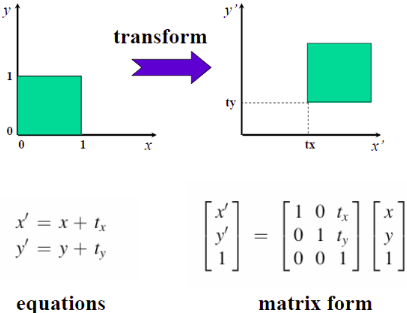

### 2. 尺度变换

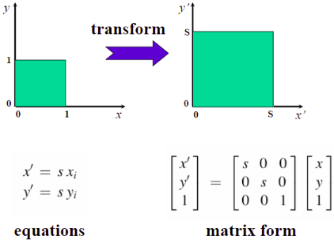

### 3. 旋转

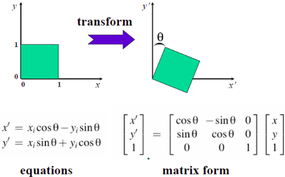

### 4. 刚体运动   

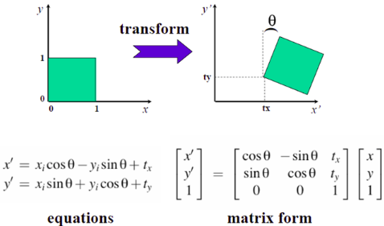

### 5. 刚体运动+尺度变换

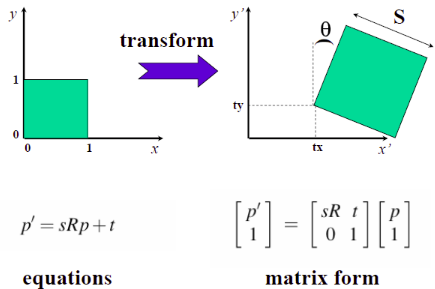

### 6. 仿射变换

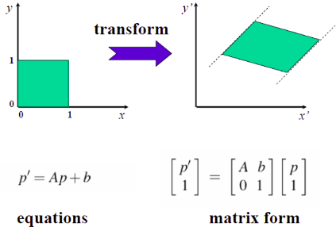

### 7. 投影变换

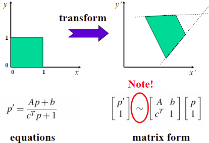

