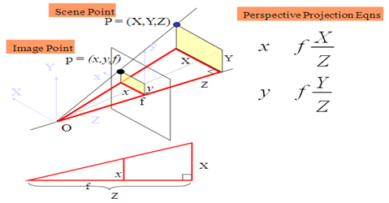
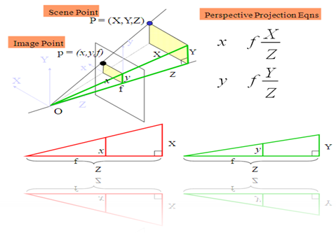
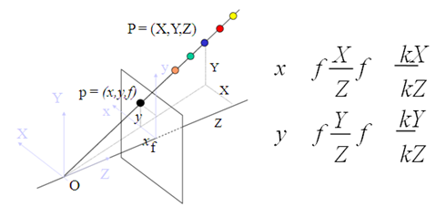
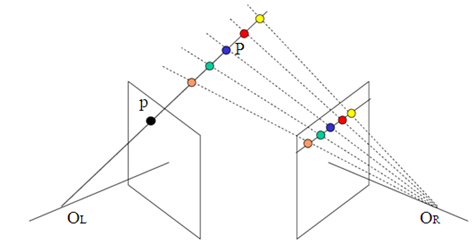
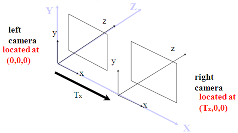
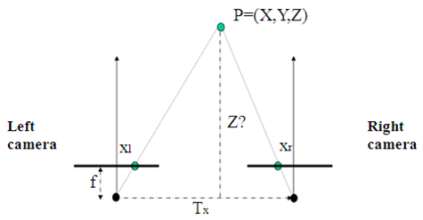

# 计算机视觉基础1 - 视差与深度信息   

## Stereo Vision - 立体视觉  

深度信息感知是人类产生立体视觉的前提。生理过程一定是相当复杂，此处，我们只从物理角度，并采用数学的方法来讨论。

在相机应用中, 可以从两个(或多个)相机同时拍的两张照片中推断深度信息.   

## 基本透视投影

根据小孔成像模型, 将图像平面(数学上)移到镜头前, 即图像平面位于相机中心 O 的前面.  

下面是 3D 点和图像点的透视投影关系.  

   

不考虑图像坐标主点中心坐标($u_0, v_0$)的情况下, 对于点 P 图像平面内的点 p 的坐标 x = f * (X / Z).   

不考虑图像坐标主点中心坐标($u_0, v_0$)的情况下, 对于点 P 图像平面内的点 p 的坐标 y = f * (Y / Z).   

   

透视投影是多对一的关系, 投影线上的 3D 空间中的任何一点对应于图像平面内的同一个点。  

   

如果用两个摄像机，则可以消除这种多对一关系，从而能够确定第三维坐标 Z 的值，即深度信息。  

   

为什么可以感知深度信息呢？ 我们的左右眼从略微不同的角度观察景物，而这种视差与物体所处的位置有关。  

## 视差(Parallax)

自己可以体验一下：将手指头放在离眼睛不同距离的位置，并轮换睁、闭左右眼，可以发现手指在不同距离的位置，视觉差也不同，且距离越近，视差越大。  

## Anaglyph image 

Anaglyph images are used to provide a stereoscopic 3D effect, when viewed with glasses where the two lenses are different (usually chromatically opposite) colors, such as red and cyan. Images are made up of two color layers, superimposed, but offset with respect to each other to produce a depth effect. Usually the main subject is in the center, while the foreground and background are shifted laterally in opposite directions. The picture contains two differently filtered colored images, one for each eye. When viewed through the "color coded" "anaglyph glasses", they reveal an integrated stereoscopic image. The visual cortexof the brain fuses this into perception of a three dimensional scene or composition.

注意: 用单眼也可以感知深度信息。

## 立体感知

下面着重借助几何和代数的方法来描述立体感知。先从简单的情况开始......  

假设两个相机的内部参数一致，如焦距、镜头等等，为了数学描述的方便， 假设两个相机的 X 轴方向一致，图像平面重叠，如下图所示，坐标系以左相机为准，右相机相对于左相机是简单的平移，用坐标表示为 (Tx,0,0).  

   

为了更好的表示几何关系, 做出上图的俯视图, 如下:  

   

$T_x$ 一般称为基线(baseline)，根据三角形相似关系，很容易得出空间中的一点 P(X,Y,Z) 分别在左右像平面上的投影坐标。  

因此， 左相机像平面像点的坐标为:  

$$
x_{_l}=f \frac{X}{Z}  \\
y_{_l}=f \frac{Y}{Z}
$$

右相机平面像点的坐标为:  

$$
x_{_r}=f \frac{X-T_x}{Z}     \\
y_{_r}=f \frac{Y}{Z}
$$

因此可以得到左右图像平面的视差 d 为:   

$$
d = x_{_l} - x_{_r} = f \frac{X}{Z} - f \frac{X-T_x}{Z} = f \frac{T_x}{Z}
$$

从而可以推导出深度值 Z: 
$$
Z = f \frac{T_x}{d}
$$

显然，深度信息 Z 和视差 d 成反比, 这与我们用手指做试验是相吻合的，这也是为什么近的物体看起来比远的物体移动得快。   