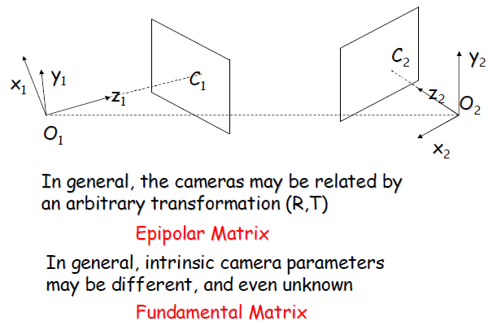
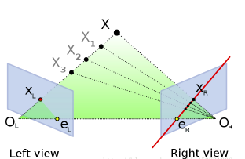

# 计算机视觉基础4 - 对极几何  

先思考一个问题： 用两个相机在不同的位置拍摄同一物体，如果两张照片中的景物有重叠的部分，我们有理由相信，这两张照片之间存在一定的对应关系，本节的任务就是如何描述它们之间的对应关系，描述工具是对极几何 ，它是研究立体视觉的重要数学方法。  

要寻找两幅图像之间的对应关系，最直接的方法就是逐点匹配，如果加以一定的约束条件对极约束(epipolar constraint)，搜索的范围可以大大减小。  

先回顾简单的立体成像系统, 两个相机在同一 XY 平面内, 只是在 X 方向上有相对偏移 $\small{T_x}$ :   

更一般的立体成像关系：两个相机的坐标无任何约束关系，相机的内部参数可能不同，甚至是未知的。要刻画这种情况下的两幅图像之间的对应关系，需要引入两个重要的概念 - 对极矩阵(Epipolar Matrix, 也叫本征矩阵)和基础矩阵(Fundamental Matrix)。   

## 对极几何中的重要概念 

极点 $e_L$: `右`相机坐标原点在`左像平面`上的投影；   
极点 $e_R$: `左`相机坐标原点在`右像平面`上的投影;
所有的极线都通过极点.   

极平面：由两个相机坐标原点 $O_L$ 、$O_R$ 和物点 $P$ 组成的平面;  

极线：极平面与两个像平面的交线，即 $x_{_R}e_{_L}$ 和 $x_{_R}e_{_R}$.   

## 极线约束 - Epipolar constraint   

如果两个相机位置已知，对于其中一幅图像中投影点 $x_{_L}$，则极线 $x_{_R}e_{_R}$ 就是已知的， 空间点 $\small{X}$ 必定投影到右像面极线上的 $x_{_R}$ 点上。这就意味着， 在一幅图像中观察到的每个点，另外一幅图像的对应极线上一定也可以观察到该点。

这就是极线约束. 空间点 $\small{X}$ 在右像面上的投影 $x_{_R}$ 必然被约束在 $x_{_R}e_{_R}$ 极线上。对于$\small{O_{_L}}x_{_L}$ 上的 $\small{X，X_1，X_2，X_3}$ 都受该约束。极线约束可以用于测试两点是否对应同一 3D 点。  

极线约束也可以用两相机间的基本矩阵来描述。   

已知投影点 $x_{_L}$, 根据上述约束找到 $x_{_R}$ 后可以得到他们的投影线  $x_{_L}\small{O_{_L}}$ 和 $x_{_R}\small{O_{_R}}$, 则两条投影线必然交于 $\small{X}$. 这就意味着可以用两个像素点的坐标计算得到空间点 $\small{X}$, 从而得到该点的深度信息.   

再回到对极几何图上来，通过上面几幅图示，利用对极几何的约束关系，我们可以找到一幅图像中特定像点在另一幅图像中对应的像点, 具体步骤如下：

1. 找到物点 X 在左像平面上的像点 $x_{_L}$；  
2. 画出极线 $x_{_L}e_{_L}$, 极线和点 $\small{O_{_L}}$ 构成极平面；  
3. 找到极平面 $\small{O_{_L}}x_{_L}e_{_L}$与右图像平面的交线，即得极线 $x_{_R}e_{_R}$；  
4. 左像点 $x_{_L}$ 在右像中的对应点一定在极线 $x_{_R}e_{_R}$ 上。  

## 本征矩阵  

假设, 坐标系以左相机的坐标系为基准. $\small{O_{_L}}$ 为左相机的中心坐标, $\small{O_{_R}}$ 为右相机的中心坐标(偏移为 $\small{T}$), 右相机相对于左相机的旋转矩阵为 $\small{R}$. $\small{X_{_L}}$ 是空间点 $\small{X}$ 在左相机坐标系中的观测坐标, $\small{X_{_R}}$ 是空间点 $\small{X}$ 在右相机坐标系中的观测坐标, 则 $\small{X_{_R}} $ 可表示为:  

$$
X_{_R} = R(X_{_L} - T)
$$

其实就是先将 $\small{X_{_L}}$ 平移到右相机坐标系原点位置, 得到 $\small{X_{_L} - T}$, 再进行旋转变换 $\small{R(X_{_L} - T)}$ 得到 $\small{X_{_R}}$.   

由于 $\small{R}$ 是正交矩阵，因此可写为:   

$$
R^{-1}X_{_R} = X_{_L} - T \quad\Rightarrow\quad  X_{_L} - T = R^{^T}X_{_R}
$$

在极平面中, $\small{X_{_L} - T, \; T,\; X_{_L}}$ 三向量共面，它们的混合积为零. 即:   

$$
(X_{_L} - T) \cdot T \times X_{_L} = \vec0 \quad\Rightarrow\quad 
(R^{^T}X_{_R})^{^T} \cdot T \times X_{_L} = \vec0 
\quad\Rightarrow\quad 
(X_{_R}^{^T}R) \cdot (T \times X_{_L}) = \vec0
$$

向量叉乘可以写成矩阵的形式:   

$$
T \times X_{_L} = (T_{y}X_{Lz} - T_{z}X_{Ly})i + (T_{z}X_{Lx} - T_{x}X_{Lz})j + (T_{x}X_{Ly} - T_{y}X_{Lx})k
$$

$$
T \times X_{_L} = S X_{_L} = 
\begin{bmatrix} 
0 & -T_{z} & T_{y} \\ T_{z} & 0 & -T_{x}  \\ -T_{y} & T_{x} & 0  
\end{bmatrix}
\begin{bmatrix} 
X_{Lx} \\ X_{Ly} \\ X_{Lz}
\end{bmatrix} = 
\begin{bmatrix} 
T_{y}X_{Lz} - T_{z}X_{Ly} \\ T_{z}X_{Lx} - T_{x}X_{Lz} \\ T_{x}X_{Ly} - T_{y}X_{Lx}
\end{bmatrix}
$$

通过进一步的改写，可以得到左像点 $\small{X_{_L}}$ 和右像点 $\small{X_{_R}}$ 之间约束关系:   

$$
(X_{_R}^{^T}R) \cdot (T \times X_{_L}) = \vec0
\quad\Rightarrow\quad\quad
X_{_R}^{^T}RS X_{_L} = \vec0
$$

显然左像点 $\small{X_{_L}}$ 和右像点 $\small{X_{_R}}$ 是通过矩阵 $\small{E = RS}$ 来约束的，我们称矩阵  $\small{E}$ 为本质矩阵(Essential Matrix)，它的基本性质有：   
- 秩为 2;
- 仅依赖于外部参数 R 和 T;   

## 总结  

本征矩阵 E 包含在物理空间中两个相机相关的旋转和平移信息, E 只能在相机坐标系内将两台相机关联起来.  

基础矩阵 F 除了包含 E 的信息外, 还包含了两个摄像机的内参数, 因此 F 可以在像素坐标系内将两台相机关联起来.   
