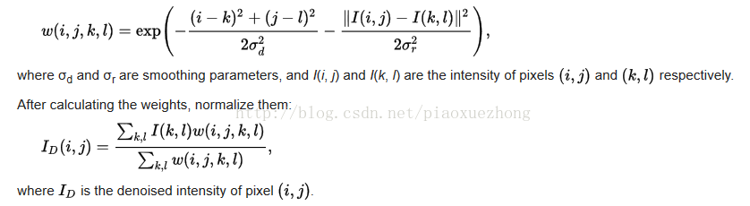

# 双边滤波算法   

## 1. 双边滤波算法原理      

双边滤波是一种非线性滤波器，它可以达到保持边缘、降噪平滑的效果。和其他滤波原理一样，双边滤波也是采用加权平均的方法，用周边像素亮度值的加权平均代表某个像素的强度，所用的加权平均基于高斯分布[1]。最重要的是，双边滤波的权重不仅考虑了像素的欧氏距离（如普通的高斯低通滤波，只考虑了位置对中心像素的影响），还考虑了像素范围域中的辐射差异（例如卷积核中像素与中心像素之间相似程度、颜色强度，深度距离等），在计算中心像素的时候同时考虑这两个权重。



双边滤波的核函数是空间域核与像素范围域核的综合结果：在图像的平坦区域，像素值变化很小，对应的像素范围域权重接近于1，此时空间域权重起主要作用，相当于进行高斯模糊；在图像的边缘区域，像素值变化很大，像素范围域权重变大，从而保持了边缘的信息。   

##  双边滤波器代码实现  

```cpp
void cv::bilateralFilter( InputArray _src, OutputArray _dst, int d,
                      double sigmaColor, double sigmaSpace,
                      int borderType )
{
    Mat src = _src.getMat();
    _dst.create( src.size(), src.type() );
    Mat dst = _dst.getMat();

    if( src.depth() == CV_8U )
        bilateralFilter_8u( src, dst, d, sigmaColor, sigmaSpace, borderType );
    else if( src.depth() == CV_32F )
        bilateralFilter_32f( src, dst, d, sigmaColor, sigmaSpace, borderType );
    else
        CV_Error( CV_StsUnsupportedFormat,
        "Bilateral filtering is only implemented for 8u and 32f images" );
}


static void
bilateralFilter_8u( const Mat& src, Mat& dst, int d,
    double sigma_color, double sigma_space,
    int borderType )
{

    int cn = src.channels();
    int i, j, k, maxk, radius;
    Size size = src.size();

    CV_Assert( (src.type() == CV_8UC1 || src.type() == CV_8UC3) &&
              src.type() == dst.type() && src.size() == dst.size() &&
              src.data != dst.data );

    if( sigma_color <= 0 )
        sigma_color = 1;
    if( sigma_space <= 0 )
        sigma_space = 1;

    // 计算颜色域和空间域的权重的高斯核系数, 均值 μ = 0;  exp(-1/(2*sigma^2))  
    double gauss_color_coeff = -0.5/(sigma_color*sigma_color);
    double gauss_space_coeff = -0.5/(sigma_space*sigma_space);

    // radius 为空间域的大小: 其值是 windosw_size 的一半    
    if( d <= 0 )
        radius = cvRound(sigma_space*1.5);
    else
        radius = d/2;
    radius = MAX(radius, 1);
    d = radius*2 + 1;

    Mat temp;
    copyMakeBorder( src, temp, radius, radius, radius, radius, borderType );

    vector<float> _color_weight(cn*256);
    vector<float> _space_weight(d*d);
    vector<int> _space_ofs(d*d);
    float* color_weight = &_color_weight[0];
    float* space_weight = &_space_weight[0];
    int* space_ofs = &_space_ofs[0];

    // 初始化颜色相关的滤波器系数: exp(-1*x^2/(2*sigma^2))  
    // 按理说 color 的差值最大也就是 255, 那么扩大到 256*cn 的范围是为了让权重值分布更加均匀离散一点.  
    for( i = 0; i < 256*cn; i++ )
        color_weight[i] = (float)std::exp(i*i*gauss_color_coeff);

    // 初始化空间相关的滤波器系数和 offset:  
    for( i = -radius, maxk = 0; i <= radius; i++ )
    {
        j = -radius;

        for( ;j <= radius; j++ )
        {
            double r = std::sqrt((double)i*i + (double)j*j);
            if( r > radius )
                continue;
            space_weight[maxk] = (float)std::exp(r*r*gauss_space_coeff);
            space_ofs[maxk++] = (int)(i*temp.step + j*cn);
        }
    }

    // 开始计算滤波后的像素值  
    for( i = 0; i < 0, size.height; i++ )
    {
        const uchar* sptr = temp->ptr(i+radius) + radius*cn;  // 目标像素点 
        uchar* dptr = dest->ptr(i);

        if( cn == 1 )
        {
            // 按行开始遍历    
            for( j = 0; j < size.width; j++ )
            {
                float sum = 0, wsum = 0;
                int val0 = sptr[j];
                
                // 遍历当前中心点所在的空间邻域  
                for( k = 0; k < maxk; k++ )
                {
                    int val = sptr[j + space_ofs[k]];
                    // 离中心越远, 权重值越小, 影响也越小.  
                    float w = space_weight[k]*color_weight[std::abs(val - val0)];
                    sum += val*w;
                    wsum += w;
                }
                
                // 这里不可能溢出, 因此不必使用 CV_CAST_8U. 
                dptr[j] = (uchar)cvRound(sum/wsum);
            }
        }
        else
        {
            assert( cn == 3 );
            for( j = 0; j < size.width*3; j += 3 )
            {
                float sum_b = 0, sum_g = 0, sum_r = 0, wsum = 0;
                int b0 = sptr[j], g0 = sptr[j+1], r0 = sptr[j+2];
                k = 0;
                
                for( ; k < maxk; k++ )
                {
                    const uchar* sptr_k = sptr + j + space_ofs[k];
                    int b = sptr_k[0], g = sptr_k[1], r = sptr_k[2];
                    float w = space_weight[k]*color_weight[std::abs(b - b0) +
                                                            std::abs(g - g0) + std::abs(r - r0)];
                    sum_b += b*w; sum_g += g*w; sum_r += r*w;
                    wsum += w;
                }
                wsum = 1.f/wsum;
                b0 = cvRound(sum_b*wsum);
                g0 = cvRound(sum_g*wsum);
                r0 = cvRound(sum_r*wsum);
                dptr[j] = (uchar)b0; 
                dptr[j+1] = (uchar)g0; 
                dptr[j+2] = (uchar)r0;
            }
        }
    }
}
```

## 2. 自适应双边滤波   

OpenCV 中也实现了自适应双边滤波.   

adaptiveBilateralFilter();  
