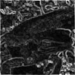
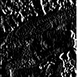

# Q.11 - 20

## Q.11. 均值滤波器

使用均值滤波器（3x3）来进行滤波吧！

----------------------
**关于 padding**:  

对于滤波操作, 一般都会进行上下左右边界的 padding 操作.  当滤波器核大小为 Kernel_size 时, 四个边界的 padding 大小均为 Kernel_size // 2, 这样滤波器的输出点正好是滤波核的中心: padding + y, padding + x.   

---------------------

均值滤波器使用网格内像素的平均值， 这是一种最简单的方案。 均值滤波器作用結果如下:  

| 输入 (imori.jpg) | 输出 (answers/answer_11.jpg) |
| :--------------: | :--------------------------: |
|    |    |

答案 >> [answers/answer_11.py](https://github.com/yoyoyo-yo/Gasyori100knock/blob/master/Question_11_20/answers/answer_11.py)  

## Q.12. Motion Filter  

使用 3x3 的 Motion Filter 来进行滤波吧。

Motion Filter 取对角线方向的像素的平均值，像下式这样定义：

```bash
  1/3  0   0
[  0  1/3  0 ]
   0   0  1/3
```

| 输入 (imori.jpg) | 输出 (answers/answer_12.jpg) |
| :--------------: | :--------------------------: |
|    |    |

答案 >> [answers/answer_12.py](https://github.com/yoyoyo-yo/Gasyori100knock/blob/master/Question_11_20/answers/answer_12.py)  

## Q.13. MAX-MIN 滤波器

MAX-MIN 滤波器也叫边缘检测滤波器。  

MAX-MIN 滤波器使用网格内像素的最大值和最小值的差值对网格内像素重新赋值。通常用于**边缘检测**。边缘检测用于检测图像中的线。像这样提取图像中的信息的操作被称为**特征提取**。   

边缘检测通常在灰度图像上进行。  

| 输入 (imori.jpg) | 输出 (answers/answer_13.jpg) |
| :--------------: | :--------------------------: |
|    |    |

答案 >> [answers/answer_13.py](https://github.com/yoyoyo-yo/Gasyori100knock/blob/master/Question_11_20/answers/answer_13.py)


## Q.14. 微分滤波器

使用 3x3 的微分滤波器来进行滤波吧。

微分滤波器对图像亮度急剧变化的边缘有提取效果，可以获得邻接像素的差值。  

微分滤波器实际上是微分计算的近似表达, 是一种特殊的 Sobel 滤波器.   

```bash
    (a)纵向         (b)横向
      0 -1  0            0 0 0
K = [ 0  1  0 ]   K = [ -1 1 0 ]
      0  0  0            0 0 0
```

| 输入 (imori.jpg) | 输出・纵向 (answers/answer_14_v.jpg) | 输出・横向 (answers/answer_14_h.jpg) |
| :--------------: | :----------------------------------: | :----------------------------------: |
|    |          |          |

答案 >>[ answers/answer_14.py](https://github.com/yoyoyo-yo/Gasyori100knock/blob/master/Question_11_20/answers/answer_14.py)   


## Q.15. Sobel 滤波器

使用 3x3 的 Sobel 滤波器来进行滤波吧。

Sobel 滤波器可以提取特定方向的边缘. 在技术上，它是一离散性差分算子，用来计算图像亮度函数的梯度近似值。在图像的任何一点使用此算子， Sobel 算子的运算将会产生对应的梯度向量或是其范数.  

通常这个滤波器作用于灰度图.  

Sobel 滤波器按下式定义：

```bash
    (a)  纵向       (b)  横向
      1 0 -1            1  2  1
Gx = [ 2 0 -2 ]   Gy = [  0  0  0 ]
      1 0 -1           -1 -2 -1
```

| 输入 (imori.jpg) | 输出・纵向 (answers/answer_15_v.jpg) | 输出・横向 (answers/answer_15_h.jpg) |
| :--------------: | :----------------------------------: | :----------------------------------: |
|    |          |          |

答案 >> [answers/answer_15.py](https://github.com/yoyoyo-yo/Gasyori100knock/blob/master/Question_11_20/answers/answer_15.py)  

特点:   

Sobel 算子根据像素点上下、左右邻点灰度加权差，在边缘处达到极值这一现象检测边缘。对噪声具有平滑作用，提供较为精确的边缘方向信息，边缘定位精度不够高。当对精度要求不是很高时，是一种较为常用的边缘检测方法。  

## Q.16. Prewitt 滤波器  

使用 3x3 的 Prewitt 滤波器来进行滤波吧。  

Prewitt 滤波器是用于边缘检测的一种滤波器，使用下式定义：

```bash
    (a)纵向          (b)横向
      -1 -1 -1          -1 0 1
K = [  0  0  0 ]  K = [ -1 0 1 ]
       1  1  1          -1 0 1
```

| 输入 (imori.jpg) | 输出・纵向 (answers/answer_16_v.jpg) | 输出・横向 (answers/answer_16_h.jpg) |
| :--------------: | :----------------------------------: | :----------------------------------: |
|    |          |          |

答案 >> [answers/answer_16.py](https://github.com/yoyoyo-yo/Gasyori100knock/blob/master/Question_11_20/answers/answer_16.py)


## Q.17. Laplacian 滤波器

使用 Laplacian 滤波器来进行滤波吧。

Laplacian 滤波器是对图像亮度进行二次微分从而检测边缘的滤波器。由于数字图像是离散的，x 方向和 y 方向的一次微分分别按照以下式子计算：

```bash
Ix(x,y) = (I(x+1, y) - I(x,y)) / ((x+1)-x) = I(x+1, y) - I(x,y)
Iy(x,y) = (I(x, y+1) - I(x,y)) / ((y+1)-y) = I(x, y+1) - I(x,y)
```

因此二次微分按照以下式子计算：

```bash
Ixx(x,y) = (Ix(x,y) - Ix(x-1,y)) / ((x+1)-x) = Ix(x,y) - Ix(x-1,y)
         = (I(x+1, y) - I(x,y)) - (I(x, y) - I(x-1,y))
         = I(x+1,y) - 2 * I(x,y) + I(x-1,y)
Iyy(x,y) = ... = I(x,y+1) - 2 * I(x,y) + I(x,y-1)
```

特此，Laplacian 表达式如下：

```bash
D^2 I(x,y) = Ixx(x,y) + Iyy(x,y)
           = I(x-1,y) + I(x,y-1) - 4 * I(x,y) + I(x+1,y) + I(x,y+1)
```

如果把这个式子表示为卷积核是下面这样的：

```bash
      0  1  0
K = [ 1 -4  1 ]
      0  1  0
```

| 输入 (imori.jpg) | 输出(answers/answer_17.jpg) |
| :--------------: | :-------------------------: |
|    |   |

答案 >> [answers/answer_17.py](https://github.com/yoyoyo-yo/Gasyori100knock/blob/master/Question_11_20/answers/answer_17.py)

## Q.18. Emboss 滤波器

使用 Emboss 滤波器来进行滤波吧。

Emboss 滤波器可以使物体轮廓更加清晰，按照以下式子定义：  

```bash
      -2 -1  0
K = [ -1  1  1 ]
       0  1  2
```

| 输入 (imori.jpg) | 输出(answers/answer_18.jpg) |
| :--------------: | :-------------------------: |
|    |   |

答案 >> [answers/answer_18.py](https://github.com/yoyoyo-yo/Gasyori100knock/blob/master/Question_11_20/answers/answer_18.py)  

## Q.19. LoG 滤波器

LoG  即高斯-拉普拉斯（ Laplacian of Gaussian ）的缩写，使用高斯滤波器使图像平滑化之后再使用拉普拉斯滤波器使图像的轮廓更加清晰。

为了防止拉普拉斯滤波器计算二次微分会使得图像噪声更加明显，所以我们首先使用高斯滤波器来抑制噪声。  

LoG 滤波器核使用以下式子定义：

```bash
LoG(x,y) = (x^2 + y^2 - s^2) / (2 * pi * s^6) * exp(-(x^2+y^2) / (2*s^2))

LoG /= (2 * np.pi * (s**6))
LoG /= LoG.sum()
```

| 输入 (imori_noise.jpg) | 输出 (answers/answer_19.jpg) |
| :--------------------: | :--------------------------: |
|    |    |

答案 >> [answers/answer_19.py](https://github.com/yoyoyo-yo/Gasyori100knock/blob/master/Question_11_20/answers/answer_19.py)

## Q.20. 直方图

使用 `Matplotlib` 来绘制 `imori_dark.jpg` 的直方图吧！  
 
直方图显示了不同数值的像素出现的次数。 在 `Matplotlib` 中有 `hist()` 函数提供绘制直方图的接口。  

> 不应该是完成对像素点的统计吗?  

| 输入 (imori_dark.jpg) | 输出 (answers/answer_20.png) |
| :-------------------: | :--------------------------: |
|    |    |

答案 >> [answers/answer_20.py](https://github.com/yoyoyo-yo/Gasyori100knock/blob/master/Question_11_20/answers/answer_20.py)  
