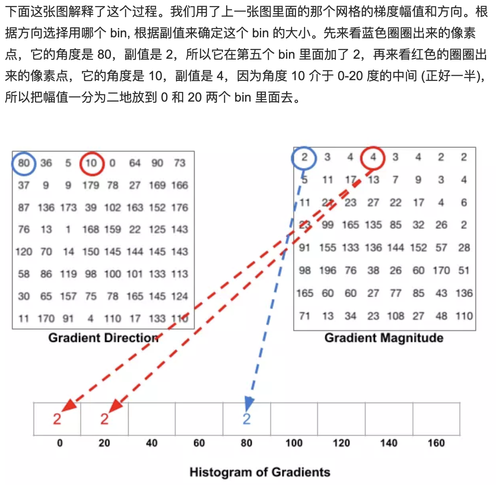
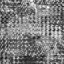

# Q. 61 - 70

## Q.61. 4-邻接的连接数

> [参考](http://ftp.gongkong.com/UploadFile/datum/2008-10/2008101416013500001.pdf)
>
> 关于这个我没有找到什么中文资料，只有两个差不多的 PPT 文档。下面的译法参照这个 PPT。
>
> ——gzr

请根据4-邻接的连接数将`renketsu.png`上色。

4连接数可以用于显示附近像素的状态。通常，对于所关注像素x0(x，y)不为零的情况，邻域定义如下：

```bash
x4(x-1,y-1) x3(x,y-1) x2(x+1,y-1)
x5(x-1,y)   x0(x,y)   x1(x+1,y)
x6(x-1,y+1) x7(x,y+1) x8(x+1,y+1)
```

这里，4-邻接的连接数通过以下等式计算：

```bash
S = (x1 - x1 x2 x3) + (x3 - x3 x4 x5) + (x5 - x5 x6 x7) + (x7 - x7 x8 x1) 
```

S的取值范围为[0,4]：
- S = 0： 内部点
- S = 1：端点
- S = 2​：连接点
- S = 3​：分支点
- S = 4：交叉点

|          输入 (renketsu.png)          |          输出(answers/answer_61.png)           |
| :-----------------------------------: | :--------------------------------------------: |
|  |  |

答案 >> [answers/answer_61.py](https://github.com/yoyoyo-yo/Gasyori100knock/blob/master/Question_61_70/answers/answer_61.py)

## Q.62. 8-邻接的连接数

请根据8-邻接的连接数将`renketsu.png`上色。

这里，8-邻接的连接数通过以下等式计算：

```bash
S = (x1 - x1 x2 x3) + (x3 - x3 x4 x5) + (x5 - x5 x6 x7) + (x7 - x7 x8 x1) 
```
において各x¥*の値の0と1を反転させた値を用いる。

|          输入 (renketsu.png)          |          输出(answers/answer_62.png)           |
| :-----------------------------------: | :--------------------------------------------: |
|  |  |

答案 >> [answers/answer_62.py](https://github.com/yoyoyo-yo/Gasyori100knock/blob/master/Question_61_70/answers/answer_62.py)

## Q.63. 细化处理

将`gazo.png`进行细化处理吧！

细化是将线条宽度设置为1的过程，按照下面的算法进行处理：

1. 从左上角开始进行光栅扫描；
2. 如果x0(x,y)=0，不处理。如果x0=(x,y)=1，满足下面三个条件时，x0=0：
   遍历到的像素4近邻像素的取值有一个以上的0；
   x0的4连接数有1；
   x0的8近邻像素中有三个以上取值为1。
3. 重复光栅扫描，直到步骤2中像素值改变次数为0。

用于细化的算法有 Hilditch 算法（问题64），Zhang-Suen 算法（问题65），田村算法等。

| 输入 (gazo.png) | 输出(answers/answer_63.png) |
| :-------------: | :-------------------------: |
|    |   |

答案 >> [answers/answer_63.py](https://github.com/yoyoyo-yo/Gasyori100knock/blob/master/Question_61_70/answers/answer_63.py)

## Q.64. Hilditch 细化算法


将`gazo.png`进行 Hilditch 细化算法处理吧！

## Q.65. Zhang-Suen 细化算法

将`gazo.png`进行 Zhang-Suen 细化算法处理吧！

但是，请注意，有必要反转`gazo.png`的值，因为以下所有操作都将0作为线，将1作为背景。

对于关注像素x1(x,y)的8-近邻定义如下：

```bash
x9 x2 x3
x8 x1 x4
x7 x6 x5
```
考虑以下两个步骤：

 步骤一：执行光栅扫描并标记满足以下5个条件的所有像素：

1. 这是一个黑色像素；
2. 顺时针查看x2, x3, ..., x9, x2时，从0到1​的变化次数仅为1​；
3. x2, x3, ..., x9中1的个数在2个以上6个以下；
4. x2,x4,x6​中的一个为1​；
5. x4,x6,x8中的一个为1；

  将标记的像素变为1。

 步骤二：执行光栅扫描并标记满足以下5个条件的所有像素：

1. 这是一个黑色像素；
2. 顺时针查看x2, x3, ..., x9, x2时，从0到1的变化次数仅为1；
3. x2, x3, ..., x9中1的个数在2个以上6个以下；
4. x2,x4,x8中的一个为1；
5. x2,x6,x8中的一个为1；

  将标记的像素变为1。

反复执行步骤一和步骤二直到没有点变化（步骤一和步骤二看起来是一样的但是条件4​和条件5​有小小的差别）。

| 输入 (gazo.png) | 输出(answers/answer_65.png) |
| :-------------: | :-------------------------: |
|    |   |

答案 >> [answers/answer_65.py](https://github.com/yoyoyo-yo/Gasyori100knock/blob/master/Question_61_70/answers/answer_65.py)

## Q.66. 方向梯度直方图（HOG）第一步：梯度幅值・梯度方向

求出`imori.jpg`的 HOG 特征量的梯度幅值和梯度方向吧！

HOG（Histogram of Oriented Gradients）是一种表示图像特征量的方法。特征量是表示图像的状态等的向量集合。

在图像识别（图像是什么）和检测（物体在图像中的哪个位置）中，我们需要：

1. 从图像中获取特征量（特征提取）；
2. 基于特征量识别和检测（识别和检测）。

由于深度学习通过机器学习自动执行特征提取和识别，所以看不到 HOG，但在深度学习变得流行之前，HOG 经常被用作特征量表达。

通过以下算法获得HOG：

1. 图像灰度化之后，在x方向和y方向上求出亮度的梯度：

```bash
x方向: gx = I(x+1, y) - I(x-1, y)
y方向: gy = I(x, y+1) - I(x, y-1)
```
2. 从gx和gy 确定梯度幅值和梯度方向：

```bash
梯度幅值: mag = sqrt(gt ** 2 + gy ** 2)
梯度方向: ang = arctan(gy / gx)
```
3. 将梯度方向[0,180]进行9等分量化。也就是说，对于[0,20]量化为 index 0，对于[20,40]量化为 index 1。
4. 将图像划分为N x  N个区域（该区域称为 cell），并作出 cell 内步骤3得到的 index 的直方图。ただし、当表示は 1 でなく勾配角度を求める。
5. C x  C个 cell 被称为一个 block。对每个 block 内的 cell 的直方图通过下面的式子进行归一化。由于归一化过程中窗口一次移动一个 cell 来完成的，因此一个 cell 会被归一化多次：

```bash
h(t) = h(t) / sqrt(Sum h(t) + epsilon)
通常　epsilon=1
```

以上，求出 HOG 特征值。

这一问，我们完成步骤1到3。

为了使示例答案更容易看出效果，`gra`是彩色的。此外，`mag`被归一化至[0,255]。

| 输入 (imori.jpg) | 梯度幅值(answers/answer_66_mag.jpg) | 梯度方向(answers/answer_66_gra.jpg) |
| :--------------: | :---------------------------------: | :---------------------------------: |
|    |       |       |

答案 >> [answers/answer_66.py](https://github.com/yoyoyo-yo/Gasyori100knock/blob/master/Question_61_70/answers/answer_66.py)

## Q.67. 方向梯度直方图（HOG）第二步：梯度直方图

在这里完成 HOG 的第4步。

取N=8，8 x  8个像素为一个 cell，将每个 cell 的梯度幅值加到梯度方向的 index 处。

> 我尽力翻译了，我的语文也不太好，上面那句话看不懂的可以看[这里](https://www.jianshu.com/p/395f0582c5f7)的给出的说明：
>
> 
>
> ——gzr

解答为按照下面的顺序排列索引对应的直方图：
```bash
1 2 3
4 5 6
7 8 9
```
| 输入 (imori.jpg) |           输出(answers/answer_67.png)           |
| :--------------: | :---------------------------------------------: |
|    |  |

答案 >> [answers/answer_67.py](https://github.com/yoyoyo-yo/Gasyori100knock/blob/master/Question_61_70/answers/answer_67.py)

## Q.68. 方向梯度直方图（HOG）第三步：直方图归一化

在这里完成 HOG 的第5步。

取C=3，将3 x  3个 cell 看作一个 block，进行直方图归一化：

```bash
h(t) = h(t) / sqrt(Sum h(t) + epsilon)
通常　epsilon=1
```

在此，我们得到 HOG 特征量。

| 输入 (imori.jpg) |           输出(answers/answer_68.png)           |
| :--------------: | :---------------------------------------------: |
|    |  |

答案 >> [answers/answer_68.py](https://github.com/yoyoyo-yo/Gasyori100knock/blob/master/Question_61_70/answers/answer_68.py)

## Q.69. 方向梯度直方图（HOG）第四步：可视化特征量

在这里我们将得到的特征量可视化。

如果将特征量叠加在灰度化后的`imori.jpg`上，可以很容易看到（蝾螈的）外形。

一个好的可视化的方法是这样的，为 cell 内的每个 index 的方向画一条线段，并且值越大，线段越白，值越小，线段越黑。

解答例

| 输入 (imori.jpg) | 输出(answers/answer_69.jpg) |
| :--------------: | :-------------------------: |
|    |   |

答案 >> [answers/answer_69.py](https://github.com/yoyoyo-yo/Gasyori100knock/blob/master/Question_61_70/answers/answer_69.py)

## Q.70. 色彩追踪（Color Tracking）

在 HSV 色彩空间内对`imori.jpg`创建一个只有蓝色部分值为255的图像。

色彩追踪是提取特定颜色的区域的方法。

然而，由于在 RGB 色彩空间内颜色有256 ^ 3种，因此十分困难（或者说手动提取相当困难），因此进行 HSV 变换。

HSV 变换在问题5中提到过，是将 RGB 变换到色相（Hue）、饱和度（Saturation）、明度（Value）的方法。

- 饱和度越小越白，饱和度越大颜色越浓烈，0<=S<=1；

- 明度数值越高越接近白色，数值越低越接近黑色（0<=V<=1）；

- 色相：将颜色使用0到360度表示，具体色相与数值按下表对应：

  |  红  |  黄  |  绿  | 青色 | 蓝色 | 品红 |  红  |
  | :--: | :--: | :--: | :--: | :--: | :--: | :--: |
  |  0°  | 60°  | 120° | 180° | 240° | 300° | 360° |

也就是说，为了追踪蓝色，可以在进行 HSV 转换后提取其中180<=H<=260的位置，将其变为255。

| 输入 (imori.jpg) | 输出(answers/answer_70.png) |
| :--------------: | :-------------------------: |
|    |   |

答案 >> [answers/answer_70.py](https://github.com/yoyoyo-yo/Gasyori100knock/blob/master/Question_61_70/answers/answer_70.py)
