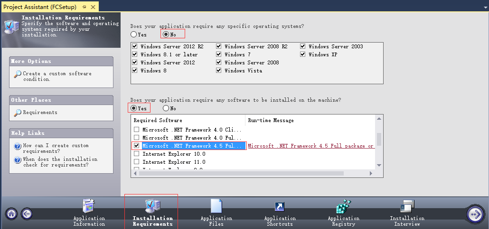

# VS 之 InstallShield Limited Edition for Visual Studio 2015 图文教程  

> InstallShield 序列号： 3F4A2QW-D2D-C16CCDD1CN

从 Visual Studio 2012 开始, 微软就把自家原来的安装与部署工具彻底废掉了, 转而让大家去安装使用第三方的打包工具 "InstallShield Limited Edition for Visual Studio" , 注意这个版本是免费的, 只需要邮件注册下, 就会有要注册码.  (其实, 早在VS2010中, 微软就把InstallShield Limited Edition for Visual Studio放在里面了, 只是那个时候自家产品还在).  

如何下载注册：http://go.microsoft.com/fwlink/?LinkID=239620&lang=1033&ver=ult. 用你的邮箱注册, 会免费发注册码的, 不需要破解.   

## 具体打包步骤

首先, 右键解决方案 | 添加 | 新建项目 | 其他项目类型 | 安装和部署 | InstallShield Limited Edition Project, 会弹出下图的界面：  

  

1、第一步, 点击 "Application Information" 选项, 如下图, 如实填写右侧内容；  

  

2、第二步, 点击 "General Information" , 根据实际情况, 填写程序基本信息, 如下图：

  

**Note**: 每次升级, 重新打包, 只需要点击这一行右侧的 "..." 按钮, 就会重新生成 Code, 安装时就会自动覆盖旧版本.   

3、点击 "Installation Requirements" , 根据实际情况选择安装要求, 我的程序为 `.NET Framework 4.5` 开发.   

  

4、点击 "Application Files" , 添加要打包的库文件、应用程序以及配置文件或者文件夹. 

  

5、选中 OCX 或者 ActiveX 等需要注册的 DLL, 右键 | Properties；

1) 如果你的是.NET项目程序DLL、EXE, 那就按照默认的设置, 不要去改, 否则出错  
2) 如果你的是OCX或者ActiveX等需要注册的DLL, 那么选择 "Self-registration" , 如下图所示:  

  

6、点击 " Application Shortcuts " 设置快捷方式, 根据需要勾选选择；  

  

7、点击 " Application Registry " 进行注册表配置, 本项目无注册表配置, 直接设置为 No 即可；  

  

8、点击 " Installation Interview " 进行安装问卷配置, 下图中圈起的为常用设置；

  

9、 " Installation Interview " 面板左侧的 " Dialogs " , 选择安装步骤、对话框、背景等设置；

  

10、若要把 `.NET Framework` 一起打包进程序去, 如下图：

  

11、解决方案, 点击 "Prepare for Release" -> 双击 "Releases" -> 点击选中 "SingleImage" -> 选项卡点击 "Setup.exe" -> 找到 "InstallShield Prerequisites Location" , 把它设置为 "Extract From Setup.exe" , 打包完成；  

  

12、打包完成后, 解决方案 | 安装程序 (FCSetup) , 右键生成, 生成成功后的程序保存在如下目录：xxx\Express\SingleImage\DiskImages\DISK1\setup.exe. 运行如下图：  

  

## Issues

### 1. 使用 InstallShield 创建快捷方式的属性中 "目标位置" 为灰色  

当我们在 Application Shortcut 设置好以后, 就可以点击界面最右上角的 Configure the Target System (配置目标系统)下的 Shortcuts/Folders: 

  

然后就进入下面这个界面, 

  

同时注意中间 "Behavior" 下的 "Target" 后的信息, 刚点进去肯定是"Advertised shortcut to[xxxxx]执行文件名字.exe "的格式, 先暂时别管这是什么意思, 下面会提到, 跟着下一步操作, 把鼠标移到"Desktop"上, 点击右键, 你会惊奇的发现, 这里面就有 Advertised shortcut. 

整理下来, Desktop 右键的属性菜单分别是：  

- NEW Shortcut  
- NEW Advertised shortcut   
- NEW Shortcut to preexisting file   
- NEW Uninstall Shortcut  
- NEW Folder  

这里破招关键就是 "NEW Advertised shortcut" 和 "NEW Shortcut to preexisting file" .   

- New Advertised Shortcut, 广告快捷方式. 这个类型的快捷方式只在基于Windows Installer 的项目中能够使用.  直到用户执行广告快捷方式的时候, 其对应的文件才会被安装到目标系统中;  
- NEW Shortcut to preexisting file, 指向现有文件的快捷方式. 即创建一个快捷方式到目标系统中已经存在的文件.   

  

关键来了, 点击 NEW Shortcut to preexisting file, 创建 "现有文件快捷方式" , 然后把之前Desktop那个快捷图标删除掉, 接着为现有文件快捷方式" 改名字, 改图标, 完后一定要改Behavior下的Target,可手写, 也可点击那一列最右边三个点进行选择, 选择完后, 你只是选了执行文件的路径, 但是没执行文件, 最后一定要手动在后面加上你的 "执行文件名字.exe" .  

到此, 已经可以生成打包了, 然后桌面会出现一个快捷文件, 点击右键选择属性你会惊喜的发现,  "目标" 个 "目标位置" 里有了相关信息, 并且能正常执行文件了, 恭喜你!   

### 2. 快捷方式生成后位于公用用户目录中  

安装程序会在公用用户目录中生成快捷方式,而不是对应的当前用户目录. 此时需要设置 General Information | ALLUSERS= "" ；  
