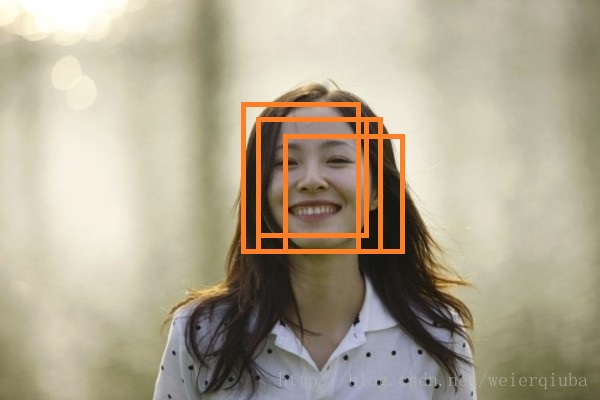
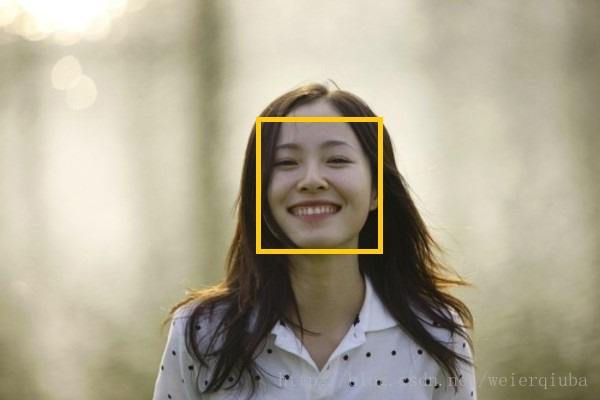

# 非极大值抑制 NMS

1. 概念： 
非极大值抑制算法`（Non-maximum suppression, NMS）`的本质是搜索局部极大值，抑制非极大值元素。
非极大值抑制`NMS`主要在图像处理中的应用主要是是为了更精确的定位某种特征。

举一个简单的例子：用梯度变化表征边缘时，梯度变化较大的区域通常比较宽，所以利用x和y方向的梯度确定一个法向arctan(y/x)，然后在法向上判断当前梯度测量是否是一个峰值（或局部极大值），如果是就保留，不是极大值就抑制（如设置为0）。

目标检测中的应用： 





如图所示：物体检测中应用NMS算法的主要目的是消除多余（交叉重复）的窗口，找到最佳物体检测位置。 人脸检测中，虽然每个窗口均检测到人脸，但仅需给出一个最有可能表征人脸的窗口。 

## 算法流程：
首先计算出所有窗口的面积，对所有窗口的分数进行从小到大排序取出最高分数的序号。循环计算1到次高分数窗口与最高分数窗口的交叉面积与两者间最小面积的比例，若超过overlap那么把这一窗口(1~~last中的窗口)抑制了。交叉面积怎么计算呢？


如上图所示，矩形的左上角坐标为x1, y1, 右下角坐标为x2, y2，两个矩形的面积分别为A, B。
1、取两个矩形左上角坐标的最大值x1_max, y1_max
2、取两个矩形右下角坐标的最小值x2_min, y2_min
3、重叠区域的宽w为max(0, x2_min - x1_max)，高h为max(0, y2_min - y1_max)
4、所以重叠率为：

<script type="text/javascript" src="http://cdn.mathjax.org/mathjax/latest/MathJax.js?config=default"></script>

$$x=\frac{w×h}{A-B+w×h}$$

## MATLAB程序实现

```matlab
function pickLocate = nms(boxes, overlap)

% Non-maximum suppression.
% In object detect algorithm, select high score detections and skip windows
% covered by a previously selected detection.
%
% input - boxes : object detect windows.
%                 xMin yMin xMax yMax score.
%         overlap : suppression threshold.
% output - pickLocate : number of local maximum score.

boxes = double(boxes);

if isempty(boxes)
    pickLocate = [];
else
    xMin = boxes(:, 1);
    yMin = boxes(:, 2);
    xMax = boxes(:, 3);
    yMax = boxes(:, 4);

    s = boxes(:, end);

    % area of every detected windows.
    area = (xMax - xMin + 1) .* (yMax - yMin + 1);

    % sort detected windows based on the score.
    [vals, I] = sort(s);

    pickLocate = [];
    while ~isempty(I)
        last = length(I);
        i = I(last);

        pickLocate = [pickLocate; i];
        suppress = [last];

        for pos = 1 : last - 1
            j = I(pos); 

            % covered area.
            xx1 = max(xMin(i), xMin(j));
            yy1 = max(yMin(i), yMin(j));
            xx2 = min(xMax(i), xMax(j));
            yy2 = min(yMax(i), yMax(j));

            w = xx2 - xx1 + 1;
            h = yy2 - yy1 + 1;

            if ((w > 0) && (h > 0))
                % compute overlap.
                o = w * h / min(area(i), area(j));

                if (o > overlap)
                    suppress = [suppress; pos];
                end
            end

            % xx1 = max(x1(i), x1(I(1:last-1)));
            % yy1 = max(y1(i), y1(I(1:last-1)));
            % xx2 = min(x2(i), x2(I(1:last-1)));
            % yy2 = min(y2(i), y2(I(1:last-1)));

            % w = max(0.0, xx2-xx1+1);
            % h = max(0.0, yy2-yy1+1);

            % inter = w.*h;
            % o = inter ./ (area(i) + area(I(1:last-1)) - inter);

            % saving the windows which o less than threshold.
            % I = I(o <= overlap);
        end
        I(suppress) = [];
    end
end
```

## `python`实现
以下是python部分，[原文链接](http://www.pyimagesearch.com/2015/02/16/faster-non-maximum-suppression-python)。

```python
# import the necessary packages  
import numpy as np  
   
# Malisiewicz et al.  
def non_max_suppression_fast(boxes, overlapThresh):  
    # if there are no boxes, return an empty list  
    if len(boxes) == 0:  
        return []  
   
    # if the bounding boxes integers, convert them to floats --  
    # this is important since we'll be doing a bunch of divisions  
    if boxes.dtype.kind == "i":  
        boxes = boxes.astype("float")  
   
    # initialize the list of picked indexes   
    pick = []  
   
    # grab the coordinates of the bounding boxes  
    x1 = boxes[:,0]  
    y1 = boxes[:,1]  
    x2 = boxes[:,2]  
    y2 = boxes[:,3]  
   
    # compute the area of the bounding boxes and sort the bounding  
    # boxes by the bottom-right y-coordinate of the bounding box  
    area = (x2 - x1 + 1) * (y2 - y1 + 1)  
    idxs = np.argsort(y2)  
   
    # keep looping while some indexes still remain in the indexes  
    # list  
    while len(idxs) > 0:  
        # grab the last index in the indexes list and add the  
        # index value to the list of picked indexes  
        last = len(idxs) - 1  
        i = idxs[last]  
        pick.append(i)  
   
        # find the largest (x, y) coordinates for the start of  
        # the bounding box and the smallest (x, y) coordinates  
        # for the end of the bounding box  
        xx1 = np.maximum(x1[i], x1[idxs[:last]])  
        yy1 = np.maximum(y1[i], y1[idxs[:last]])  
        xx2 = np.minimum(x2[i], x2[idxs[:last]])  
        yy2 = np.minimum(y2[i], y2[idxs[:last]])  
   
        # compute the width and height of the bounding box  
        w = np.maximum(0, xx2 - xx1 + 1)  
        h = np.maximum(0, yy2 - yy1 + 1)  
   
        # compute the ratio of overlap  
        overlap = (w * h) / area[idxs[:last]]  
   
        # delete all indexes from the index list that have  
        idxs = np.delete(idxs, np.concatenate(([last],  
            np.where(overlap > overlapThresh)[0])))  
   
    # return only the bounding boxes that were picked using the  
    # integer data type  
    return boxes[pick].astype("int")  
```
