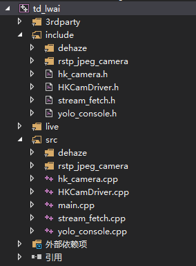
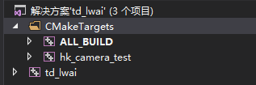

# 在 CMake 生成的 VS2015 工程中保持源码文件的目录组织  

在某一工程内，多个文件散乱的分布在 Source Files/ 目录和 Header Files 目录中, 不便于查看和调试代码，如下图所示.  

  

通过使用 source_group 命令, 可以使源码保持原本的目录组织方式 (当然也可以自己重新组织).  

先看看组织后的目录数:  

  


## 目录组织 - source_group()  

先看看官方给出的命令说明: source_group() 用于定义生成 IDE 工程时的源码分组 (source groups). 有两种创建方式:  

```cmake
source_group(<name> [FILES <src>...] [REGULAR_EXPRESSION <regex>])
source_group(TREE <root> [PREFIX <prefix>] [FILES <src>...])
```

用于定义工程中的源码属于哪个目录组, 主要用于 Visual Studio 中. 有以下选项:  

- **TREE**  CMake 会自动检测 `<src>` 文件路径来确定需要创建的 source groups, 使得工程中的目录结构和实际文件在磁盘上的目录结构一致. 根据 `<root>` 指定的根路径将 `<src>` 中的路径截断为相对路径;  
- **PREFIX**  在 `<root>` 路径中的 Source group 和文件会被放在 `<prefix>`  group 中;  
- **FILES**  将显式指定的所有源文件都放在 `<name>` group 中, 如果是相对路径, 则是以当前源码路径为参考;  
- **REGULAR_EXPRESSION**  可以匹配到正则表达式的源码文件会被放在 `<name>` group 中.  如果某个源码文件可以和多个组进行匹配, 则该文件会被归到最后一个组; 如果某个源码文件没有和任一个组匹配上, 则该文件会被归到正则表达式的最后一个组.  

`<name>` 和 `<prefix>` 中可以使用两个反斜杆 '\\' 符号来指定子 group.  

```cmake
source_group(outer\\inner ...)
source_group(TREE <root> PREFIX sources\\inc ...)
```

为了保证版本的向后兼容性, 以下命令的作用相同:   

```cmake
source_group(<name> <regex>)
source_group(<name> REGULAR_EXPRESSION <regex>)
```

**例子**  

```
source_group(TREE ${CMAKE_SOURCE_DIR} FILES ${LIVE555_SRC_FILES})
source_group(TREE ${CMAKE_SOURCE_DIR} FILES ${HEADER_FILES})
source_group(TREE ${CMAKE_SOURCE_DIR} FILES ${SRC_FILES})

add_executable( ${PROJECT_NAME} 
                ${SRC_FILES} 
                ${LIVE555_SRC_FILES} 
                ${HEADER_FILES})
```

Note: 只有在 add_executable() 中的文件才会被 source_group 分组. 如果你发现有些文件没有被正确分组, 应该首先确认这些文件是否出现在 add_executable() 的 [source-x] 列表中.  


## 对工程进行分类 - set_target_properties()  

同类工程在一个的文件夹内，十分整洁. 可以使用 set_target_properties() 函数实现:   

```cmake
# 1. 打开允许创建文件夹的开关
set_property(GLOBAL PROPERTY USE_FOLDERS ON)
# 2. 把工程加到文件夹中
set_target_properties(hk_camera_test PROPERTIES FOLDER "CMakeTargets")
# 3. 给 cmake 自动创建的工程重新命名, 默认名为 "CMakePredefinedTargets" 
set_property(GLOBAL PROPERTY PREDEFINED_TARGETS_FOLDER "CMakeTargets")
```

最终效果如下:  

  

## 参考  

[1] cmake 在 vs 中创建文件夹组织目标工程: https://blog.csdn.net/bcfd_yundou/article/details/90697485  
[2] cmake 组织项目: https://www.jianshu.com/p/c31b00acc57b  
