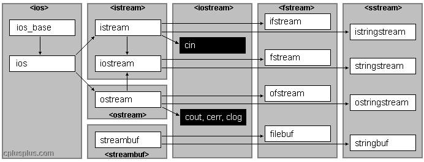

# C++ 文件读写详解（ofstream, ifstream, fstream）  

在看 C++ 编程思想中，每个练习基本都是使用 ofstream, ifstream, fstream，以前粗略知道其用法和含义，在看了几位大牛的博文后，进行整理和总结: 




这里主要是讨论 fstream 的内容:   

```cpp
#include <fstream>
ofstream         // 文件写操作 内存写入存储设备 
ifstream         // 文件读操作，存储设备读区到内存中
fstream          // 读写操作，对打开的文件可进行读写操作 
```

## 1. 打开文件

在 fstream 类中，成员函数 open() 实现打开文件的操作，从而将数据流和文件进行关联，通过ofstream, ifstream, fstream 对象进行对文件的读写操作.   

函数: open() 

```cpp
public member function
 
void open ( const char * filename,
            ios_base::openmode mode = ios_base::in | ios_base::out );
 
void open(const wchar_t *_Filename,
        ios_base::openmode mode= ios_base::in | ios_base::out,
        int prot = ios_base::_Openprot)；
``` 

参数:  

- filename   操作文件名  
- mode       文件的打开方式  
- prot       文件的打开属性  // 基本很少用到，在查看资料时，发现有两种方式   

文件的打开方式在 ios 类(所以流式 I/O 的基类)中定义，有如下几种方式:   

|ios 定义|文件打开方式|  
|--------|-----|  
|ios::in |	为输入(读)而打开文件 |   
|ios::out |	为输出(写)而打开文件 |  
|ios::ate |	初始位置: 文件尾 |  
|ios::app |	所有输出附加在文件末尾 |  
|ios::trunc |	如果文件已存在则先删除该文件 |   
|ios::binary |	二进制方式 |  

这些方式是能够进行组合使用的，以 "或" 运算（ "|" ）的方式: 例如   

```cpp
ofstream out;
out.open("Hello.txt", ios::in|ios::out|ios::binary) // 根据自己需要进行适当的选取  
```

打开文件的属性同样在 ios 类中也有定义:  

|ios 定义|文件的打开属性|  
|--------|-----|  
|0 |  普通文件  |
|1 |  只读文件  |
|2 |  隐含文件  |
|4 |  系统文件  |

对于文件的属性也可以使用 "或" 运算和 "+" 进行组合使用，这里就不做说明了。  

很多程序中，可能会碰到 ofstream out("Hello.txt"), ifstream in("..."), fstream foi("...") 这样的的使用，并没有显式的去调用 open() 函数就进行文件的操作，直接调用了其默认的打开方式，因为在 stream 类的构造函数中调用了 open() 函数, 并拥有同样的构造函数，所以在这里可以直接使用流对象进行文件的操作，默认方式如下:   

```cpp
ofstream out("...", ios::out);
ifstream in("...", ios::in);
fstream foi("...", ios::in|ios::out);
```

当使用默认方式进行对文件的操作时，你可以使用成员函数 is_open() 对文件是否打开进行验证.   

## 2.关闭文件  

当文件读写操作完成之后，我们必须将文件关闭以使文件重新变为可访问的。成员函数 close()，它负责将缓存中的数据排放出来并关闭文件。这个函数一旦被调用，原先的流对象就可以被用来打开其它的文件了，这个文件也就可以重新被其它的进程所访问了。为防止流对象被销毁时还联系着打开的文件，析构函数将会自动调用关闭函数 close()。   


## 3.文本文件的读写  

类 ofstream, ifstream 和 fstream 是分别从 ostream, istream 和 iostream 中引申而来的。这就是为什么 fstream 的对象可以使用其父类的成员来访问数据。  

一般来说，我们将使用这些类与同控制台 (console) 交互同样的成员函数 (cin 和 cout) 来进行输入输出。如下面的例题所示，我们使用重载的插入操作符 <<:    

```cpp
    // writing on a text file
#include <fiostream.h>
int main () 
{
    ofstream out("out.txt");
    if (out.is_open()) 
    {
        out << "This is a line.\n";
        out << "This is another line.\n";
        out.close();
    }
    return 0;
}
```

结果: 在 out.txt 中写入:   

This is a line.  
This is another line.   

从文件中读入数据也可以用与 cin >> 的使用同样的方法:   

```cpp
// reading a text file
#include <iostream.h>
#include <fstream.h>
#include <stdlib.h>

int main () {
    char buffer[256];
    ifstream in("test.txt");
    if (! in.is_open())
    { cout << "Error opening file"; exit (1); }
    while (!in.eof() )
    {
        in.getline (buffer,100);
        cout << buffer << endl;
    }
    return 0;
}
```

//结果 在屏幕上输出:   

This is a line.  
This is another line  

上面的例子读入一个文本文件的内容，然后将它打印到屏幕上。注意我们使用了一个新的成员函数叫做eof ，它是 ifstream 从类 ios 中继承过来的，当到达文件末尾时返回 true 。   

**状态标志符的验证(Verification of state flags)**   

除了 eof() 以外，还有一些验证流的状态的成员函数（所有都返回bool型返回值）:    

bad()    

如果在读写过程中出错，返回 true 。例如: 当我们要对一个不是打开为写状态的文件进行写入时，或者我们要写入的设备没有剩余空间的时候。  

fail()   

除了与 bad() 同样的情况下会返回 true 以外，加上格式错误时也返回true ，例如当想要读入一个整数，而获得了一个字母的时候。   

eof()  

如果读文件到达文件末尾，返回true。  

good()  

这是最通用的: 如果调用以上任何一个函数返回 true 的话，此函数返回 false 。  

要想重置以上成员函数所检查的状态标志，你可以使用成员函数 clear()，没有参数。   

**获得和设置流指针(get and put stream pointers)**  

所有输入/输出流对象(i/o streams objects)都有至少一个流指针:   

- ifstream， 类似istream, 有一个被称为 get pointer的指针，指向下一个将被读取的元素。  
- ofstream, 类似 ostream, 有一个指针 put pointer ，指向写入下一个元素的位置。  
- fstream, 类似 iostream, 同时继承了get 和 put  

我们可以通过使用以下成员函数来读出或配置这些指向流中读写位置的流指针: 

tellg() 和 tellp()    

这两个成员函数不用传入参数，返回 pos_type 类型的值(根据 ANSI-C++ 标准) ，就是一个整数，代表当前 get 流指针的位置 (用 tellg ) 或 put 流指针的位置(用 tellp).  

seekg() 和seekp()   

这对函数分别用来改变流指针 get 和put的位置。两个函数都被重载为两种不同的原型:   

```cpp
seekg ( pos_type position );  
seekp ( pos_type position );  
```

使用这个原型，流指针被改变为指向从文件开始计算的一个绝对位置。要求传入的参数类型与函数 tellg 和tellp 的返回值类型相同。   

```cpp
seekg ( off_type offset, seekdir direction );  
seekp ( off_type offset, seekdir direction );  
```

使用这个原型可以指定由参数 direction 决定的一个具体的指针开始计算的一个位移(offset)。它可以是:   

|ios 定义|流指针的偏移|  
|--------|-----|  
|ios::beg| 从流开始位置计算的位移 |  
|ios::cur| 从流指针当前位置开始计算的位移 |  
|ios::end| 从流末尾处开始计算的位移 |  

流指针 get 和 put 的值对文本文件(text file)和二进制文件(binary file)的计算方法都是不同的，因为文本模式的文件中某些特殊字符可能被修改。由于这个原因，建议对以文本文件模式打开的文件总是使用 seekg 和 seekp 的第一种原型，而且不要对 tellg 或 tellp 的返回值进行修改。对二进制文件，你可以任意使用这些函数，应该不会有任何意外的行为产生。  

以下例子使用这些函数来获得一个二进制文件的大小:  

```cpp
 // obtaining file size
#include <iostream.h>
#include <fstream.h>

const char * filename = "test.txt";

int main () 
{
    long l,m;
    ifstream in(filename, ios::in|ios::binary);
    l = in.tellg();
    in.seekg (0, ios::end);
    m = in.tellg();
    in.close();
    cout << "size of " << filename;
    cout << " is " << (m-l) << " bytes.\n";
    return 0;
    }
```
   //结果:
   size of example.txt is 40 bytes.


## 4. 二进制文件

在二进制文件中，使用<< 和>>，以及函数（如getline）来操作符输入和输出数据，没有什么实际意义，虽然它们是符合语法的。   

文件流包括两个为顺序读写数据特殊设计的成员函数: write 和 read。第一个函数 (write) 是ostream 的一个成员函数，都是被 ofstream 所继承。而 read 是 istream 的一个成员函数，被ifstream 所继承。类 fstream 的对象同时拥有这两个函数。它们的原型是:   

```cpp
write ( char * buffer, streamsize size );
read ( char * buffer, streamsize size );
```

这里 buffer 是一块内存的地址，用来存储或读出数据。参数 size 是一个整数值，表示要从缓存（buffer）中读出或写入的字符数。   

```cpp
// reading binary file
#include <iostream>
#include <fstream.h>

const char * filename = "test.txt";

int main () {
    char * buffer;
    long size;
    ifstream in (filename, ios::in|ios::binary|ios::ate);
    size = in.tellg();
    in.seekg (0, ios::beg);
    buffer = new char [size];
    in.read (buffer, size);
    in.close();
    
    cout << "the complete file is in a buffer";
    
    delete[] buffer;
    return 0;
}
```

//运行结果: 
The complete file is in a buffer

## 5.缓存和同步(Buffers and Synchronization)

当我们对文件流进行操作的时候，它们与一个 streambuf 类型的缓存(buffer)联系在一起。这个缓存（buffer）实际是一块内存空间，作为流(stream)和物理文件的媒介。例如，对于一个输出流， 每次成员函数 put (写一个单个字符)被调用，这个字符不是直接被写入该输出流所对应的物理文件中的，而是首先被插入到该流的缓存（buffer）中。   

当缓存被排放出来(flush)时，它里面的所有数据或者被写入物理媒质中（如果是一个输出流的话），或者简单的被抹掉(如果是一个输入流的话)。这个过程称为同步(synchronization)，它会在以下任一情况下发生:    

- 当文件被关闭时: 在文件被关闭之前，所有还没有被完全写出或读取的缓存都将被同步。  
- 当缓存 buffer 满时: 缓存Buffers 有一定的空间限制。当缓存满时，它会被自动同步。  
- 控制符明确指明: 当遇到流中某些特定的控制符时，同步会发生。这些控制符包括: flush 和 endl。  
- 明确调用函数sync(): 调用成员函数sync() (无参数)可以引发立即同步。这个函数返回一个int 值，等于-1 表示流没有联系的缓存或操作失败。   
