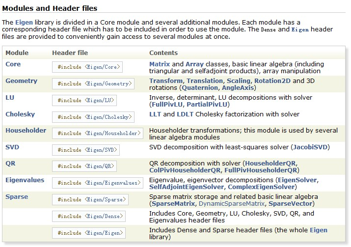
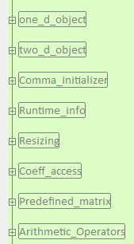

# C++矩阵处理工具 - Eigen   

推荐几个可以在 C++ 中调用的数学平台： eigen、bias、lapack、svd、CMatrix，本文着重 eigen 做以讲解，希望对各位有所帮助。   

下面是本文主线，主要围绕下面几点进行讲解：

**********************************************************************************************
- Eigen 是什么   
- 下载 Eigen3    
- Eigen3 样例代码   
- 去哪里更深入学习   
**********************************************************************************************

## Eigen 是什么

Eigen 是 C++ 中可以用来调用并进行矩阵计算的一个库，里面封装了一些类，需要的头文件和功能如下：   



Eigen 的[主页](http://eigen.tuxfamily.org/dox/)上有一些更详细的 Eigen 介绍.   

## 下载 Eigen3 

在 Eigen 的[主页](http://eigen.tuxfamily.org/index.php?title=Main_Page) 上提供了 Egien 的下载, 因为 Eigen 只是在头文件中实现的, 因此并没有对应的库文件.   


## Eigen 的样例代码
 
当然有，这篇文章重点就是这里！  

以下是我整理的一些常用操作，基本的矩阵运算就在下面了，算是个入门吧~主要分以下几部分：   




```cpp

#include <iostream>
#include <Eigen/Dense>

//using Eigen::MatrixXd;
using namespace Eigen;
using namespace Eigen::internal;
using namespace Eigen::Architecture;

using namespace std;


int main()
{

#pragma region one_d_object

    cout<<"*******************1D-object****************"<<endl;

    Vector4d v1;
    v1<< 1,2,3,4;
    cout<<"v1=\n"<<v1<<endl;

    VectorXd v2(3);
    v2<<1,2,3;
    cout<<"v2=\n"<<v2<<endl;

    Array4i v3;
    v3<<1,2,3,4;
    cout<<"v3=\n"<<v3<<endl;

    ArrayXf v4(3);
    v4<<1,2,3;
    cout<<"v4=\n"<<v4<<endl;

#pragma endregion

#pragma region two_d_object
    
    cout<<"*******************2D-object****************"<<endl;
    //2D objects:
    MatrixXd m(2,2);

    //method 1
    m(0,0) = 3;
    m(1,0) = 2.5;
    m(0,1) = -1;
    m(1,1) = m(1,0) + m(0,1);

    //method 2
    m<<3,-1,
        2.5,-1.5;
    cout <<"m=\n"<< m << endl;

#pragma endregion

#pragma region Comma_initializer

    cout<<"*******************Initialization****************"<<endl;

    int rows=5;
    int cols=5;
    MatrixXf m1(rows,cols);
    m1<<( Matrix3f()<<1,2,3,4,5,6,7,8,9 ).finished(),
        MatrixXf::Zero(3,cols-3),
        MatrixXf::Zero(rows-3,3),
        MatrixXf::Identity(rows-3,cols-3);
    cout<<"m1=\n"<<m1<<endl;

#pragma endregion

#pragma region Runtime_info
    
    cout<<"*******************Runtime Info****************"<<endl;

    MatrixXf m2(5,4);
    m2<<MatrixXf::Identity(5,4);
    cout<<"m2=\n"<<m2<<endl;

    MatrixXf m3;
    m3=m1*m2;
    cout<<"m3.rows()="<<m3.rows()<<"  ;  "
             <<"m3.cols()="<< m3.cols()<<endl;
    
    cout<<"m3=\n"<<m3<<endl;

#pragma endregion
    
#pragma region Resizing
    
    cout<<"*******************Resizing****************"<<endl;

    //1D-resize	
    v1.resize(4);
    cout<<"Recover v1 to 4*1 array : v1=\n"<<v1<<endl;

    //2D-resize
    m.resize(2,3);
    m.resize(Eigen::NoChange, 3);
    m.resizeLike(m2);
    m.resize(2,2);
    
#pragma endregion

#pragma region Coeff_access
    
    cout<<"*******************Coefficient access****************"<<endl;

    float tx=v1(1);
    tx=m1(1,1);
    cout<<endl;

#pragma endregion

#pragma  region Predefined_matrix

    cout<<"*******************Predefined Matrix****************"<<endl;

    //1D-object
    typedef  Matrix3f   FixedXD;
    FixedXD x;
    
    x=FixedXD::Zero();
    x=FixedXD::Ones();
    x=FixedXD::Constant(tx);//tx is the value
    x=FixedXD::Random();
    cout<<"x=\n"<<x<<endl;

    typedef ArrayXf Dynamic1D;
    //或者 typedef VectorXf Dynamic1D
    int size=3;
    Dynamic1D xx;
    xx=Dynamic1D::Zero(size);
    xx=Dynamic1D::Ones(size);
    xx=Dynamic1D::Constant(size,tx);
    xx=Dynamic1D::Random(size);
    cout<<"xx=\n"<<x<<endl;

    //2D-object
    typedef MatrixXf Dynamic2D;
    Dynamic2D y;
    y=Dynamic2D::Zero(rows,cols);
    y=Dynamic2D::Ones(rows,cols);
    y=Dynamic2D::Constant(rows,cols,tx);//tx is the value
    y=Dynamic2D::Random(rows,cols);

#pragma endregion

#pragma region Arithmetic_Operators

    cout<<"******************* Arithmetic_Operators****************"<<endl;

    //add & sub
    MatrixXf m4(5,4);
    MatrixXf m5;
    m4=m2+m3;
    m3-=m2;

    //product
    m3=m1*m2;
 
    //transposition
    m5=m4.transpose();
    //m5=m.adjoint();//伴随矩阵	
    
    //dot product
    double xtt;
    cout<<"v1=\n"<<v1<<endl;
    v2.resize(4);
    v2<<VectorXd::Ones(4);
    cout<<"v2=\n"<<v2<<endl;

    cout<<"*************dot product*************"<<endl;
    xtt=v1.dot(v2);
    cout<<"v1.*v2="<<xtt<<endl;

    //vector norm

    cout<<"*************matrix norm*************"<<endl;
    xtt=v1.norm();
    cout<<"norm of v1="<<xtt<<endl;
    xtt=v1.squaredNorm();
    cout<<"SquareNorm of v1="<<xtt<<endl;

#pragma endregion

    cout<<endl;
}
```

## 去哪里更深入学习  

参考 Eigen 中的[类及函数](http://eigen.tuxfamily.org/dox/namespaceEigen.html)、Eigen 的[官方教程](http://eigen.tuxfamily.org/dox/GettingStarted.html).   