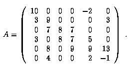
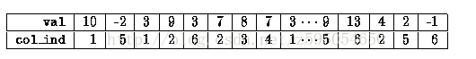
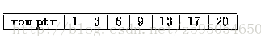

# 稀疏(sparsity)矩阵的压缩存储

压缩矩阵`行`或`列`来存储矩阵的格式是很普遍的，一般不会存储空值。当在一个矩阵-向量积或预解决的每个简单标量中需要间接寻址。  
## 1. 行压缩    
行压缩存储方式会把一个稀疏矩阵行的非零数值放在连续的存储空间。    
假设我们有一个非对称的稀疏矩阵 `A` :   
  
**定义 3 个向量**  
1 个浮点类型： `val`  
2 个整型： `col_ind , row_ptr`   
`val` 向量用于存储矩阵 `A` 的非零元素值，从第一行开始遍历。
`col_ind` 向量用于存储 `val` 向量中值对应的列索引（向量下标从0开始, 列索引值从1开始）。如下图：   
   
也就是说，如果 `val(k) = Ai,j` 那么 `j = col_ind(k)`    
`row_ptr` 用于存储每行中第一非零元素的在 `col_ind` 中的位置(可以理解为换行指示).
如：   
第一行中的一个非零元素为 `10` 在 `col_ind` 向量中的位置为 `1`;
第二行中的第一个非零元素 `3` 在 `col_ind` 向量中的位置为 `3`，
这样以此类推，可得到如下向量：     
   
如果 `val(k) = Ai,j` 那么有 `row_ptr(i) <= k < row_ptr(i+1)`  
如果我们的稀疏矩阵是对称的，那么我们只需要存储上三角（或下三角）即可。   
