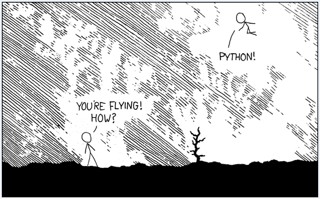

# 手把手教你写网络爬虫（1）：网易云音乐歌单  

> python 3 

大家好，《手把手教你写网络爬虫》连载开始了！在笔者的职业生涯中，几乎没有发现像网络爬虫这样的编程实践，可以同时吸引程序员和门外汉的注意。本文由浅入深的把爬虫技术和盘托出，为初学者提供一种轻松的入门方式。请跟随我们一起踏上爬虫学习的打怪升级之路吧！

## 介绍

**什么是爬虫？**   

简单的说网络爬虫（Web crawler）也叫做网络铲（Web scraper）、网络蜘蛛（Web spider），其行为一般是先“爬”到对应的网页上，再把需要的信息“铲”下来。   

**为什么学习爬虫？**   

看到这里，有人就要问了：google、百度等搜索引擎已经帮我们抓取了互联网上的大部分信息了，为什么还要自己写爬虫呢？ 这是因为，需求是多样的。比如在企业中，爬取下来的数据可以作为数据挖掘的数据源。甚至有人为了炒股，专门抓取股票信息。笔者就见过有人为了分析房价，自学编程，爬了绿中介的数据。   

在大数据深入人心的时代，网络爬虫作为网络、存储与机器学习等领域的交汇点，已经成为满足个性化网络数据需求的最佳实践。还犹豫什么？让我们开始学习吧！   

## 语言&环境

语言：人生苦短，我用 Python。让 Python 带我们飞！   



`urllib.request`： 这是 Python 自带的库，不需要单独安装，它的作用是为我们打开 url 获取 html 的内容。Python 官方文档的介绍：The urllib.request module defines functions and classes which help in opening URLs (mostly HTTP) in a complex world — basic and digest authentication, redirections, cookies and more.

`BeautifulSoup`：是一个可以从 HTML 或 XML 文件中提取数据的 Python 库。它能够通过你喜欢的转换器实现惯用的文档导航，查找，修改文档的方式。 BeautifulSoup 会帮你节省数小时甚至数天的工作时间。安装比较简单：   
```bash
$ pip3 install beautifulsoup4
```
验证的方法，进入 Python 直接 import 一下，如果没有异常，那就说明安装成功了！
```python
from bs4 import BeautifulSoup
```
BeautifulSoup 库的名字取自《爱丽丝梦游仙境》里的同名诗歌。   

## 爬取数据

接下来，我们就用 urllib.request 获取 html 内容，再用 BeautifulSoup 提取其中的数据，完成一次简单的爬取。   
```python
from urllib.request import urlopen
from bs4 import BeautifulSoup

html = urlopen('http://jr.jd.com')
print(html.read())
html.close() 
```
把这段代码保存为get_html.py，然后运行，看看输出了什么：   
```bash
b'<!DOCTYPE html>\n<html>\n<head>\n    <meta charset = "utf-8">\n    <meta http-equiv = "Content-Type" content = "text/html; charset=utf-8">\n    <meta name="description" content = "\xe4\xba\xac\xe4\xb8 ...
```

果然，输出了 http://jr.jd.com 这个网页的全部 HTML 代码。  

输出的代码简直无法直视，如何方便的找到我们想抓取数据呢？ 用 Chrome 打开 url，然后按 F12，再按 Ctrl + Shift + C。如果我们要抓导航栏，就用鼠标点击任意一个导航栏的项目，浏览器就在 html 中找到了它的位置。效果如下：  


 
定位到的 html 代码：
```html
<a class="nav-item-primary" href="//licai.jd.com" clstag="jr|keycount|jr_shouye|jr_shouye_licai">理财
    <i></i>
    <b></b>
</a>
```

有了这些信息，就可以用 BeautifulSoup 提取数据了。升级一下代码：    

```python
from urllib.request import urlopen
from bs4 import BeautifulSoup

html = urlopen('http://jr.jd.com')
print(html.read())
bs_obj = BeautifulSoup(html.read(), 'html.parser')

text_list = bs_obj.find_all("a", "nav-item-primary")

for text in text_list:
    print(text.get_text())

html.close() 
```

把这段代码保存为get_data.py，然后运行，看看输出了什么：   

```bash

首页
理财
众筹
保险
白条
股票
东家财富
企业金融
金融云
城市计算
```

没错，得到了我们想要的数据！   

BeautifulSoup 提供一些简单的、Python 式的函数用来处理导航、搜索、修改分析树等功能。它是一个工具箱， 通过解析文档为用户提供需要抓取的数据， 因为简单，所以不需要多少代码就可以写出一个完整的应用程序。怎么样，是不是觉得只要复制粘贴就可以写爬虫了？简单的爬虫确实是可以的！   

## 一个迷你爬虫

我们先定一个小目标：爬取网易云音乐播放数大于 500万 的歌单。   

打开歌单的 url: http://music.163.com/#/discover/playlist，然后用 BeautifulSoup 提取播放数:   
```html
<span class="nb">3715</span>
```
结果表明，我们什么也没提取到。难道我们打开了一个假的网页？   

**动态网页**： 所谓的动态网页，是指跟静态网页相对的一种网页编程技术。静态网页，随着 html 代码的生成，页面的内容和显示效果就基本上不会发生变化了 —— 除非你修改页面代码。 而动态网页则不然，页面代码虽然没有变，但是显示的内容却是可以随着时间、环境或者数据库操作的结果而发生改变的。  

值得强调的是，不要将动态网页和页面内容是否有动感混为一谈。这里说的动态网页，与网页上的各种动画、滚动字幕等视觉上的动态效果没有直接关系，动态网页也可以是纯文字内容的，也可以是包含各种动画的内容，这些只是网页具体内容的表现形式，无论网页是否具有动态效果，只要是采用了动态网站技术生成的网页都可以称为动态网页。    

现在我们明白了，这是一个动态网页，我们得到它的时候，歌单还没请求到呢，当然什么都提取不出来！    

我们之前的技术不能执行那些让页面产生各种神奇效果的 JavaScript 代码。如果网站的 HTML 页面没有运行 JavaScript， 就可能和你在浏览器里看到的样子完全不同，因为浏览器可以正确地执行 JavaScript。  

用 Python 解决这个问题只有两种途径：   
- 直接从 JavaScript 代码里采集内容;   
- 用 Python 的第三方库运行 JavaScript， 直接采集你在浏览器里看到的页面。我们当然选择后者。今天第一课，不深究原理，先简单粗暴的实现我们的小目标。   

**Selenium**： 是一个强大的网络数据采集工具，其最初是为网站自动化测试而开发的。 近几年，它还被广泛用于获取精确的网站快照，因为它们可以直接运行在浏览器上。Selenium 库是一个在 WebDriver 上调用的 API。 WebDriver 有点儿像可以加载网站的浏览器，但是它也可以像 BeautifulSoup 对象一样用来查找页面元素， 与页面上的元素进行交互（发送文本、点击等）， 以及执行其他动作来运行网络爬虫。 安装方式与其他 Python 第三方库一样。   

```bash
$ pip3 install Selenium
```

验证一下：   

```python
from selenium import webdriver
```

Selenium 自己不带浏览器，它需要与第三方浏览器结合在一起使用。 例如，如果你在 Firefox 上运行 Selenium，可以直接看到一个Firefox 窗口被打开，进入网站，然后执行你在代码中设置的动作。虽然这样可以看得更清楚，但不适用于我们的爬虫程序，爬一页就打开一页效率太低，所以我们用一个叫 PhantomJS 的工具代替真实的浏览器。   

PhantomJS： 是一个“无头”（headless）浏览器。 它会把网站加载到内存并执行页面上的 JavaScript， 但是它不会向用户展示网页的图形界面。把 Selenium 和 PhantomJS 结合在一起，就可以运行一个非常强大的网络爬虫了，可以处理 cookie、JavaScript、header， 以及任何你需要做的事情。   

PhantomJS 并不是 Python 的第三方库，不能用 pip 安装。它是一个完善的浏览器，所以你需要去它的官方网站下载，然后把可执行文件拷贝到 Python 安装目录的 Scripts 文件夹，像这样：   

```bash
sudo apt-get install phantomjs
```

开始干活！

打开歌单的第一页：

http://music.163.com/#/discover/playlist

用 Chrome 的 “开发者工具”F12 先分析一下，很容易就看穿了一切。  

播放数nb (number broadcast): 18万  
```html
<span class="nb">18万</span>
```
 
封面 msk (mask)：有标题和 url.   
```html
<a title="你真酷，从来不找我聊天" href="/playlist?id=2264606507" class="msk"></a>
```

同理，可以找到“下一页”的 url，最后一页的 url 是 “javascript:void(0)”。   
```html
<div id="m-pl-pager"> <div class="u-page">
<a href="javascript:void(0)" class="zbtn zprv js-disabled">上一页</a>
<a href="javascript:void(0)" class="zpgi js-selected">1</a>
<a href="/discover/playlist/?order=hot&amp;cat=%E5%85%A8%E9%83%A8&amp;limit=35&amp;offset=35" class="zpgi">2</a>
<a href="/discover/playlist/?order=hot&amp;cat=%E5%85%A8%E9%83%A8&amp;limit=35&amp;offset=70" class="zpgi">3</a>
<a href="/discover/playlist/?order=hot&amp;cat=%E5%85%A8%E9%83%A8&amp;limit=35&amp;offset=105" class="zpgi">4</a>
<a href="/discover/playlist/?order=hot&amp;cat=%E5%85%A8%E9%83%A8&amp;limit=35&amp;offset=140" class="zpgi">5</a>
<a href="/discover/playlist/?order=hot&amp;cat=%E5%85%A8%E9%83%A8&amp;limit=35&amp;offset=175" class="zpgi">6</a>
<a href="/discover/playlist/?order=hot&amp;cat=%E5%85%A8%E9%83%A8&amp;limit=35&amp;offset=210" class="zpgi">7</a>
<a href="/discover/playlist/?order=hot&amp;cat=%E5%85%A8%E9%83%A8&amp;limit=35&amp;offset=245" class="zpgi">8</a>
<span class="zdot">...</span>
<a href="/discover/playlist/?order=hot&amp;cat=%E5%85%A8%E9%83%A8&amp;limit=35&amp;offset=1260" class="zpgi">37</a>
<a href="/discover/playlist/?order=hot&amp;cat=%E5%85%A8%E9%83%A8&amp;limit=35&amp;offset=35" class="zbtn znxt">下一页</a>
</div>
</div>
```

最后，用 25 行代码即可完成我们的工作。  
```python
#coding=utf-8

from urllib.request import urlopen
from bs4 import BeautifulSoup
from selenium import webdriver
from selenium.webdriver.chrome.options import Options
import csv

url = 'http://music.163.com/#/discover/playlist'

chrome_options = Options()
chrome_options.add_argument('--headless')
chrome_options.add_argument('--disable-gpu')
chrome_options.add_argument('--headless')

# driver = webdriver.PhantomJS()
driver = webdriver.Chrome(chrome_options=chrome_options)
# print (driver.title)

# Save Result to a .csv file
csv_file = open("/home/klm/playlist.csv", "w", newline = '')
writer = csv.writer(csv_file)
writer.writerow(['歌单名', '播放数', '链接'])

while url != "javascript:void(0)":
    driver.get(url)
    driver.switch_to.frame("contentFrame")
    data = driver.find_element_by_id("m-pl-container").\
        find_element_by_tag_name("li")

    # find the keyword of playtimes
    nb = data.find_element_by_class_name("nb").text 
    
    # pick the favorous playlists (> 500 万)
    if '万' in nb and int(nb.split("万")[0]) > 500:
        msk = data.find_element_by_css_selector("a.msk")
        writer.writerow([msk.get_attribute("title"), nb, msk.get_attribute("href")])

    url = driver.find_element_by_css_selector("a.zbtn.znxt").\
        get_attribute("href")
csv_file.close()
```
把这段代码保存为 get_data.py，然后运行。 运行结束后， 在程序的目录里生成了一个 playlist.csv 文件。   

看到成果后是不是很有成就感？如果你感兴趣，还可以按照这个思路，找找评论数最多的单曲，再也不用担心没歌听了！   

今天的内容比较浅显，希望对你有用。就先介绍到这里，我们下期再见！   

