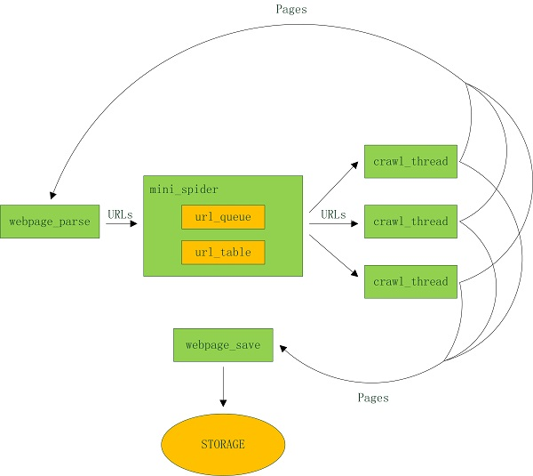

# 手把手教你写网络爬虫（2）：迷你爬虫架构   

## 介绍

大家好！ 回顾上一期，我们在介绍了爬虫的基本概念之后，就利用各种工具横冲直撞的完成了一个小爬虫，目的就是猛、糙、快，方便初学者上手，建立信心。 对于有一定基础的读者，请不要着急，以后我们会学习主流的开源框架，打造出一个强大专业的爬虫系统！ 不过在此之前，要继续打好基础，本期我们先介绍爬虫的种类，然后选取最典型的通用网络爬虫，为其设计一个迷你框架。 有了自己对框架的思考后，再学习复杂的开源框架就有头绪了。   

今天我们会把更多的时间用在思考上，而不是一根筋的 coding。用 80% 的时间思考，20% 的时间敲键盘，这样更有利于进步。   

## 语言&环境

语言：带足弹药，继续用 Python 开路！   

threading：threading 库可以在单独的线程中执行任何的在 Python 中可以调用的对象。Python 2.x 中的 thread 模块已被废弃，用户可以使用 threading 模块代替。在 Python 3 中不能再使用 thread 模块。为了兼容性，Python 3 将thread重命名为 _thread。   

queue：queue 模块中提供了同步的、线程安全的队列类，包括 FIFO（先入先出)队列 Queue， LIFO（后入先出）队列 LifoQueue，和优先级队列 PriorityQueue。 这些队列都实现了锁原语，能够在多线程中直接使用。可以使用队列来实现线程间的同步。   

re：Python 自 1.5 版本起增加了 re 模块，它提供 Perl 风格的正则表达式模式。re 模块使 Python 语言拥有全部的正则表达式功能。 

argparse：Python 用于解析命令行参数和选项的标准模块，用于代替已经过时的 optparse 模块。argparse 模块的作用是用于解析命令行参数。  

configparser：读取配置文件的模块。  

## 爬虫的种类

网络爬虫按照系统结构和实现技术，大致可以分为以下几种类型： 通用网络爬虫（General Purpose Web Crawler）、 聚焦网络爬虫（Focused Web Crawler）、 增量式网络爬虫（Incremental Web Crawler）、 深层网络爬虫（Deep Web Crawler）。实际的网络爬虫系统通常是几种爬虫技术相结合实现的。   

### 1. 通用网络爬虫

通用网络爬虫又称全网爬虫（Scalable Web Crawler）， 爬取对象从一些种子 URL 扩充到整个 Web。主要为门户站点搜索引擎和大型 Web 服务提供商采集数据。   

通用网络爬虫的结构大致可以分为页面爬取模块、 页面分析模块、 链接过滤模块、 页面存储模块、 URL 队列、 初始 URL 集合几个部分。为提高工作效率， 通用网络爬虫会采取一定的爬取策略。 常用的爬取策略有： 深度优先策略、广度优先策略。  

1) 深度优先策略（DFS）： 其基本方法是按照深度由低到高的顺序，依次访问下一级网页链接，直到不能再深入为止。  
2) 广度优先策略（BFS）： 此策略按照网页内容目录层次深浅来爬取页面，处于较浅目录层次的页面首先被爬取。 当同一层次中的页面爬取完毕后，爬虫再深入下一层继续爬取。   

### 2. 聚焦网络爬虫  

聚焦网络爬虫（Focused Crawler），又称主题网络爬虫（Topical Crawler），是指选择性地爬取那些与预先定义好的主题相关页面的网络爬虫。 和通用网络爬虫相比，聚焦爬虫只需要爬取与主题相关的页面，极大地节省了硬件和网络资源， 保存的页面也由于数量少而更新快， 还可以很好地满足一些特定人群对特定领域信息的需求。我们之前爬的歌单就属于这一种。   

### 3. 增量式网络爬虫  

增量式网络爬虫（Incremental Web Crawler）是指对已下载网页采取增量式更新和只爬取新产生的或者已经发生变化网页的爬虫， 它能够在一定程度上保证所爬取的页面是尽可能新的页面。 和周期性爬取和刷新页面的网络爬虫相比， 增量式爬虫只会在需要的时候爬取新产生或发生更新的页面， 并不重新下载没有发生变化的页面， 可有效减少数据下载量， 及时更新已爬取的网页，减小时间和空间上的耗费， 但是增加了爬取算法的复杂度和实现难度。现在比较火的舆情爬虫一般都是增量式网络爬虫。   

### 4. 深网爬虫

Web 页面按存在方式可以分为表层网页（Surface Web）和深层网页（Deep Web，也称 Invisible Web Pages 或 Hidden Web）。 表层网页是指传统搜索引擎可以索引的页面，以超链接可以到达的静态网页为主构成的 Web 页面。Deep Web 是那些大部分内容不能通过静态链接获取的、隐藏在搜索表单后的，只有用户提交一些关键词才能获得的 Web 页面。例如那些用户注册后内容才可见的网页就属于 Deep Web。   

## 一个迷你框架  

下面以比较典型的通用爬虫为例，分析其工程要点，设计并实现一个迷你框架。架构图如下：


 
代码结构：
```
config_load.py    配置文件加载
crawl_thread.py    爬取线程
mini_spider.py    主线程
spider.conf    配置文件
url_table.py    url队列、url表
urls.txt    种子url集合
webpage_parse.py    网页分析
webpage_save.py    网页存储
```
 
看看 spider.conf 配置文件里有什么内容：
```
[spider]
url_list_file: ./urls.txt
output_directory: ./output
max_depth: 2
crawl_interval: 1
crawl_timeout: 10
target_url: .*.html
thread_count: 5
```

### Step 1. 采用广度优先搜索算法 BFS 还是深度优先搜索算法 DFS？

理论上，这两个算法都能够在大致相同的时间里爬取整个互联网上的内容。但显然各个网站最重要的网页应该是它的首页。 在极端情况下，如果只能下载非常有限的网页，那么应该下载的所有网站的首页，如果把爬虫再扩大些，应该爬取从首页直接链接的网页，因为这些网页是网站设计者自己认为相当重要的网页。 在这个前提下，显然 BFS 明显优于 DFS。事实上在搜索引擎的爬虫里，主要采用的就是 BFS。我们的框架采取这种策略。  

抓取深度可以通过配置文件中的 max_depth 设置，只要没到达指定深度，程序就会不停的将解析出的 url 放入队列中：  

```python
# mini_spider.py

    # 向队列中填充URLs
    cur_depth = 0
    depth = conf.max_depth
    while cur_depth <= depth:
        for host in hosts:
            url_queue.put(host)
            time.sleep(conf.crawl_interval)
        cur_depth += 1
        web_parse.cur_depth = cur_depth
        url_queue.join()
        hosts = copy.deepcopy(u_table.todo_list)
        u_table.todo_list = []
```
### Step 2. 初始 URL 集合、URL 队列  

我们来看看通用爬虫如何下载整个互联网。 假设从一家门户网站的首页出发，先下载这个网页（深度=0）, 然后通过分析这个网页，可以找到页面里的所有超链接， 也就等于知道了这家门户网站首页所直接连接的全部网页， 诸如京东理财、京东白条，京东众筹等（深度=1）。 接下来访问、下载并分析京东理财等网页，又能找到其他相连的网页（深度=2）。 让计算机不停的做下去，就能下载整个网站。  

在这个过程中，我们需要一个“初始 URL 集合”保存门户的首页，还需要一个“URL 队列”保存分析网页得到的超链接。   

```python
# mini_spider.py
hosts = copy.deepcopy(conf.urls)
hosts = list(set(hosts))

...
# 创建队列实例
url_queue = queue.Queue()
```
 
```python
# url_table.py
class UrlTable:
    def __init__(self, urls):
        self.todo_list = []
        self.all_urls = {}
        for url in urls:
            self.all_urls[url] = 0
```

### Step 3. 记录哪些网页已经下载过的小本本 —— URL表  

在互联网上， 一个网页可能被多个网页中的超链接所指向。 这样在遍历互联网这张图的时候， 这个网页可能被多次访问到。 为了防止一个网页被下载和解析多次， 需要一个URL表记录哪些网页已经下载过。再遇到这个网页的时候，我们就可以跳过它。  

```python
# crawl_thread.py
def add_url(self, ans):
    """
    如果地址不与已有的重复, 则添加到 todo_list
    """
    if lock.acquire():
        if ans not in self.u_table.all_urls:
            self.u_table.all_urls[ans] = 0
            self.u_table.add_todo_list(ans)
        else:
            logging.debug("Duplicated url: %s" % ans)
        lock.release()
    else:
        logging.debug("Lock error")
```

### Step 4. 多个抓取线程

为了提升爬虫性能，需要多个抓取线程， 从 URL 队列获取链接进行处理。 多线程并没什么毛病，但 Python 的多线程可能会引起很多人的质疑，这源于 Python 设计之初的考虑：GIL。 GIL 的全称是 Global Interpreter Lock(全局解释器锁)，某个线程想要执行，必须先拿到 GIL，并且在一个 Python 进程中，GIL 只有一个。结果就是 Python 里一个进程永远只能同时执行一个线程，这就是为什么在多核 CPU 上，Python 的多线程效率并不高。那么我们为什么还要用 Python 多线程呢？   

CPU 密集型代码(各种循环处理、编解码等等)，在这种情况下，由于计算工作多，ticks 计数很快就会达到阈值，然后触发 GIL 的释放与再竞争（多个线程来回切换当然是需要消耗资源的），Python 下的多线程对 CPU 密集型代码并不友好。   

IO 密集型代码(文件处理、网络爬虫等)， 多线程能够有效提升效率(单线程下有 IO 操作会进行 IO 等待，造成不必要的时间浪费，而开启多线程能在线程 A 等待时，自动切换到线程 B，可以不浪费 CPU 的资源，从而能提升程序执行效率)。Python 的多线程对 IO 密集型代码比较友好。  

所以，对于 IO 密集的爬虫程序，使用 Python 多线程是没问题的。  

```python
# crawl_thread.py
def run(self):
    """
    URL打开, 保存, 分析
    """
    while True:
        # 从队列中获取一个URL
        host = self.queue.get()
        try:
            url = urllib.request.urlopen(host, data=None, timeout=self.config.crawl_timeout)
            # 分析字符编码, 并以该编码读取网页
            charset = ContentMetaAttributeValue.CHARSET_RE.search(url.headers['content-type'])
            charset = charset and charset.group(3) or None
            response = BeautifulSoup(url.read(), "html.parser", from_encoding=charset)
        except urllib.error.HTTPError as e:
            logging.debug("Exception: %s" % e.code)
            continue
        except urllib.error.URLError as e:
            logging.debug("Exception: %s" % e.reason)
            continue
        except Exception as e:
            logging.debug("Exception: %s" % e)
            continue
        finally:
            # 标记队列工作已完成
            self.queue.task_done()

        # 保存网页
        self.web_save.save(host, response, threading.current_thread().getName())

        # 如果当前网页不是最大深度, 则分析该网页, 提取urls
        if self.web_parse.cur_depth < self.config.max_depth:
            ans_list = self.web_parse.parse(host, response)
            for ans in ans_list:
                self.add_url(ans)
```

### Step 5. 页面分析模块

从网页中解析出 URLs 或者其他有用的数据。这个是上期重点介绍的，可以参考之前的代码。  

```python
# webpage_parse.py
class WebParse:
    """
    网页分析
    """
    def __init__(self, target_url):
        self.target_url = target_url
        self.cur_depth = 0

    def parse(self, host, response):
        """
        根据正则表达式提取URL
        """
        ans_list = []
        content = response.findAll('a')
        pat = re.compile(r'href="(%s)"' % self.target_url)
        pat2 = re.compile(r'http')
        for item in content:
            h = pat.search(str(item))

            if h is None:
                continue
            href = h.group(1)
            if pat2.search(href):
                ans = href
            else:
                if '/' in str(host[7:]):
                    ans = str(host[0:str(host).rindex('/')]) + '/' + href
                else:
                    ans = str(host) + '/' + href
            ans_list.append(ans)
        return ans_list

```

### Step 6. 页面存储模块  

保存页面的模块，目前将文件保存为文件，以后可以扩展出多种存储方式，如 mysql，mongodb，hbase 等等。  

```python
# webpage_save.py
class WebSave:
    """
    网页保存
    """
    def __init__(self, output_dir):
        self.output_dir = output_dir

    def save(self, host, response, thread_name):
        """
        保存指定的网页
        """
        url_name = str(host).split('//')[1]
        url_name = url_name.replace('/', '-')
        filename = self.output_dir + '/' + url_name
        logging.debug("%s - %s - File saved: %s" %
                      (time.strftime(ISO_TIME_FORMAT, time.localtime()), thread_name, filename))

        try:
            saved_file = open(filename, 'w', encoding='utf-8')
            saved_file.write(str(response))
            saved_file.close()
        except IOError as e:
            logging.debug("IOError: %s" % e)

```
写到这里，整个框架已经清晰的呈现在大家眼前了， 千万不要小看它， 不管多么复杂的框架都是在这些基本要素上扩展出来的。    


## 下一步

基础知识的学习暂时告一段落，希望能够帮助大家打下一定的基础。下期开始为大家介绍强大成熟的爬虫框架 Scrapy， 它提供了很多强大的特性来使得爬取更为简单高效！   

