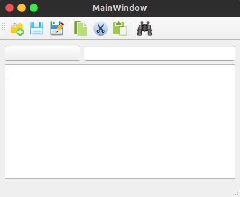

# Qt布局管理器  

> 

Qt中的布局管理器主要包括QBoxLayout基本布局管理器、QGridLayout栅格布局管理器和QFormLayout窗体布局管理器，而基本布局管理器又分为QHBoxLayout水平布局管理器和QVBoxLayout垂直布局管理器。  

## 1. 完善菜单  

可以将动作编辑器中的动作拖动到工具栏中作为快捷图标使用.  

可以在工具栏上右击来添加分隔符.  

## 2. 垂直布局管理器  

可以选中布局管理器，然后按下上方工具栏中的 “打破布局” 按钮来删除布局管理器。（当然也可以先将三个按钮移出，然后按下 Delete 键来删除布局管理器，如果不移出按钮，那么会将它们同时删除）.  

下面使用分裂器（QSplitter）来进行布局，先同时选中三个按钮，然后按下上方工具栏中的“使用分裂器垂直布局”按钮. 然后进行放大，可以发现，使用分裂器按钮纵向是可以变大的，这就是分裂器和布局管理器的重要区别。   

布局管理器除了可以对部件进行布局以外，还有个重要用途，就是使部件随着窗口的大小变化而变化。我们删除界面上的部件，然后拖入一个文本编辑器Text Edit部件。   

## 3. 纯代码设计布局界面   

~~~cpp

~~~

栅格布局管理会将所有的空间分隔成一些行和列，行和列的交叉处形成单元格，然后将部件放到指定的单元格中。这里新建了一个按钮部件和一个行编辑器部件，它们在界面上放到同一行，后者宽度是前者的两倍，然后将界面上已有的文本编辑器部件放到它们下面.  

