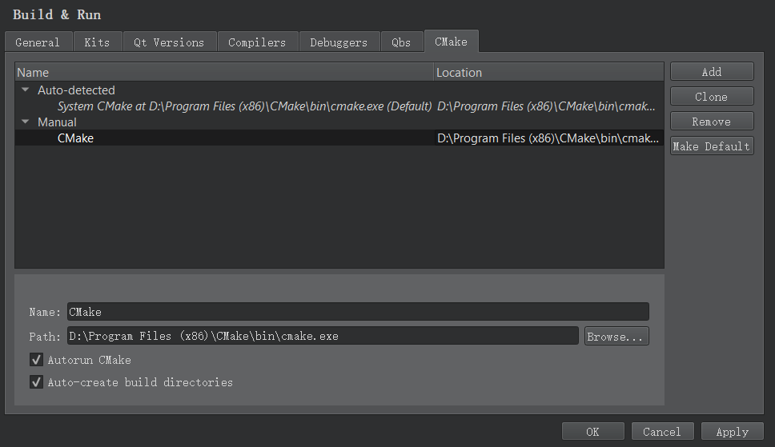
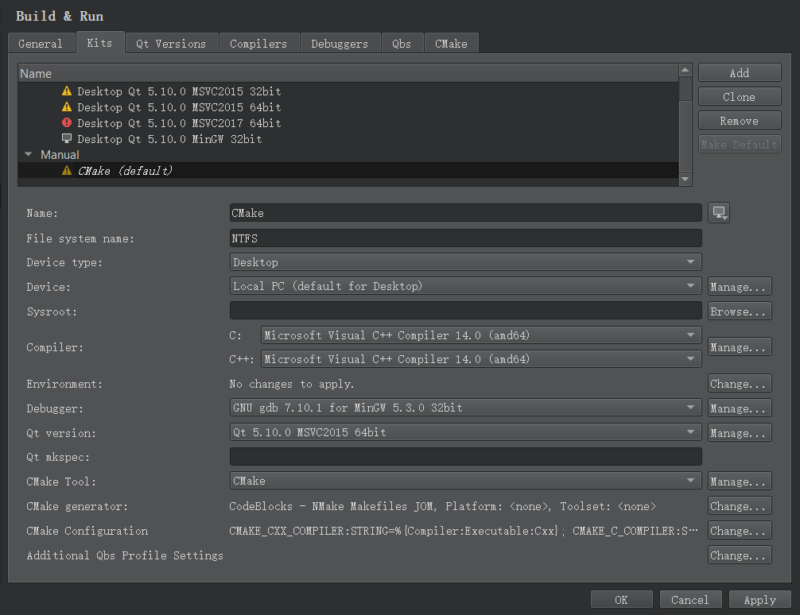

# Setting Up a CMake Project

CMake is an alternative to qmake for automating the generation of build configurations. It controls the software compilation process by using simple configuration files, called CMakeLists.txt files. CMake generates native build configurations and workspaces that you can use in the compiler environment of your choice.

Qt Creator automatically detects the CMake executable specified in the PATH. You can add paths to other CMake executables and use them in different build and run kits.

## 1. Adding CMake Tools

Qt Creator supports CMake version 3.0, or later.

To specify paths to CMake executables and to add them to kits:

1. 选择 Tools | Options | Build & Run | CMake | Add.  



- In the Name field, specify a name for the tool.  
- In the Path field, specify the path to the CMake executable.
选择 Apply to save your changes.  
- 选择 the Kits tab to add the CMake tool to a build and run kit. The kit also specifies the CMake Generator that is used for producing project files for Qt Creator and the configuration variables that are used:  



## 2. 新建 CMake 工程  

To create a CMake project:   

选择 File | New File or Project | Non-Qt Project | Plain C Application 或 Plain C++ Application | Choose.  


- In the Name field, enter a name for the project.  
- In the Create in field, enter the path for the project files, and then select Next (or Continue on OS X).  
- In the Build system field, select CMake, and then select Next.  
- Select CMake kits for the platforms that you want to build the application for, and then select Next.  
- Review the project settings, and click Finish (or Done on OS X).  
- Select Run CMake to generate a .cbp file.  


Some projects require command line arguments to the initial CMake call. CMake will remember the arguments during subsequent calls.

Qt Creator generates a main.cpp and CMakeLists.txt file that you can modify in the Edit mode.

## 打开 CMake Projects

To open an existing CMake project:

选择 File | Open File or Project.
Select the CMakeLists.txt file from your CMake project.
Select a kit that is configured to use CMake for building the project.
In Projects, right-click the project name to open the context menu, and then select Run CMake to have the project contents listed in the view.
Editing CMake Configuration Files
To open a CMakeLists.txt file for editing, right-click it in the Projects view and select Open with | CMake Editor.

The following features are supported:

Pressing F2 when the cursor is on a filename to open the file
Keyword completion
Auto-indentation
Matching parentheses and quotes
Building CMake Projects
To build CMake projects, select Build Project or press Ctrl+B (or Cmd+B on OS X).

Qt Creator builds CMake projects by running make, mingw32-make, nmake, or ninja depending on the selected kit.

By default, Qt Creator uses the Default build configuration. You can select another build configuration in Projects | Build Settings | Edit build configuration. In addition to debug and release build configurations, you can create a release build that contains debug information or a release build with the smallest possible size.


In the Build directory field, you can specify the directory in which the project is built (shadow build).

To view all settings, select the Advanced check box.

To modify the value of a build setting, select it, and then select Edit. The new value is displayed in italics until you save the changes by selecting Apply Configuration Changes. Any configuration change might trigger a follow-up configuration change, so keep saving until no more values are displayed in italics.

You can add arguments and targets for the build command in Build Steps.


You can add arguments and targets for the clean command in Clean Steps.


The build errors and warnings are parsed and displayed in the Issues output pane.

## Running CMake Projects 


Qt Creator automatically adds Run Configurations for all targets specified in the CMake project file.


To run CMake projects, select Run or press Ctrl+R (or Cmd+R on OS X).

Deploying CMake Projects to Embedded Linux Devices
Qt Creator cannot extract files to be installed from a CMake project, and therefore, only executable targets are automatically added to deployment files. You must specify all other files in the QtCreatorDeployment.txt file that you create and place in either the root directory of the CMake project or the build directory of the active build configuration. Currently, Qt Creator first checks the root directory and only if no QtCreatorDeployment.txt exists it checks the active build directory.

Use the following syntax in the file:

<deployment/prefix>
<relative/source/file1>:<relative/destination/dir1>
...
<relative/source/filen>:<relative/destination/dirn>
Where:

<deployment/prefix> is the (absolute) path prefix to where files are copied on the remote machine.
<relative/source/file> is the file path relative to the CMake project root. No directories or wildcards are allowed in this value.
<relative/destination/dir> is the destination directory path relative to deployment/prefix.
To automate the creation of QtCreatorDeployment.txt file:

Define the following macros in the top level CMakeLists.txt file:
file(WRITE "${CMAKE_SOURCE_DIR}/QtCreatorDeployment.txt" "<deployment/prefix>\n")

macro(add_deployment_file SRC DEST)
    file(RELATIVE_PATH path ${CMAKE_SOURCE_DIR} ${CMAKE_CURRENT_SOURCE_DIR})
    file(APPEND "${CMAKE_SOURCE_DIR}/QtCreatorDeployment.txt" "${path}/${SRC}:${DEST}\n")
endmacro()

macro(add_deployment_directory SRC DEST)
    file(GLOB_RECURSE files RELATIVE "${CMAKE_CURRENT_SOURCE_DIR}" "${SRC}/*")
    foreach(filename ${files})
        get_filename_component(path ${filename} PATH)
        add_deployment_file("${filename}" "${DEST}/${path}")
    endforeach(filename)
endmacro()
Use add_deployment_file(<file/name>) to add files and add_deployment_directory(<folder/name>) to add directories (including subdirectories) to the QtCreatorDeployment.txt file.
Re-run cmake after you add or remove files using the macros.
Adding External Libraries to CMake Projects
Through external libraries, Qt Creator can support code completion and syntax highlighting as if they were part of the current project or the Qt library.

Qt Creator detects the external libraries using the FIND_PACKAGE() macro. Some libraries come with the CMake installation. You can find those in the Modules directory of your CMake installation.

Note: If you provide your own libraries, you also need to provide your own FindFoo.cmake file. For more information, see CMake FAQ.

Syntax completion and highlighting work once your project successfully builds and links against the external library.

Using Other Build Systems


## issues  

1) 遇到问题 xxx is not able to compile a simple test

```bash
 xxx is not able to compile a simple test
:-1: error: Generator: execution of make failed. Make command was: “jom” “/NOLOGO” “all”
```

问题就应该出现在 QT Creator 调用 cmake 时出现了问题。一番搜索之后，发现 jom.exe 是 QTCreator/bin 下面的一个可执行文件，是 QT Creator 调用该可执行文件出现了问题吗？找不到该文件？  

解决方法: 将 QTCreator 的可执行目录 ( C:\Qt\Qt5.9.4\Tools\QtCreator\bin) 加入 Windows 的 Path 变量后，重新启动 QTCreator, 打开上述项目成功。  

## 定制化设置  

(1) 设置 Default Build Directory  

选择 Tools | Options | Build & Run | 概要 | Default Build Directory. 将其设置为 build/. 

默认的的 Build 路径为: `../%{JS: Util.asciify("build-%{CurrentProject:Name}-%{CurrentKit:FileSystemName}-%{CurrentBuild:Name}")}`

其中 `%{CurrentBuild:Name}:`表示编译类型, 例如 Release / Default / Debug.  

(2) 工程创建完毕后会直接利用当前的 CMakeLists.txt 在 build/ 目录中生成 Makefile. 因此不必显式指定 ../ 为编译目录.  

(3) 去掉: QT_QMAKE_EXECUTABLE 预定义 CMake 变量  

a) 选择 Tools | Options | Build & Run | 构建套件 | 手动设置 | Desktop Qt 5.10.0 MSVC2017 64bit. 

- 在 CMakeConfiguration 中去掉 QT_QMAKE_EXECUTABLE:STRING=%{Qt:qmakeExecutable};   

b) 选择 Tools | Options | Build & Run | 构建套件 | 手动设置 | cmake. 

**注意这个 cmake 构建套件需要提前设置好**. 

- 设置好 QT 版本和编译器版本;  
- 在 CMakeConfiguration 中去掉 QT_QMAKE_EXECUTABLE:STRING=%{Qt:qmakeExecutable};  

## Qt VTK PCL CMake 工程实例  

```cmake
cmake_minimum_required(VERSION 3.10)

project(pcl_visualizer)

set(CMAKE_BUILD_TYPE Release)

# init_qt: Let's do the CMake job for us
set(CMAKE_AUTOMOC ON) # For meta object compiler
set(CMAKE_AUTORCC ON) # Resource files
set(CMAKE_AUTOUIC ON) # UI files
set (CMAKE_AUTOUIC_SEARCH_PATHS src)

# Find includes in corresponding build directories
set(CMAKE_INCLUDE_CURRENT_DIR ON)
include_directories( include )

# Find the QtWidgets library
set( VTK_DIR "D:/thirdparty20170624/vtk/build")
find_package(VTK REQUIRED)
include_directories(${VTK_INCLUDE_DIRS})
link_directories(${VTK_LIBRARY_DIRS})

set( PCL_DIR "C:/PCL_181/cmake")
find_package(PCL 1.8 REQUIRED)
include_directories(${PCL_INCLUDE_DIRS})
link_directories(${PCL_LIBRARY_DIRS})
add_definitions(${PCL_DEFINITIONS})

find_package(Qt5 REQUIRED Widgets)  #  Core Gui

# Fix a compilation bug under ubuntu 16.04 (Xenial)
# list(REMOVE_ITEM PCL_LIBRARIES "vtkproj4")

FILE(GLOB SRCS_FILES src/*.cpp src/*.c src/*.cc src/*.cxx)
FILE(GLOB HDS_FILES include/*.hpp include/*.h include/*.hh include/*.hxx)
source_group(TREE ${CMAKE_SOURCE_DIR} FILES ${SRCS_FILES})
source_group(TREE ${CMAKE_SOURCE_DIR} FILES ${HDS_FILES})

add_executable(${PROJECT_NAME} ${SRCS_FILES} ${HDS_FILES})
# Qt5::Core  Qt5::Gui
target_link_libraries(${PROJECT_NAME} ${PCL_LIBRARIES} ${VTK_LIBRARIES} Qt5::Widgets)  
```