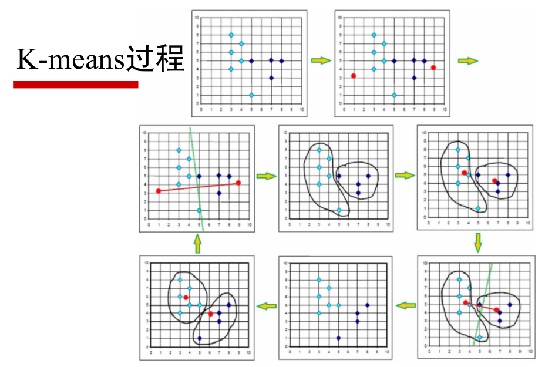
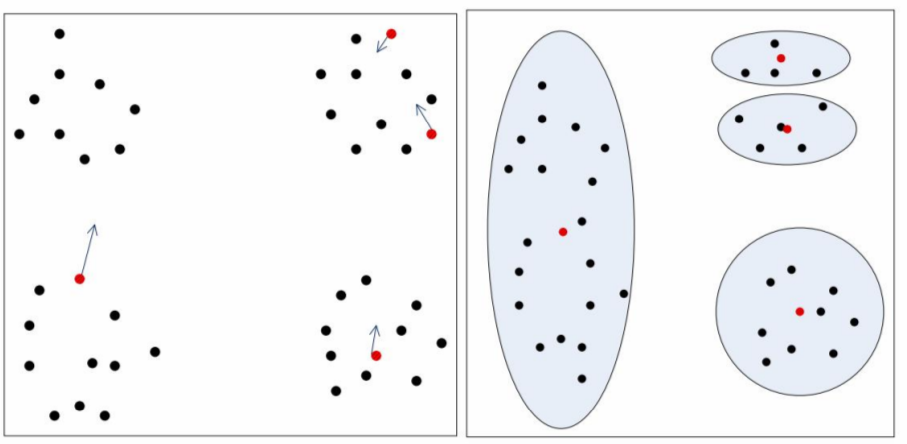

# K-means 聚类     

**基本实现**:    
1. 算法首先随机的选取 k 个对象, 每个对象初始化地代表了一个族的均值或中心;   
2. 对其余对象计算其与 k 个簇中心的距离, 并把它赋给最近的簇;  
3. 重新计算刚刚添加过对象的簇的平均值;
4. 重复步骤1, 直到准则函数(最小平方误差MSE函数)收敛.    
需要注意的是: 算法最后一定会收敛, 但是不一定收敛到最优结果.    

## 度量距离的常用方法        
相对熵(KL 距离)     

直观的理解一下 k = 2 时的 K-means 的迭代过程(取巧的话可以使用垂直平分线).    

    

K-means 是初值敏感的.     

    

那么如何改善 K-means 的敏感问题呢?    

把两个最后距离最近的中心点合并, 把距离其他中心点最远的中心点分割为 2 个.     

## KNN 和 K-Means 的区别    

|KNN|Means|
|:----|:----|
|目的是为了确定一个点的分类|目的是为了将一系列点集分成 k 类 |
|KNN是分类算法|K-Means是聚类算法|
|监督学习，分类目标事先已知|非监督学习，将相似数据归到一起从而得到分类，没有外部分类|
|训练数据集有label，已经是完全正确的数据|训练数据集无label，是杂乱无章的，经过聚类后才变得有点顺序，先无序，后有序|
|没有显式的学习过程，属于memory-based learning|有明显的前期训练过程|
|K的含义：“k”是用来计算的相邻数据数。来了一个样本x，要给它分类，即求出它的y，就从数据集中，在x附近找离它最近的K个数据点，这K个数据点，类别c占的个数最多，就把x的label设为c|K的含义：“k”是类的数目。K是人工固定好的数字，假设数据集合可以分为K个簇，由于是依靠人工定好，需要一点先验知识|
|K值确定后每次结果固定|K值确定后每次结果可能不同，从 n个数据对象任意选择 k 个对象作为初始聚类中心，随机性对结果影响较大|
|时间复杂度：O（n）|时间复杂度：O(n*k*t)，t为迭代次数|

相似点：都包含这样的过程，给定一个点，在数据集中找离它最近的点。即二者都用到了NN(Nears Neighbor)算法，一般用 KD 树来实现 KNN。    