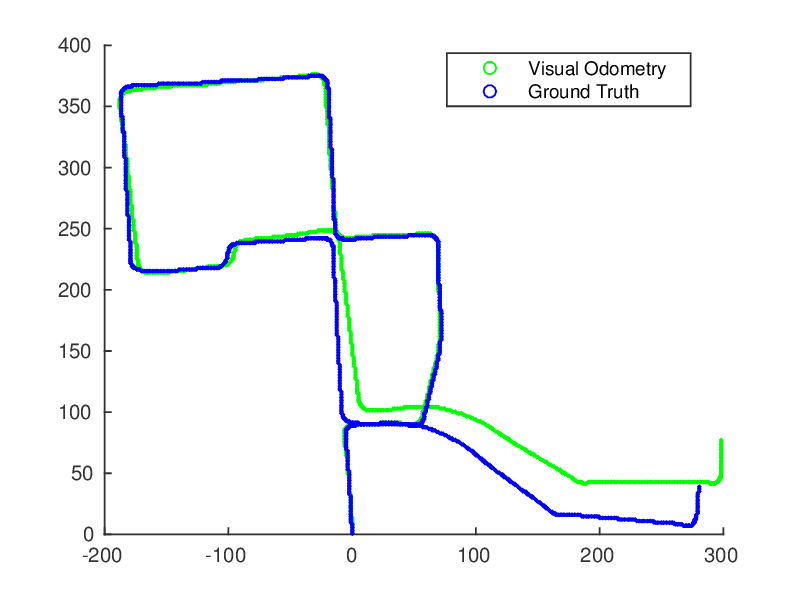

# 视觉里程计简介

> 本文英文博客原文: http://avisingh599.github.io/vision/monocular-vo/  

这篇博客主要讲述一个简单的视觉里程计 (Visual Odometry) 的实现。整个流程较为简单, 后续在此基础上对效率精度进一步提高。  

本文对应的源码: https://github.com/avisingh599/mono-vo   

## 什么是视觉里程计？   

首先我们看一看维基百科的介绍 https://en.wikipedia.org/wiki/Visual_odometry. 在机器人和计算机视觉问题中, 视觉里程计就是一个通过分析处理相关图像序列来确定机器人的位置和姿态。  

在汽车中有一个里程计, 记录着汽车行驶的距离, 可能的计算方式就是通过计算车轮滚动的次数乘以轮子的周长, 但是里程计会遇到精度的问题, 例如轮子打滑, 随着时间的增加, 误差会变得越来越大。而在机器人和视觉领域, 里程计不仅仅要估计行驶的距离, 还要知道机器人行驶的整个轨迹 (机器人每个时刻的位置和姿态). 对于每个时刻 *t*, 机器人的位置和姿态表示为 $(x_t,y_t,z_t,\alpha_t, \beta_t, \gamma_t)$, 其中 $x_t, y_t, z_t$ 表示机器人在世界坐标系中的位置信息, $\alpha_t, \beta_t, \gamma_t$ 为欧拉角, 表示机器人的姿态, 分布表示为$roll(\alpha_t), pitch(\beta_t), yaw(\beta_t)$.   

确定机器人轨迹的方法有很多, 这里主要介绍的是视觉里程计. 通常做法是将一个摄像头 (或多个摄像头阵列) 刚性连接到一个移动的物体上 (如机器人), 通过摄像头采集的视频流来确定相机的 6 自由度, 如果使用 1 个摄像头, 则称为单目视觉里程计 (Monocular Visual Odometry), 如果使用两个 (或者更多) 摄像机, 则称为立体视觉里程计 (Stereo Visual Odometry)。  

## 单目或立体视觉里程计   

主要阐述两者之间的优缺点, 立体视觉里程计的优点在于可以估算出精确的轨迹, 单目估计的轨迹和一个比例因子 (scale factor) 有关, 因此对于单目 VO, 可以说的是机器人在 X 方向上移动了一个单位, 但是对于立体 VO, 我们可以说机器人在 X 方向上移动了1米。另外对于立体 VO 计算的轨迹通常更精确 (因为提供了更多的数据), 但是在有些情况下, 如相机与观测物体的距离相距太远 (与立体 VO 中的两个相机之间的距离进行对比), 这样立体 VO 就退化为单目 VO; 另外考虑设备的装配, 单目更有一些优势, 比如在一些非常小的机器人上, (如: [robobees](http://robobees.seas.harvard.edu/publications)).  

## 单目视觉里程计的基本算法

主要阐述简单的算法过程, 基于 OpenCV3.0 进行简单实现, 后期进行扩展, 对效率及精度进行一步步优化。  

(1) 输入  

- 通过摄像头获取的视频流 (灰度或彩色图像) : 记录摄像头在 t 和 t+1 时刻获得的图像为 It 和 It+1;  
- 相机的内参: 通过相机标定获得, 可以通过 matlab 或者 OpenCV 计算.     

(2) 输出   

- 计算每相邻两帧之间相机的旋转矩阵 R 和平移矩阵 t, 表示两帧之间设备的运动情况.   

**需要说明的是**:  在单目视觉里程计中, 平移矩阵值是根据一个 scale factor 计算的.   

(3) 计算过程  

1) 获得两张相邻图像: $I^t, I^{t+1}$ ;   
2) 对两张图像 $I^t, I^{t+1}$ 进行畸变矫正处理;  
3) 使用 FAST 算法对图像 $I^t$ 进行特征检测;
4) 通过 KLT 算法跟踪这些特征到图像 $I^{t+1}$ 中, 如果跟踪的特征丢失导致特征数小于某个阈值, 则重新进行特征检测;  
5) 通过带 RANSAC 的 Nister’s 5 点算法来估计两幅图像的本质矩阵 E;  
6) 使用上一步计算的本质矩阵 E 估计 R,t;  
7) 借助外部的尺度信息 (例如车速表: speedometer) 确定旋转矩阵和平移向量;   

### 1. 畸变校正  

实际场景中的直线会由于畸变而在图像中变得弯曲, 因此需要通过畸变校正补偿图像中出现的弯曲. 畸变校正是利用相机标定阶段的畸变参数完成.

由于 KITTI 中的数据是经过矫正的, 因此可以省略这一步.  

OpenCV 中已经提供了现成的畸变校正函数: 

```cpp
void undistort(InputArray src, OutputArray dst, InputArray cameraMatrix, InputArray distCoeffs, InputArray newCameraMatrix=noArray() )
```

其中:  

- src – Input (distorted) image.
- dst – Output (corrected) image that has the same size and type as src.  
- cameraMatrix – Input camera matrix  A = $\vec{f_x},{0},{c_x} \quad {0},{f_y},{c_y} \quad {0},{0},{1}$.  
- distCoeffs – 畸变参数向量, $(k_1, k_2, p_1, p_2[, k_3[, k_4, k_5, k_6]])$, 向量元素可以是 4, 5, 或 8. If the vector is NULL/empty, the zero distortion coefficients are assumed.  
- newCameraMatrix – Camera matrix of the distorted image. By default, it is the same as cameraMatrix but you - may additionally scale and shift the result by using a different matrix.   

### 2. 特征检测  

本文使用 FAST 角点检测器. 

如果想深入了解 FAST, 可以阅读 FAST 的论文和代码: http://www.edwardrosten.com/work/fast.html   

简单介绍一下 FAST 算法.  如果想知道一个点 P 是否为角点, 在点 P 周围以半径为 3 绘制一个圆, 这个圆会穿过 16 个像素点. 比较这 16 个点和点 P 的亮度值, 如果存在连续的多个像素点的亮度值都大于点 P 的亮度值 ( 或连续的多个像素点的亮度值都大于点 P 的亮度值), 则认为点 P 为角点.  为了加速算法, 可以预先剔除非角点的像素点, 首先检查 16 个像素点中 1,9,5,13 和中心点 P 的亮度值关系, 如果至少有 3 个像素点的值大于或小于点 P, 则后续继续判断其他 12 个像素点; 否则该点 P 不是角点.   

特征提取是一个视觉问题的基础部分，虽然深度学习在特征提取问题中已经取得了不错的成果，但是在实用的角度（比如考虑效率）人工特征提取还很有必要，计算机视觉中常用的图像特征包括：点，边缘，直线，曲线等。在我们基础部分，我们主要考虑点特征，点特征也分为角点和斑点特征，对于经典的斑点特征提取SIFT，SURF等算法在执行效率上较为欠缺，目前我们主要使用FAST（features from accelerated segment test）特征提取算法。
FAST算法简单过程，假设有一个点p是我们要检测的点,如下图所示：


具体就是查看点p周围的16个点的像素值与该候选点灰度的差别是否够大（灰度值大于某个阈值），如果个数足够大（16个点中差值大于某个阈值的个数大于某个阈值，通常认为阈值为周长的四分之三），则认为该候选点位一个特征点。
为了获得更快的结果，作者通过对候选点周围中上下左右四点（即上图中1,5,9,13）先进行检查，这4个点中至少有3个点与候选点灰度值足够大，否则不用计算其它点，直接认为该候选点不是特征点，更详细的过程可以参考上述论文。

   

下面是基于 OpenCV 进行特征检测的示例代码:  

```cpp
void featureDetection(Mat img_1, vector<Point2f>& points1)
{ 
    vector<KeyPoint> keypoints_1;
    int fast_threshold = 20;
    bool nonmaxSuppression = true;
    FAST(img_1, keypoints_1, fast_threshold, nonmaxSuppression);
    KeyPoint::convert(keypoints_1, points1, vector<int>());
}
```

**注意**:  

上面示例代码中设置的参数在 KITTI 数据集的每张图片上可以检测到 ~4000 个特征点. 

如果你要在自己的数据集上进行测试, 那么需要调整这些参数.   

上面示例代码的最后一行将检测到的特征点类型从 KeyPoints 转换为 Point2f, 这样就可以直接传递给特征跟踪器 KLT (接下来就会介绍它).  

### 3. 特征跟踪  

KLT (https://cecas.clemson.edu/~stb/klt/) 特征跟踪器将会使用上一步 FAST 检测到的角点进行跟踪, 即在 $I^t$ 中检测到的角点会在下一帧中跟踪它.   

KLT 的策略是在新的图片中, 以上一步检测到的每个角点位置为基准, 在其邻域内搜索角点.   

如果将 $I^t$ 中的特征记为 $F^t$, 则 $I^{t+1}$ 中的对应特征为 $F^{t+1}$.  

以下是基于 OpenCV 进行 KLT 特征跟踪的示例代码:  

```cpp
void featureTracking( Mat img_1, Mat img_2, 
                      vector<Point2f>& points1, vector<Point2f>& points2, 
                      vector<uchar>& status)
{ 
    // this function automatically gets rid of points for which tracking fails
    vector<float> err;
    Size winSize=Size(21,21);

    TermCriteria termcrit=TermCriteria(TermCriteria::COUNT+TermCriteria::EPS, 30, 0.01);
    calcOpticalFlowPyrLK(img_1, img_2, points1, points2, status, err, winSize, 3, termcrit, 0, 0.001);

    // getting rid of points for which the KLT tracking failed or those who have gone outside the frame
    int indexCorrection = 0;
    for( int i=0; i<status.size(); i++) {  
        Point2f pt = points2.at(i- indexCorrection);
        if ((status.at(i) == 0)||(pt.x<0)||(pt.y<0)){
            
            if((pt.x<0)||(pt.y<0))	{
                status.at(i) = 0;
            }
            points1.erase (points1.begin() + i - indexCorrection);
            points2.erase (points2.begin() + i - indexCorrection);
            indexCorrection++;
        }
    }
}
```

**注意**:  

上面的示例代码中会剔除那些 KLT 追踪失败和出界的特征点.  

**Feature Re-Detection**  

KLT 跟踪可能会丢失某些特征点 (比如某些点跑到了相机视野范围外), 如果出现这种情况 (本方法中设置了一个固定的特征点数目阈值 2000 ), 需要重新检测特征点.   

### 3. 估计本质矩阵 - Essential Matrix Estimation   

一旦得到了相邻帧之间的特征点对, 就可以根据对极约束计算出相机的本质矩阵 E. 本质矩阵表示为:   

$$
y^{^T}_{_1}Ey_{_2} = 0
$$

其中,    

$y_{_1}, y_{_2}$ 是图像归一化的齐次坐标 (也叫归一化平面上的坐标);  

一旦我们找到了匹配的关键点对, 有多种方法可以计算本质矩阵 E.  

一种简单的算法是使用 8 点法; 还有一种方法是使用 5 点法, 可以得到更为准确的结果. 这些方法都是通过求解现行方程组, 因为本质矩阵只有 5 个自由度, 因此最少需要五个特征点对.  

### 4. RANSAC 随机一致性采样方法  

如果检测到的所有特征点对都是可用的, 但是估计相机运动一般只需要 5 (或 8) 个点.  

但是一般情况下, 特征跟踪算法结果并不准确, 可能会得到错误的结果. 对于可能含有错误的数据, 标准的处理方法是 RANSAC.  

这是一个迭代算法, 每个迭代中都会在所有点对中随机采样 5 个点对来估计本质矩阵 E, 然后使用这个本质矩阵来检查其余点是否满足本质矩阵公式表示. 迭代固定次数后算法停止, 最终的本质矩阵 E 应该选择符合以下条件的本质矩阵: 满足本质矩阵公式表示的特征点对最多.  

OpenCV 中计算本质矩阵的 API 如下:  

```cpp
E = findEssentialMat(points2, points1, focal, pp, RANSAC, 0.999, 1.0, mask);
```

### 5. 从本质矩阵 E 中计算 R, t  

本质矩阵还有一种表示方法:  

$$
E=t^{\text{^}}R
$$

其中,   

- $t^{\text{^}}$ 是 $t$ 的外积运算, 也就是 $t$ 对应的反对称矩阵 (具体请参考<<视觉 SLAM 十四讲>>);  
- $R$ 是旋转矩阵.  

对本质矩阵进行奇异值分解然后使用旋转矩阵 R 的约束条件可以得到下面的式子:  

$$
E=U\Sigma V^T \\
t^{\text{^}}=VW\Sigma V^T  \\
R=UW^{−1}V^T
$$

其中,   

- U, V 为正交矩阵;  
- $\Sigma$ 为奇异值矩阵, 根据 E 的内在性质可知:  $\Sigma = diag(\sigma, \sigma, 0)$ ;  

下面是 OpenCV 的内部实现:   

```cpp
recoverPose(E, points2, points1, R, t, focal, pp, mask);
```

### 6. Constructing Trajectory - 构建轨迹  

使用下面的方程就可以跟踪相机的运动轨迹:  

$$
R_{pos} = R R_{pos} \\
t_{pos} = t_{pos} + scale * R_{pos} t 
$$

其中,  

- $R_{pos}, t_{pos}$ 表示运动中相机的姿态.  
- $R, t$ 表示估计出的相机运动.  
- $scale$ 表示相机的平移运动的尺度信息.  

**Note**:  

单目相机估计出的平移向量 $t$ 是没有尺度信息的, 因此平移向量 $t$ 的尺度信息 scale 需要使用其他方式获取.   

在这篇文章中, 使用 KITTI 数据集中的 poses ground truth 信息中附带的尺度信息.  

### 7. Heuristics - 启发式思考  

大多数计算机视觉算法并没有启发式思考, 因此显得不太完整. 视觉里程计 VO 是个例外, 下面解释了使用到的启发式思考:  

**前向运动是主要的运动 (Dominant Motion is Forward)**  

整个视觉里程计算法是基于这样一个假设: 环境中的大多数点是刚体点. 然而, 假设场景中有一辆静止的轿车, 此时一辆公交经过这辆轿车形成遮挡, 那么算法就认为轿车移动出了路面 (这显然是不可能的). 因此, 如果在前向方向上没有找到一个主要的平移, 那么就忽略掉这次运动估计.  

### 8. 结果 - Results

看看算法在 KITTI 数据集上的运行效果.  

   

## 9. What next?  

这个实现中有一个主要的问题: 无法估计平移向量的相对尺度信息. 我尝试了很多方法, 但是都出现和很严重的 "尺度漂移" (“scale drift” ) 现象, 随着误差的累积, 最后的视觉里程计估计错误. 

## 参考博客  

- [Monocular Visual Odometry using OpenCV](http://avisingh599.github.io/vision/monocular-vo/)   
- [视觉里程计简介-冯兵](http://fengbing.net/2015/07/25/%E8%A7%86%E8%A7%89%E9%87%8C%E7%A8%8B%E8%AE%A1%E7%AE%80%E4%BB%8B/)    
- David Nister An efficient solution to the five-point relative pose problem (2004)   
