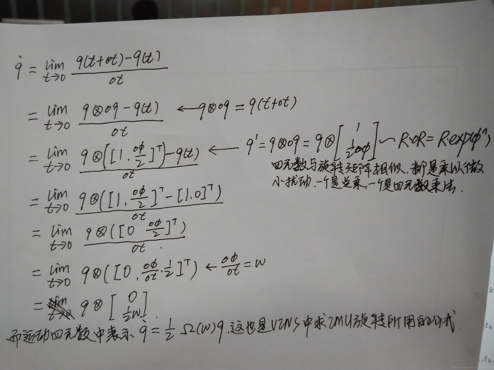
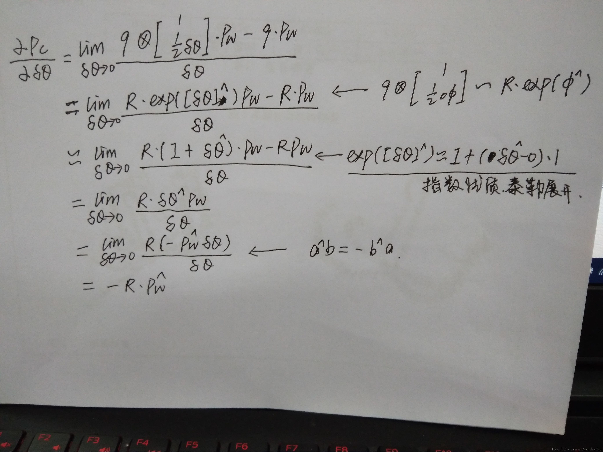

# VINS理论与代码详解 0——理论基础白话篇

VINS中比较难办的一个问题就是四元数旋转的计算，求导等问题。所以还是应该单独说明一下这部分内容。  

1.涉及到旋转四元数基本性质
在SLAM中所有涉及到的四元数旋转都是单位四元数，这一点很重要，所以要单独说出来，这和SLAM中的旋转矩阵是一致的，因为旋转矩阵是正交阵，他们都不会改变状态量的大小，只是方向上的变化。四元数的表示以及基本运算书上写的很清楚，就不多说了。

2.四元数求导
这部分在VINS中挺重要的，因为凡是涉及到IMU积分求四元数旋转都需要这部分理论知识。

  

VINS在计算IMU预积分旋转四元数的时候使用的都是第二个求导式子，在后面的求雅各比和协方差矩阵列状态误差传播方程的时候使用的是第一个推导的式子。

3.四元数与3D点乘积的求导
设Pc=q*Pw，其中Pc是相机坐标系下的点，Pw是世界坐标系下的点。由上面的公式可知，运动四元数的增量可以由δθ表示，因此求Pc对四元数增量δθ的倒数就可以表示对四元数的倒数。

  

## 参考博客  

https://www.zybuluo.com/Xiaobuyi/note/866099