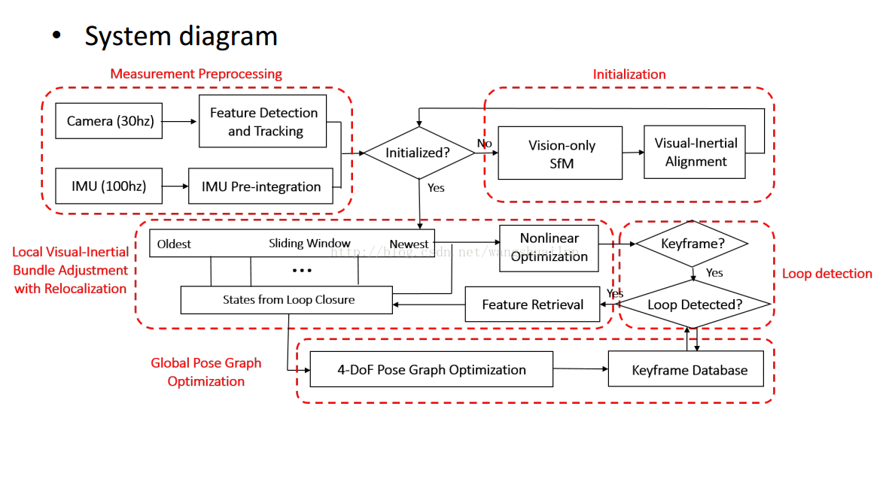

# VINS 理论与代码详解 1 - 框架解析  

     写在前面：本文整和自己的思路，希望对学习VINS或者VIO的同学有所帮助，如果你觉得文章写的对你的理解有一点帮助，可以推荐给周围的小伙伴们当然，如果你有任何问题想要交流，欢迎随时探讨。话不多说，下面上正文。   

    VINS 代码主要包含在两个文件中，分别是 feature_tracker和vins_estimate，feature_tracker就像文件的名字一样，总体的作用是接收图像，使用KLT光流算法跟踪；vins_estimate包含相机和IMU数据的前端预处理（也就是预积分过程）、单目惯性联合初始化（在线的标定过程）、基于滑动窗口的BA联合优化、全局的图优化和回环检测等。要想真正的理解一个SLAM框架，必须真正搞懂其对应的算法模型，然后才能研究其代码逻辑，最后做到相得益彰的效果，因此本次讲解主要是结合论文中的理论知识这和两个文件中的代码进行详细的探讨。整体的框架都比较熟悉，如下图所示，第一部分是Measuremen Preprocessing：观测值数据预处理，包含图像数据跟踪IMU数据预积分；第二部分是Initialization：初始化，包含单纯的视觉初始化和视觉惯性联合初始化；第三部分Local Visual-Inertia BA and Relocalization：局部BA联合优化和重定位，包含一个基于滑动窗口的BA优化模型；第四部分Global Pose Graph Optimization：全局图优化，只对全局的位姿进行优化；第五部分Loop detection：回环检测。

  

