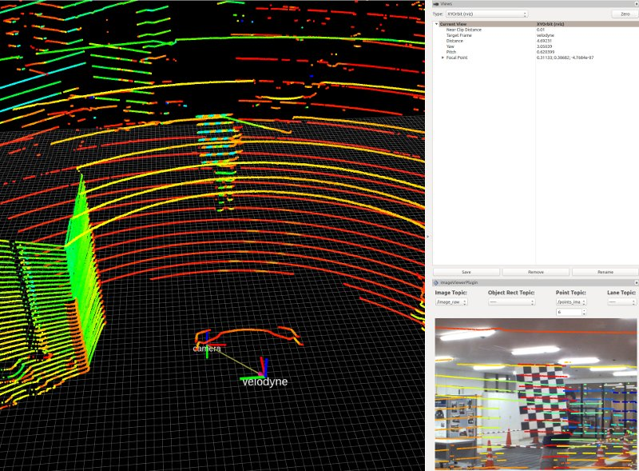

# 使用 Autoware 标定雷达和相机实践  

>　本文使用的 rosbag 数据来自 [这里](https://drive.google.com/open?id=16PdqoSVnvelMBUb1EpImWJoqm6Q9HX4N). 由于是谷歌网盘, 需要翻墙才能下载.   

> 本文的工作是在已经成功编译 Autoware 之后展开的.   

- Lidar: Velodyne-16, Camera: mindvision

## 如何录制和播放 rosbag 数据  

如果想要使用自己的雷达进行标定, 需要自己录制 rosbag 数据; 录制前确保磁盘空间充足.   

```bash
roslaunch velodyne_pointcloud 32c_points.launch
rosrun rviz rviz -f velodyne
rosbag record -a
```

Change downsample rosbag topic name to /points_raw

```bash
rosbag play -r 0.7 bag_name.bag /filtered_points:=/points_raw
```

播放 rosbag 数据就相对简单很多, 使用如下命令:  

```bash
rosbag play -l /path/to/yourBagFile.bag --clock
```

更详细的操作请参考: http://wiki.ros.org/openni_launch/Tutorials/BagRecordingPlayback.  

## 安装相机标定需要的依赖包

```bash
sudo apt-get install ros-melodic-camera-calibration
sudo apt install libcanberra-gtk-module libcanberra-gtk3-module

# 如果没有安装 gtk-module, 则会报如下错误: 
Gtk-Message: 16:36:24.790: Failed to load module "canberra-gtk-module"
```

## 查看 rosbag 信息

1) 查看 rosbag 发布的 topic  

```bash
$ rosbag info /path/to/yourBagFile.bag

path:        new_rectified.bag
version:     2.0
duration:    1:53s (113s)
start:       Nov 23 2016 06:32:14.41 (1479853934.41)
end:         Nov 23 2016 06:34:07.88 (1479854047.88)
size:        3.1 GB
messages:    5975
compression: none [1233/1233 chunks]
types:       sensor_msgs/CameraInfo  [c9a58c1b0b154e0e6da7578cb991d214]
             sensor_msgs/Image       [060021388200f6f0f447d0fcd9c64743]
             sensor_msgs/PointCloud2 [1158d486dd51d683ce2f1be655c3c181]
topics:      /sensors/camera/camera_info 2500 msgs: sensor_msgs/CameraInfo 
             /sensors/camera/image_color 1206 msgs: sensor_msgs/Image      
             /sensors/velodyne_points    2269 msgs: sensor_msgs/PointCloud2
```

2) 查看发布的数据节点  

```bash
rosrun image_view image_view image:=/sensors/camera/image_color
```

## 开始标定相机  

在联合标定雷达和相机之前需要先标定相机的内参. 下载好的 rosbag 数据中同时包含了相机数据和雷达点云数据, 使用下面的命令开始标定相机:   

```bash
rosrun camera_calibration cameracalibrator.py --size=7x5 --square=0.050 image:=/sensors/camera/image_color camera:=/sensors/camera/camera_info  --no-service-check

rosrun autoware_camera_lidar_calibrator cameracalibrator.py --square SQUARE_SIZE --size MxN image:=/image_topic

rosrun autoware_camera_lidar_calibrator cameracalibrator.py --size=7x5 --square=0.050 image:=/sensors/camera/image_color camera:=/sensors/camera/camera_info  --no-service-check
````

程序会自动检测可用于标定的关键帧, 当绿色进度条走完之后点击 "Calibration" 就可以开始标定了, 标定完成后点击 "Save" 就会将标定结果保存至 ${HOME} 目录. 以下是标定的输出信息:  

```bash
[image] width 964, height 724

[autoware_camera_calibration]

camera matrix
487.437853 0.000000 457.699899
0.000000 487.552100 366.122820
0.000000 0.000000 1.000000

distortion
-0.221347 0.119486 0.003050 0.000588 -0.030696

rectification
1.000000 0.000000 0.000000
0.000000 1.000000 0.000000
0.000000 0.000000 1.000000

projection
449.760590 0.000000 496.835175 0.000000
0.000000 487.552094 366.122817 0.000000
0.000000 0.000000 1.000000 0.000000

Wrote Autoware Calibration file in: /home/magic/20191202_1708_autoware_camera_calibration.yaml
Wrote calibration data to: /home/magic/20191202_1708_calibrationdata.tar.gz
```

## Camera-LiDAR 联合标定 - 外参标定  

通过单击图像和点云中的对应点来执行 Camera-LiDAR 外参标定. 此节点分别使用 rviz 包中的 clicked_point 和 image_view2 包中的 screenpoint.   

**1\.** 启动 camera_lidar_calibration.launch  

首先需要修改 `autoware.ai/install/autoware_camera_lidar_calibrator/share/autoware_camera_lidar_calibrator/launch/camera_lidar_calibration.launch` 文件:  

```xml 
<arg name="image_src" default="/image_raw" />
<arg name="camera_info_src" default="/camera_info" />
<arg name="camera_id" default="/" />

<!-- 将上面的几行替换为 -->
<arg name="image_src" default="/image_color" />
<arg name="camera_info_src" default="/camera_info" />
<arg name="camera_id" default="/sensors/camera/" />
```

然后在一个已经 source 过的终端输入下面的命令:  

```bash
roslaunch autoware_camera_lidar_calibrator camera_lidar_calibration.launch intrinsics_file:=/PATH/TO/YYYYmmdd_HHMM_autoware_camera_calibration.yaml image:=/sensors/camera/image_color 
roslaunch autoware_camera_lidar_calibrator camera_lidar_calibration.launch intrinsics_file:=/home/magic/20191202_1708_autoware_camera_calibration.yaml image:=/sensors/camera/image_color 
```

上述命令成功运行后将显示图像查看器. 关于命令行参数的描述如下:  

|参数| 类型 | 描述 | 
|------|-------|---------|
|image_src | string | 相机图像数据的 Topic, 默认是 /image_raw.|  
|camera_id | string | 如果不只一个相机, 应该将其设置为合适的相机空间; eg: /camera0 |
|intrinsics_file | string | 相机内参的标定信息文件.|
|compressed_stream | bool | 如果设置为 true, 会将压缩的视频流转换为未压缩的图像后再启动.|

**2\.** 播放 rosbag 数据  

```bash
rosbag play -l /path/to/yourBagFile.bag --clock
```

**3\.** 添加 tf 节点用于显示点云数据  

```bash
rosrun tf static_transform_publisher 1 0 0 1.5708 3.14159 1.5708 velodyne camera_optical 10
```

如果没有 tf 节点, 那么将会报错: For frame [velodyne]: Fixed Frame [world] does not exist.  

报错的原因是: 在 /tf tree 中没有 velodyne 节点. 解决办法是为 velodyne 坐标系手动添加一个 publisher, 这样就可以将 rviz 中的 `欧拉角/四元数` 坐标系转换为 velodyne 坐标系. 使用下面的命令可以告诉 rviz 将 velodyne 坐标系经过怎样的变换后进行发布:  

```bash
static_transform_publisher x y z qx qy qz qw frame_id child_frame_id period_in_ms

static_transform_publisher x y z yaw pitch roll frame_id child_frame_id period_in_ms
```

第一种使用的是四元数方法, 而第二种使用的是欧拉角方法. 其中 period_in_ms 表示发布的时间间隔.  

**4\.** 打开 Rviz 并显示点云和正确的纠正过的图像帧.  

```bash
rosparam set use_sim_time true
rosrun rviz rviz
```

打开 rviz 之后, 点击 add 添加 PointCloud2 组件, 将其对应的 Topic 设置为 /sensors/velodyne_points.  


**5\.** 通过单击图像和点云中的对应点来执行 Camera-LiDAR 外参标定  

同时观察图像和点云.  

- 1\) 在图像中找到一个可以匹配点云中对应点的点.   
- 2\) 单击图像中点的像素.   
- 3\) 在 rviz 中点击 Publish Point 工具栏图标, 然后在 Rviz 中单击和刚刚在图像中选取的相应 3D 点.  

需要使用 **至少 9 个** 不同的点重复此操作. 完成后, 文件将保存在 home 目录中, 名称为YYYYmmdd_HHMM_autoware_lidar_camera_calibration.yaml.   

点选图像中的点和 rviz 中的 3D 点时, 会打印如下信息:  

```bash
[ INFO] [1575339196.317630771]: Publish screen point /sensors/camera/image_rectified/screenpoint (367.000000 201.000000)
[367, 201]

Number of points: 0:1
[1.32931, -0.0015592, 0.114511]

Number of points: 1:1
PT_1[396, 173]
Pt[396, 173]
```

## 示例  

要测试标定结果, 可以在 Autoware 的 calibration_publisher 功能包中使用生成的 yaml 文件, 然后在 Sensing 选项卡中使用 Points Image.   

```bash
roslaunch src/util/packages/runtime_manager/scripts/calibration_publisher.launch file:=/home/s1nh/20190215_200018_autoware_lidar_camera_calibration.yaml image_topic_src:=/mynteye/left/image_raw

roslaunch /home/magic/work/gitwork/lidar_camera_calibration/autoware.ai/src/autoware/utilities/runtime_manager/scripts/calibration_publisher.launch file:=/PATH/TO/YYYYmmdd_HHMM_autoware_camera_calibration.yaml image_topic_src:=/sensors/camera/image_color 

roslaunch /home/magic/work/gitwork/lidar_camera_calibration/autoware.ai/src/autoware/utilities/runtime_manager/scripts/calibration_publisher.launch file:=/home/magic/20191203_101437_autoware_lidar_camera_calibration.yaml image_topic_src:=/sensors/camera/image_color 


rosparam set _points_node /sensors/velodyne_points
rosrun points2image points2image _points_node:=/sensors/velodyne_points
```

```bash
roslaunch runtime_manager runtime_manager.launch
```

启动 autoware runtime_manager, 执行完毕后，打开 rviz，选择 Panels –> Add New Panel –> ImageViewerPlugin，然后在新窗口中设置 Image Topic 为 /sensors/camera/image_color, 设置 Point Topic 为 /points_image.  

同时可以发布和对齐 LiDAR 与相机之间的转换.  


### Camera-LiDAR calibration example

To test the calibration results, the generated yaml file can be used in the `Calibration Publisher` and then the `Points Image` in the **Sensing** tab.



### Notes

This calibration tool assumes that the Velodyne is installed with the default order of axes for the Velodyne sensor.
* X axis points to the front
* Y axis points to the left
* Z axis points upwards

## 提高雷达相机联合标定精度的方法  

1) amc-nu answer  

Seems you haven’t performed both parts of the calibration 6.

First, obtain the intrinsic parameters for your camera using the “Camera Calibrator” 6

Once you got obtained and saved the file. You can proceed to extrinsic calibration 5.

Finally, with the complete file, don’t forget to “Register Camera-Lidar TF” when using in the calibration.publisher

2) Camera-Lidar Calibration with Autoware
Levi
Levi
show me the code
2 人赞同了该文章
（专栏的文章可以增加目录吗……为什么界面这么丑……


使用了9帧图像-点云标定后得到的结果（不是特别精确
安装环境：Ubuntu16.04 + ROS Kinetic + CUDA9.0 + Python2.7

使用硬件：速腾聚创16线激光雷达 + USB相机

1 安装 Autoware
1.1 写在前面

容器方式：v1.11.0 版本安装后界面中没有 Calibration Tool Kit（游戏结束）
源码方式：安装需要 C++14，注意 ~/.bashrc 里不要alias g++='g++ -std=c++14'
1.2 安装步骤

官方指南：autowarefoundation/autoware

将源码克隆到$HOME目录下，执行git submodule update --init --recursive
v1.11.0版本要 colcon，我们失败了（colcon的安装要先添加key，点这里），请看3
取而代之的，使用git checkout v1.10.0切换到支持catkin_make的最新版本
按照官方指南，依次执行命令，装好必须的依赖
在~/Autoware/ros目录下执行./catkin_make_release
然后是踩坑时间：
第一个报错：Python2.7找了Python3.5中的YAML库，将2.7的路径提前即可：

export PYTHONPATH=/usr/bin/python2.7/dist-packages/:$PYTHONPATH >> ~/.bashrc
第二个报错：PCL_INFO ("......") requires a indicator before statement：注释出错行

第三个报错：#error "PCL requires C++14 or above"：检查了编译参数已经gnu++14，故直接到出错文件pcl_config.h注释该行

7. 继续编译成功，回到~/Autoware/ros执行./run，输入密码进入主界面

2 联合标定
参考：无人驾驶汽车系统入门（二十二）——使用Autoware实践激光雷达与摄像机组合标定

2.1 刷新环境

echo "source ~/Autoware/ros/devel/setup.bash" >> ~/.bashrc
2.2 录制标定视频素材

打开：Autoware->ROSBAG，选择话题/usb_cam/image_raw和/points_raw
按照参考教程中的方式，将标定板变换不同角度，采集一段视频序列，作为标定素材
按照参考教程中的步骤，完成标定过程，得到相机与雷达的内外参数、畸变矩阵（.yml
2.3 可视化投影点云

除了下面的步骤，大致可按照参考教程顺利进行

2.3.1 修改雷达源数据话题

这一步，修改（或转发）你的雷达节点发出的数据话题名为/points_raw

为了正确实现标定，我们需要让工具箱的节点订阅到我们的雷达源数据和图像源数据
在ROS中，话题的订阅和发布是通过注册话题名来实现的，发布者与订阅者需要相同名字
在Autoware的源码中，写死了订阅雷达源数据的话题名为/points_raw
在Autoware的Calibration Toolkit中，仅可修改图像源数据的话题名，Image Source Topic
为了让节点订阅到正确的话题，我们修改自己的雷达发出的话题名为/points_raw
rostopic echo /points_raw，检查修改之后的话题是否在发布点云数据
2.3.2 检查相机源数据话题

这一步，检查相机发布的话题是否会与 Calibration Publisher 发布的话题发生冲突

rostopic list查看话题列表，这里由相机发布的是/usb_cam开头的topic
话题列表中可以找到/usb_cam/image_raw，/usb_cam是相机的 ID
/calibration_publiser发布/camera_info和投影矩阵/projection_matrix
/points2image必须正确订阅以上两个话题，才能完成点云到图像上的投影
假设选择/usb_cam作为Camera_ID ，Points Image 将订阅/usb_cam/camera_info
尝试修改 Calibration Publisher 的发布话题名为/usb_cam/camera_info
此时与相机发布的话题冲突，体现为终端报错：[/points2image] Process died
因此修改points2image.launch，删除$(arg camera_id)，即去掉话题名前缀
现在，Points Image 的订阅话题将不再以Camera_ID作为前缀
rosnode info /points2image，确保其订阅源为/calibration_publisher
3 注意事项
必须先打开软件中的 Calibration Toolkit 、Points Image 、Rviz，再打开相机雷达，否则 Calibration Toolkit 无法找到正确的标定文件路径（即使设置了），这是终端上的表现为：[/calibration_publisher] process died
在打开相机、雷达之前，仔细检查终端 echo 的消息中，上述两个工具的话题订阅信息
camera_frame、lidar_frame 的设置仅影响 Rviz 中的原点坐标，应该与雷达、相机话题发布者源码中的frame匹配，否则原点对不上，投影就乱了
但 frame 设置不会影响/points_image的正确显示，上述的话题订阅关系才是关键  

## 标定原理  

You can use our Python API to do this since API offers all of required information for sensor calibrations such as sensor positions, camera image sizes, or field of view of a camera. Below is an example to get sensor calibration between Lidar and camera for Autoware. If you created your own vehicle, just put your vehicle name, then it'll write a calibration result into a yaml file.  

```py
#!/usr/bin/env python3
#
# Copyright (c) 2019 LG Electronics, Inc.
#
# This software contains code licensed as described in LICENSE.
#

import os
import math
import lgsvl
import numpy as np
from pyquaternion import Quaternion
from lgsvl.utils import transform_to_matrix


class AutowareCalibration:
    def __init__(self, agent_name="XE_Rigged-autoware"):
        self.agent_name = agent_name
        self.scene_name = "SimpleMap"
        self.sim = lgsvl.Simulator(os.environ.get("SIMULATOR_HOST", "127.0.0.1"), 8181)
        if self.sim.current_scene != self.scene_name:
            self.sim.load(self.scene_name)
        self.sim.reset()
        self.ego = self.sim.add_agent(self.agent_name, lgsvl.AgentType.EGO)
        self._load_sensors()
    
    def _load_sensors(self):
        for sensor in self.ego.get_sensors():
            if sensor.name == "Main Camera":
                self.sensor_camera = sensor
            if sensor.name == "velodyne":
                self.sensor_lidar = sensor
    
    def calibrate(self):
        extrinsic_mat = self._get_extrinsic(self.sensor_lidar, self.sensor_camera)
        intrinsic_mat = self._get_intrinsic(self.sensor_camera)
        self._mat_to_str(extrinsic_mat, intrinsic_mat)
    
    def _mat_to_str(self, extrinsic_mat, intrinsic_mat):
        ext_str = ', '.join(['{:.12e}'.format(e) for e in extrinsic_mat.flatten()])
        int_str = ', '.join(['{:.12e}'.format(e) for e in intrinsic_mat.flatten()])
        yaml = '%YAML:1.0\n' \
            + '---\n' \
            + 'CameraExtrinsicMat: !!opencv-matrix\n' \
            + '   rows: 4\n' \
            + '   cols: 4\n' \
            + '   dt: d\n' \
            + '   data: [{}]\n'.format(ext_str) \
            + 'CameraMat: !!opencv-matrix\n' \
            + '   rows: 3\n' \
            + '   cols: 3\n' \
            + '   dt: d\n' \
            + '   data: [{}]\n'.format(int_str) \
            + 'DistCoeff: !!opencv-matrix\n' \
            + '   rows: 1\n' \
            + '   cols: 5\n' \
            + '   dt: d\n' \
            + '   data: [0., 0., 0., 0., 0.]\n' \
            + 'ImageSize: [{}, {}]\n'.format(self.im_width, self.im_height) \
            + 'ReprojectionError: 0.'
        
        with open('{}.yaml'.format(self.agent_name), 'w+') as f:
            f.write(yaml)

    def _get_extrinsic(self, lidar, camera):
        lid_to_ego = self._get_tf(lidar.transform)
        ego_to_lid = np.linalg.inv(lid_to_ego)
        cam_to_ego = self._get_tf(camera.transform)
        cam_to_lid = np.dot(ego_to_lid, cam_to_ego)

        quat1 = Quaternion(axis=(1, 0, 0), angle=-np.pi / 2)
        quat2 = Quaternion(axis=(0, 1, 0), angle=np.pi / 2)
        quat = quat1 * quat2
        tf = np.dot(cam_to_lid, quat.transformation_matrix)

        tmp = tf[2][3]
        tf[2][3] = tf[1][3]
        tf[1][3] = -tf[0][3]
        tf[0][3] = tmp

        return tf

    def _get_intrinsic(self, camera):
        self.im_width = camera.width
        self.im_height = camera.height
        aspect_ratio = self.im_width / self.im_height
        vertical_fov = camera.fov
        horizon_fov = 2 * math.degrees(math.atan(math.tan(math.radians(vertical_fov) / 2) * aspect_ratio))
        fx = self.im_width / (2 * math.tan(0.5 * math.radians(horizon_fov)))
        fy = self.im_height / (2 * math.tan(0.5 * math.radians(vertical_fov)))
        cx = self.im_width / 2
        cy = self.im_height / 2

        proj_mat = np.array([
            [fx, 0, cx],
            [0, fy, cy],
            [0, 0, 1],
        ])

        return proj_mat
    
    def _get_tf(self, tr):
        tf = np.eye(4)

        px = tr.position.x
        py = tr.position.y
        pz = tr.position.z

        ax = tr.rotation.x * math.pi / 180.0
        ay = tr.rotation.y * math.pi / 180.0
        az = tr.rotation.z * math.pi / 180.0

        sx, cx = math.sin(ax), math.cos(ax)
        sy, cy = math.sin(ay), math.cos(ay)
        sz, cz = math.sin(az), math.cos(az)

        tf[:3, :3] = np.array([
            [sx * sy * sz + cy * cz, cx * sz, sx * cy * sz - sy * cz],
            [sx * sy * cz - cy * sz, cx * cz, sy * sz + sx * cy * cz],
            [cx * sy, -sx, cx * cy],
        ])
        
        tf[:3, 3] = np.transpose([px, py, pz])

        return tf


if __name__ == "__main__":
    calib = AutowareCalibration()
    calib.calibrate()
```


## 参考资料  

[] lidar-camera-calib: https://github.com/aravindk2604/lidar-camera-calib.  
[] 多目相机、Velodyne标定那些破事: ttp://s1nh.org/post/calib-velodyne-camera/  


[] https://blog.csdn.net/learning_tortosie/article/details/82347694

