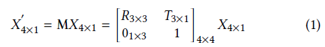
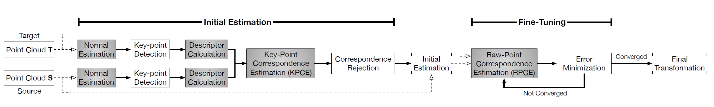

# Point Cloud Registration Pipeline  

"Tigris: Architecture and Algorithms for 3D Perception in Point Clouds" (MICRO'19). 论文地址: https://
doi.org/10.1145/3352460.3358259.   

github 代码地址: https://github.com/horizonresearch/pointcloud-pipeline. 实现了一种点云配准的流程, 并且提供了各种组件的灵活配置, 也可以向其中添加自己的实现.  

> 点云配准目标是: 计算两帧点云的转换矩阵, 然后合并为一个大的点云.  

> 应用: 移动机器人可以通过估计其实时的位姿 (旋转和平移矩阵) 来对齐连续的两帧点云数据, 完成地图重建.  

## Abstract 

本论文基于点云的配准 (point cloud registration), 其在里程计, SLAM 和 3D 重建场景中都有广泛应用. 这些场景要求: 功耗低, 实时性和高效点云配置.   
Tigris 是一种专门用于点云配准的算法框架. 通过对多种配置算法进行分析发现, KD-tree 搜索是点云配置算法效率的瓶颈. 本文提出了一种加速的 (acceleration-amenable) 数据结构和搜索算法, 该算法使用了不同于 KD-tree 搜索并行方式, 

exposes different forms of parallelism of KD-tree search in the context of point cloud registration. The co-designed accelerator systematically exploits the parallelism while incorporating a set of architectural techniques that further improve the accelerator efficiency.

在 RTX 2080 Ti GPU 硬件平台上, Tigris 在 KD-tree 搜索过程中加速了 77.2×, 并且节省了 7.4× 功耗, 最终将配准性能提升了 41.7%, 并且节约了 3.0× 功耗.  

## Introduction  

We present Tigris, a software-hardware system specialized for
3D point cloud registration. Tigris achieves high efficiency not
only by the specialized datapaths and control logics that mitigate
common inefficiencies in general-purpose processors, but also by a
combination of acceleration techniques that exploit unique characteristics
of point cloud registration. In particular, Tigris identifies
and exploits different forms of parallelism, captures unique data
reuse patterns while reducing the overall compute demand. Critically,
we enable these techniques by co-designing the data structure,
algorithm, and the accelerator architecture.

(1) large design space with many parameters that are often
collectively co-optimized given a particular design target. In
order to obtain general conclusions without overly specializing
for one particular design point, we first construct a configurable
registration pipeline,

(2) KD-tree search, however, is inherently sequential due to the recursive
tree traversal. To enable effective hardware acceleration,
we propose a parallel KD-tree search algorithm to introduce finegrained
parallelism that are amenable to hardware acceleration.
The algorithm builds on top of the two-stage KD-tree data structure,
a variant of KD-tree that provides high degrees of parallelism
by balancing recursive search with brute-force search. However,
two-stage KD-tree necessarily introduces lots of redundant computations
in increasing parallelism. To mitigate the redundancies,
we observe that point cloud registration is resilient to imprecisions
introduced in KD-tree search due to the noisy nature of point
cloud data. Our algorithm incorporates an approximate KD-tree
search procedure that reduces workload while presenting massive
parallelism to the hardware. 

The new data structure and algorithm in conjunction uniquely
expose two forms of parallelism in KD-tree search: query-level
parallelism (QLP) and node-level parallelism (NLP). The key design
principle of the hardware accelerator is to exploit the two forms of
parallelism with proper architectural mechanisms. Specifically, the
accelerator incorporates parallel processing elements (PE) to exploit
the QLP while applying pipelining to exploit the NLP within a query.
While parallel PEs and pipelining are well-established techniques,
effectively applying them in KD-tree search requires us to design a
set of architectural optimizations that leverage compute and data
access patterns specific to KD-tree search.

给定两个点云帧 S 和 T, 点云配准目标是: 估计一个转换矩阵 M, M 应该保证 S' 和 T 之间的欧式距离 (error) 最小. 其中 S' 是使用 M 将 S 上的所有点变换后的新点云.  

其中, $ X = [x,y, z, 1]^T $ and $ X′ = [x′, y′, z′, 1]^T$ 分别是 $X$ 和 $X′$ 的齐次坐标. 转换矩阵 M (4×4) 由旋转矩阵 R (3×3) 和 平移向量 T (3×1) 表示.  

总结一下这篇论文的主要贡献:  

- 发现了 KD-tree search 是点云配准算法的性能瓶颈;  
- 阐述了点云配准算法对 KD-tree search 引入的误差的容忍性;  
- 提出一种可修改的加速的 (acceleration-amenable) KD-tree 数据结构和搜索算法; 基于一种新的 two-stage KD-tree 数据机构, KD-tree 搜索算法可以实现大量的并行运算;  
- 基于上一步中的 KD-tree 搜索算法, 设计了一种算法加速框架, 完成了多方面的不同形式的并行加速;  

本文的论文结构安排如下:  

- Sec. 2 介绍了点云处理的背景;  
- Sec. 3 进行了算法设计空间探索, 确定了 KD-tree 搜索是点云配准算法的瓶颈;  
- Sec. 4 提出一种可修改的加速的 KD-tree 数据结构和搜索算法;  
- Sec. 5 介绍了对应的 Tigris 加速架构;  
- Sec. 6 介绍了试验方法和验证的结果;  
- Sec. 7 将 Tigris 和相关的论文进行比较;  
- Sec. 8 进行论文总结.  

  

在初始估计阶段, 通过在两个点云 S 和 T 中匹配一系列显著性的点, 然后估计一个初始的变换矩阵. 这个操作类似于图像处理中的关键点匹配.  

**(1) Normal Estimation**   计算所有点的表面法向量. 其中, 一个点的法向量是该点所在正切平面的垂直向量. 法向量是重要的 metadata, 在后续的特征描述子计算和关键点匹配中需要使用法向量;  
**(2) Key-Point Detection**  从两个点云 S 和 T 中检测关键点. 使用关键点信息可以提高前端部分的计算效率. 这里我们使用了连各种不同的特征提取算法: NARF [62] 和 SIFT [40, 59] 及其参数化特征方法: SIFT 特征尺度 (scale) 和 NARF 特征幅度 (range); 
**(3) Feature Descriptor Calculation**  计算每个关键点对应的特征描述子. 某一点的特征描述子是该点邻域信息的高维度表示, 因此特征描述子可以为点云配准提供丰富的特征信息; 该阶段中将原始 3D 点云空间转换到高维度的特征空间. 特征空间的维度取决于所使用是什么特征描述子. 这里使用了两个不同的特征描述子: FPFH [56] and SHOT [64], 并且不同的搜索半径来计算描述子;  
**(4) Key-Point Correspondence Estimation (KPCE)**  使用关键点的特征描述子建立两个点云 S 和 T 的关键点之间的匹配关系. 具体实现为, 对于两个点云中的两个关键点 s 和 t, 如果在特征空间中, 关键点 s 对应的特征描述子是 t 对应的特征描述子的最近邻, 则 KPCE 就会建立匹配 (correspondence).   
**(5) Correspondence Rejection**  移除不正确的匹配后得到一系列正确的关键点匹配关系, 利用这些匹配关系可以估计出变换矩阵 M. 这里使用经典的 RANSAC 算法 [19] 和简单的距离阈值算法.  

接下来进入 fine-tuning 阶段, 该阶段使用了 Iterative Closest Point 方法, 一共需要迭代两个阶段:  

**(1) Raw-Point Correspondence Estimation (RPCE)**  在原始点云坐标空间内建立转换后的点云 S' 和点云 T 之间的匹配关系. 对点云 S' 中的每个点, RPCE 会在点云 T 中搜索该点的最近邻点. 不同于 KPCE 的是, RPCE 是在原始的 3D 坐标空间中搜索;  
**(2) Transformation Estimation**  针对上一步中得到的匹配点对, 该阶段建立这些点对之间的 error 代价函数, 然后使用优化求解器最小化 error 来得到点云 S' 和 T 之间的变换矩阵 M', 然后使用 M' 将 S' 转换为 S''. S'' 成为新的 source 点云, 被送入 (1) 中的 RPCE 阶段继续迭代. error 代价函数使用的是 point-to-point 或 point-to-plane 的均方误差; 优化求解器使用的是奇异值分解 (Singular Value Decomposition) 和列文伯格-夸克 (Levenberg-Marquardt) 算法 [45]. **另外一个关键参数是收敛准则, 它直接决定了 ICP 的停止与否, 从而影响算法的精度和运行时间.**  

## 算法应用  

通过算法估计得到的转换矩阵 M, 将点云 S 变换到 S' 后合并到 T 点云中, 然后将 T 作为接下来的输入点云 S 继续下一帧检测.  

- 读取 pose_result_kitti.txt 文件中的内容到变换矩阵 $M_{\text{[4x4]}}$ 中;  
- 遍历点云 S, 使用 M 将其中的所有点 s 转换为 s';  
- 然后将其添加到点云 T 中, 两个点云 S 和 T 配准结束.  
