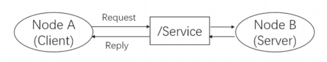

# Ubuntu 1804 运行 ROS-Academy-for-Beginners 工程  

> 源码: git clone -b melodic https://github.com/DroidAITech/ROS-Academy-for-Beginners.git  
> 讲义: https://sychaichangkun.gitbooks.io/ros-tutorial-icourse163/content/  
> 视频教程: https://www.icourse163.org/course/ISCAS-1002580008 

## 源码下载  

ROS-Academy-for-Beginners 的默认仓库是为 ubuntu1604 ros-kinect 开发的,  因此对于 ubuntu 1804,  需要切换到 melodic 分支:  

```bash
cd ~/tutorial_ws/src
git clone -b melodic https://github.com/DroidAITech/ROS-Academy-for-Beginners.git  
```

**编译程序**:  

```bash
cd ~/tutorial_ws
catkin_make
source ~/tutorial_ws/devel/setup.bash #刷新环境 方法一
```

**运行仿真程序:**  

```bash
roslaunch robot_sim_demo robot_spawn.launch

# 再打开一个新的终端，输入以下命令，用键盘控制机器人移动
rosrun robot_sim_demo robot_keyboard_teleop.py
```

## 1. ROS 简介  


## 2 ROS 文件系统 

### 2.1 Catkin_make 

Catkin 沿用了包管理的传统像 find_package() 基础结构,  pkg-config. 扩展了 CMake,  例如:  

- 软件包编译后无需安装就可使用;   
- 自动生成 find_package() 代码,   pkg-config 文件;  
- 解决了多个软件包构建顺序.   

一个 Catkin 的软件包（package）必须要包括两个文件:    

- package.xml: 包括了 package 的描述信息 name,  description,  version,  maintainer(s),  licenseopt. authors,  url's,  dependencies,  plugins,  etc...  
- CMakeLists.txt: 构建 package 所需的 CMake 文件调用 Catkin 的函数/宏,  解析 package.xml 找到其他依赖的 catkin 软件包,  并将本软件包添加到环境变量中.   

catkin_make 命令也有一些可选参数,  例如: 

```cmake
usage: catkin_make [-h] [-C DIRECTORY] [--source SOURCE] [--build BUILD]
                   [--use-ninja] [--use-nmake] [--force-cmake] [--no-color]
                   [--pkg PKG [PKG ...]]
                   [--only-pkg-with-deps ONLY_PKG_WITH_DEPS [ONLY_PKG_WITH_DEPS ...]]
                   [--cmake-args [CMAKE_ARGS [CMAKE_ARGS ...]]]
                   [--make-args [MAKE_ARGS [MAKE_ARGS ...]]]
                   [--override-build-tool-check]

optional arguments:
  -h,  --help            show this help message and exit
  -C DIRECTORY,  --directory DIRECTORY
                        The base path of the workspace (default '.')
  --source SOURCE       The path to the source space (default
                        'workspace_base/src')
  --build BUILD         The path to the build space (default
                        'workspace_base/build')
  --use-ninja           Use 'ninja' instead of 'make'
  --use-nmake           Use 'nmake' instead of 'make'
  --force-cmake         Invoke 'cmake' even if it has been executed before
  --no-color            Disables colored output (only for catkin_make and
                        CMake)
  --pkg PKG [PKG ...]   Invoke 'make' on specific packages only
  --only-pkg-with-deps ONLY_PKG_WITH_DEPS [ONLY_PKG_WITH_DEPS ...]
                        Whitelist only the specified packages and their
                        dependencies by setting the CATKIN_WHITELIST_PACKAGES
                        variable. This variable is stored in CMakeCache.txt
                        and will persist between CMake calls unless explicitly
                        cleared; e.g. catkin_make
                        -DCATKIN_WHITELIST_PACKAGES="".
  --cmake-args [CMAKE_ARGS [CMAKE_ARGS ...]]
                        Arbitrary arguments which are passed to CMake. It must
                        be passed after other arguments since it collects all
                        following options.
  --make-args [MAKE_ARGS [MAKE_ARGS ...]]
                        Arbitrary arguments which are passes to make. It must
                        be passed after other arguments since it collects all
                        following options. This is only necessary in
                        combination with --cmake-args since else all unknown
                        arguments are passed to make anyway.
  --override-build-tool-check
                        use to override failure due to using different build
                        tools on the same workspace.


-h,  --help 帮助信息
-C DIRECTORY,  --directory DIRECTORY 工作空间的路径 (默认为 '.')
--source SOURCE src 的路径 (默认为'workspace_base/src')
--build BUILD build 的路径 (默认为'workspace_base/build')
--use-ninja 用 ninja 取代 make
--use-nmake 用 nmake 取代 make
--force-cmake 强制 cmake,  即使已经 cmake 过
--no-color 禁止彩色输出(只对catkin_make和CMake生效)
--pkg PKG [PKG ...] 只对某个PKG进行make
--only-pkg-with-deps ONLY_PKG_WITH_DEPS [ONLY_PKG_WITH_DEPS ...] 将指定的package列入白名单CATKIN_WHITELIST_PACKAGES,  之编译白名单里的package. 该环境变量存在于CMakeCache.txt. 
--cmake-args [CMAKE_ARGS [CMAKE_ARGS ...]]传给CMake的参数
--make-args [MAKE_ARGS [MAKE_ARGS ...]]传给Make的参数
--override-build-tool-check
```

配置文件 *.yaml 一般放在 config/ 或 param/ 子文件夹下.   

### 2.2 package  

一个 package 可以编译出来多个目标文件（ROS 可执行程序、动态静态库、头文件等等）.   

一个package下常见的文件、路径有: 

```bash
├── CMakeLists.txt # package 的编译规则(必须)
├── package.xml    # package 的描述信息(必须),  
                   # manifest.xml 是属于 rosbuild 编译系统的包清单
├── src/           # 源代码文件
├── include/       # C++头文件
├── scripts/       # 可执行脚本
├── msg/           # 自定义消息
├── srv/           # 自定义服务
├── models/        # 3D模型文件
├── urdf/          # urdf文件
├── launch/        # launch文件 
```

**package 的创建**  

创建一个 package 需要在 catkin_ws/src 下,  用到 catkin_create_pkg 命令,  用法是:   

```bash
catkin_create_pkg package <depends>
```

其中 package 是包名,  depends 是依赖的包名,  可以依赖多个软件包.   

例如,  新建一个 package 叫做 test_pkg , 依赖 roscpp、rospy、std_msgs (常用依赖). 

```bash
$ catkin_create_pkg test_pkg roscpp rospy std_msgs
```

**package 相关命令**  

|        rospack 命令        |           功能描述          |
|:-------------------------:|:--------------------------:|
|rospack help               | rospack 命令的用法          |
|rospack list               | 列出本机所有的 packages     |
|rospack depends [package]  | 显示某个 package 的依赖包   | 
|rospack find [packages]    | 定位某个 package          |
|rospack profile            | 刷新所有的 package 路径记录 |
|roscd [pkg-name]           | 直接切换到包所在的目录下     |
|rosls [pkg-name]           | 直接列出包中的文件          |
|rosed [pkg-name] [file]    | 编辑指定包中的某个文件       |

rosdep 是用于管理ROS package依赖项的命令行工具，用法如下:     

|        rosdep 命令        |           功能描述          |
|:-------------------------:|:--------------------------:|
|rosdep install [pkg-name]  | 安装 pacakge 的依赖          |
|rosdep check [pkg-name]    | 检查 package 的依赖是否满足   |
|rosdep db                  | 生成和显示依赖数据库          |
|rosdep init                | 初始化 /etc/ros/rosdep 中的源|
|rosdep keys                | 检查 package 的依赖是否满足   |
|rosdep update              | 更新本地的 rosdep 数据库      |

一个较常使用的命令是:  

```bash
rosdep install --from-paths src --ignore-src --rosdistro=kinetic -y 
```

用于安装工作空间中 src 路径下所有 package 的依赖项（由 pacakge.xml 文件指定).  


**package 相关命令**  

CMakeLists.txt 的基本语法都还是按照 CMake，而 Catkin 在其中加入了少量的宏，总体的结
构如下:   

```bash
cmake_minimum_required() #CMake的版本号
project() #项目名称
find_package() #找到编译需要的其他CMake/Catkin package
catkin_python_setup() #catkin新加宏，打开catkin的Python Module的支持
add_message_files() #catkin新加宏，添加自定义Message/Service/Action文件
add_service_files()
add_action_files()
generate_message() #catkin新加宏，生成不同语言版本的msg/srv/action接口
catkin_package() #catkin新加宏，生成当前package的cmake配置，供依赖本包的其他软件包调用
add_library() #生成库
add_executable() #生成可执行二进制文件
add_dependencies() #定义目标文件依赖于其他目标文件，确保其他目标已被构建
target_link_libraries() #链接
catkin_add_gtest() #catkin新加宏，生成测试
install() #安装至至本机
```

### 2.3 文件系统使用工具

```bashwps
rospack find [packages]
catkin_create_pkg <pkg-name> [deps]
```


### 2.4 package.xml 写法  

```xml
<pacakge>                   根标记文件
<name>                      包名
<version>                   版本号
<description>               内容描述
<maintainer>                维护者
<license>                   软件许可证

<buildtool_depend>          编译构建工具，通常为 catkin
<depend>                    指定依赖项为编译、导出、运行需要的依赖，最常用
<build_depend>              编译依赖项
<exec_depend>               运行依赖项
<build_export_depend>       导出依赖项
<test_depend>               测试用例依赖项
<doc_depend>                文档依赖项
```

其中注意区分 `<build_depend>`,  `<exec_depend>` 和 `<depend>`. 因为有的运行依赖库和编译依赖库名字不同,  因此需要分别使用 `<build_depend>` 和 `<exec_depend>` 指定,  而对于名字相同的运行依赖库和编译依赖库,  可以使用 `<depend>` 来整合.  

metapacakge 中的以上两个文件和普通 pacakge 不同点是:   
- CMakeLists.txt :加入了catkin_metapackage()宏，指定本软件包为一个metapacakge.   
- package.xml :标签将所有软件包列为依赖项，标签中添加标签声明.   

metapacakge 在我们实际开发一个大工程时可能有用.  

```xml
<package>
    <name>ros_academy_for_beginners</name> 
    <description>
        --------------------------------------------------------------------------
        A ROS tutorial for beginner level learners. This metapacakge includes some
        demos of topic,  service,  parameter server,  tf,  urdf,  navigation,  SLAM...
        It tries to explain the basic concepts and usages of ROS.
        --------------------------------------------------------------------------
    </description>

    <!-- ... -->

    <buildtool_depend>catkin</buildtool_depend>

    <run_depend>navigation_sim_demo</run_depend>
    <run_depend>param_demo</run_depend>
    <run_depend>robot_sim_demo</run_depend>
    <run_depend>service_demo</run_depend>
    <run_depend>slam_sim_demo</run_depend>
    <run_depend>tf_demo</run_depend>
    <run_depend>topic_demo</run_depend>

    <export>
        <metapackage/>
    </export>
</package>
```

### 2.5 其他常见文件类型  

在 ROS 的 pacakge 中，还有其他许多常见的文件类型，这里做个总结.   

2.7.1 launch 文件  

launch 文件一般以 .launch 或 .xml 结尾，它对 ROS 需要运行程序进行了打包，通过一句命令来启动. 一般launch 文件中会指定要启动哪些 package 下的哪些可执行程序，指定以什么参数启动，以及一些管理控制的命令.  launch 文件通常放在软件包的 launch/ 路径中中.  launch 文件的具体写法见 3.2 节.   

2.7.2 msg/srv/action 文件  

ROS 程序中有可能有一些自定义的消息/服务/动作文件，为程序的发者所设计的数据结构，这类的文件以 .msg ,  .srv ,  .action 结尾，通常放在package的 msg/ ,  srv/ ,  action/ 路径下. msg文件写法见3.4节，srv文件写法见 3.6 节.    

2.7.3 urdf/xacro文件   

urdf/xacro 文件是机器人模型的描述文件，以 .urdf 或 .xacro 结尾. 它定义了机器人的连杆和关节的信息，以及它们之间的位置、角度等信息，通过 urdf 文件可以将机器人的物理连接信息表示出来. 并在可视化调试和仿真中显示. urdf 文件的写法见第七章.   

2.7.4 yaml 文件  

yaml 文件一般存储了 ROS 需要加载的参数信息，一些属性的配置. 通常在 launch 文件或程序中读取 .yaml 文件，把参数加载到参数服务器上. 通常我们会把 yaml 文件存放在 param/ 路径下.  

2.7.5 dae/stl 文件  

dae 或 stl 文件是 3D 模型文件，机器人的 urdf 或仿真环境通常会引用这类文件，它们描述了机器人的三维模型. 相比 urdf 文件简单定义的性状，dae/stl 文件可以定义复杂的模型，可以直接从 solidworks 或其他建模软件导出机器人装配模型，从而显示出更加精确的外形.    

2.7.6 rviz 文件  

rviz 文件本质上是固定格式的文本文件，其中存储了 RViz 窗口的配置（显示哪些控件、视角、参数）. 通常 rviz 文件不需要我们去手动修改，而是直接在 RViz 工具里保存，下次运行时直接读取.   


## 3. ROS 通信架构  

### 3.1 Node & Master   

#### 3.1.1 Node  

在 ROS 的世界里，**最小的进程单元就是节点（node）**. 一个软件包里可以有多个可执行文件，可执行文件在运行之后就成了一个进程(process)，这个进程在 ROS 中就叫做节点.  从程序角度来说，node 就是一个可执行文件（通常为 C++ 编译生成的可执行文件、Python 脚本）被执行，加载到了内存之中；   

从功能角度来说，通常一个 node 负责者机器人的某一个单独的功能. 由于机器人的功能模块非常复杂，我们往往不会把所有功能都集中到一个 node 上，而会采用分布式的方式，把鸡蛋放到不同的篮子里. 例如有一个node来控制底盘轮子的运动，有一个 node 驱动摄像头获取图像，有一个 node 驱动激光雷达，有一个 node 根据传感器信息进
行路径规划……这样做可以降低程序发生崩溃的可能性，试想一下如果把所有功能都写到一个程序中，模块间的通信、异常处理将会很麻烦.   


我们在 1.4 节打开了小海龟的运动程序和键盘控制程序，在 1.5 节同样启动了键盘运动程序，这每一个程序便是一个 node. ROS 系统中不同功能模块之间的通信，也就是节点间的通信. 我们可以把键盘控制替换为其他控制方式，而小海龟运动程序、机器人仿真程序则不用变化. 这样就是一种模块化分工的思想.   

#### 3.1.2 Master  

由于机器人的元器件很多，功能庞大，因此实际运行时往往会运行众多的 node，负责感知世界、控制运动、决策和计算等功能. 那么如何合理的进行调配、管理这些 node? 这就要利用 ROS 提供给我们的节点管理器 master,  master 在整个网络通信架构里相当于管理中心，管理着各个 node. node 首先在 master 处进行注册，之后 master 会将该 node 纳入整个 ROS 程序中.   

node 之间的通信也是先由 master 进行“牵线”，才能两两的进行点对点通信. 当 ROS 程序启动时，第一步首先启动 master，由节点管理器处理依次启动 node.   

#### 3.1.3 启动 master 和 node  

当我们要启动 ROS 时，首先输入命令:  

```bash
$ roscore
```

此时 ROS master 启动，同时启动的还有 rosout 和 parameter server,  其中 rosout 是负责日志输出的一个节点，其作用是告知用户当前系统的状态，包括输出系统的 error、warning 等等，并且将 log 记录于日志文件中， parameter server 即是参数服务器，它并不是一个 node，而是存储参数配置的一个服务器，后文我们会单独介绍.    
每一次我们运行 ROS 的节点前，都需要把 master 启动起来，这样才能够让节点启动和注册. master 之后，节点管理器就开始按照系统的安排协调进行启动具体的节点.   

节点就是一个进程，只不过在 ROS 中它被赋予了专用的名字里——node. 在第二章我们介绍了 ROS 的文件系统，我们知道一个 package 中存放着可执行文件，可执行文件是静态的，当系统执行这些可执行文件，将这些文件加载到内存中，它就成为了动态的 node. 具体启动 node 的语句是:   

```bash
$ rosrun pkg_name node_name
```

通常我们运行 ROS，就是按照这样的顺序启动，有时候节点太多，我们会选择用 launch 文件来启动，下一小节会有介绍.  Master、Node 之间以及 Node 之间的关系如下图所示:   


#### 3.1.4 rosrun 和 rosnode 命令  

rosrun 命令的详细用法如下:   

```bash
$ rosrun [--prefix cmd] [--debug] pkg_name node_name [ARGS]
```

rosrun 将会寻找 pkg_name 下的名为 node_name 的可执行程序，将可选参数 ARGS 传入.   

例如在 GDB 下运行 ros 程序:   

```cpp
$ rosrun --prefix 'gdb -ex run --args' pkg_name node_name
```

rosnode 命令的详细作用列表如下:   

|   rosnode 命令   |              作用               |
|-----------------|---------------------------------|
|rosnode list     | 列出当前运行的node信息             |
|rosnode info     | node_name 显示出node的详细信息     |
|rosnode kill     | node_name 结束某个node            |
|rosnode ping     | 测试连接节点                      |
|rosnode machine  | 列出在特定机器或列表机器上运行的节点  |
|rosnode cleanup  | 清除不可到达节点的注册信息          |


以上命令中常用的为前三个，在开发调试时经常会需要查看当前 node 以及 node 信息，所以请记住这些常用命令. 如果你想不起来，也可以通过 rosnode help 来查看 rosnode 命令的用法.   

### 3.2 launch文件

#### 3.2.1 简介

机器人是一个系统工程，通常一个机器人运行操作时要开启很多个 node，对于一个复杂的机器人的启动操作应该怎么做呢? 当然，我们并不需要每个节点依次进行 rosrun，ROS 为我们提供了一个命令能一次性启动 master 和多个 node. 该命令是:    

```bash
$ roslaunch pkg_name file_name.launch
```

roslaunch 命令首先会自动进行检测系统的 roscore 有没有运行，也即是确认节点管理器是否在运行状态中，如果master 没有启动，那么 roslaunch 就会首先启动 master，然后再按照 launch 的规则执行. launch 文件里已经配置好了启动的规则.  所以 roslaunch 就像是一个启动工具，能够一次性把多个节点按照我们预先的配置启动起来，减少我们在终端中一条条输入指令的麻烦.    

#### 3.2.2 写法与格式   

launch 文件同样也遵循着 xml 格式规范，是一种标签文本，它的格式包括以下标签:    

```xml
<launch>        <!--根标签-->
  <node>        <!--需要启动的 node 及其参数-->
  <include>     <!--包含其他 launch -->
  <machine>     <!--指定运行的机器-->
  <env-loader>  <!--设置环境变量-->
  <param>       <!--定义参数到参数服务器-->
  <rosparam>    <!--启动 yaml 文件参数到参数服务器-->
  <arg>         <!--定义变量-->
  <remap>       <!--设定参数映射-->
  <group>       <!--设定命名空间-->
</launch>       <!--根标签-->
```

参考链接:http://wiki.ros.org/roslaunch/XML   


#### 3.2.3 示例

launch 文件的写法和格式看起来内容比较复杂，我们先来介绍一个最简单的例子如下: 


```xml
<launch>
  <node name="talker" pkg="rospy_tutorials" type="talker" />
</launch>
```

这是官网给出的一个最小的例子，文本中的信息是，它启动了一个单独的节点 talker , 该节点是包 rospy_tutorials 软件包中的节点.    

然而实际中的 launch 文件要复杂很多，我们以 Ros-Academy-for-Beginners 中的 robot_sim_demo 为例:   

```xml
<launch>
<!--arg 是 launch 标签中的变量声明，arg 的 name 为变量名，default 或者 value 为值-->
    <arg name="robot" default="xbot2"/>
    <arg name="debug" default="false"/>
    <arg name="gui" default="true"/>
    <arg name="headless" default="false"/>
    
    <!-- Start Gazebo with a blank world -->
    <include file="$(find gazebo_ros)/launch/empty_world.launch"> 
        <!--include用来嵌套仿真场景的launch文件-->
        <arg name="world_name" value="$(find robot_sim_demo)/worlds/ROS-Academy.world"/>
        <arg name="debug" value="$(arg debug)" />
        <arg name="gui" value="$(arg gui)" />
        <arg name="paused" value="false"/>
        <arg name="use_sim_time" value="true"/>
        <arg name="headless" value="$(arg headless)"/>
    </include>
    
    <!-- Oh,  you wanted a robot? --> <!--嵌套了机器人的launch文件-->
    <include file="$(find robot_sim_demo)/launch/include/$(arg robot).launch.xml" />
    <!--如果你想连同 RViz 一起启动，可以按照以下方式加入 RViz 这个 node-->
    <!--node name="rviz" pkg="rviz" type="rviz" args="-d $(find robot_sim_demo)/urdf_gazebo.rviz" /-->
</launch>
```

这个 launch 文件相比上一个简单的例子来说，内容稍微有些复杂，它的作用是: 启动 gazebo 模拟器 | 导入参数内容 | 加入机器人模型.   

如果我们要进行自己写 launch 文件，可以先从改 launch 文件的模板入手，基本可以满足普通项目的要求.   

### 3.3 Topic  

#### 3.3.1 简介  

ROS 的通信方式是 ROS 最为核心的概念，ROS 系统的精髓就在于它提供的通信架构. ROS 的通信方式有以下四种:   

- Topic 主题;  
- Service 服务;  
- Parameter Service 参数服务;  
- Actionlib 动作库.  

#### 3.3.2 Topic  

ROS 中的通信方式中，topic 是常用的一种. 对于实时性、周期性的消息，使用 topic 来传输是最佳的选择. topic 是一种点对点的单向通信方式，这里的“点”指的是 node，也就是说 node 之间可以通过 topic 方式来传递信息.   

topic 要经历下面几步的初始化过程: 首先，publisher 节点和 subscriber 节点都要到节点管理器进行注册，然后publisher 会发布 topic，subscriber 在 master 的指挥下会订阅该 topic，从而建立起 sub-pub 之间的通信. 注意整个过程是单向的. 其结构示意图如  

  

Subscriber 接收消息会进行处理，一般这个过程叫做回调(Callback). 所谓回调就是提前定义好了一个处理函数（写在代码中），当有消息来就会触发这个处理函数，函数会对消息进行处理. 上图就是 ROS 的 topic 通信方式的流程示意图. topic 通信属于一种异步的通信方式. 下面我们通过一个示例来了解下如何使用 topic 通信.   


#### 3.3.3 通信示例  

参考下图，我们以摄像头画面的发布、处理、显示为例讲讲 topic 通信的流程. 在机器人上的摄像头拍摄程序是一个 node（圆圈表示, 我们记作 node1），当 node1 运行启动之后，它作为一个 Publisher 就开始发布 topic. 比如它发布了一个 topic（方框表示），叫做 /camera_rgb ，是 rgb 颜色信息，即采集到的彩色图像. 同时，node2 假如是图像处理程序,  它订阅了 /camera_rgb 这个 topic，经过节点管理器的介绍，它就能建立和摄像头节点（node1）的连接.   

那么怎么样来理解“异步”这个概念呢? 在 node1 每发布一次消息之后，就会继续执行下一个动作，至于消息是什么状态、被怎样处理，它不需要了解；而对于 node2 图像处理程序，它只管接收和处理 /camera_rgb 上的消息，至于是谁发来的，它不会关心. 所以 node1、node2 两者都是各司其责，不存在协同工作，我们称这样的通信方式是异通信.  


ROS 是一种分布式的架构，一个 topic 可以被多个节点同时发布，也可以同时被多个节点接收. 比如在这个场景中用户可以再加入一个图像显示的节点，我们在想看看摄像头节点的画面，则可以用自己的笔记本连接到机器人上的节点管理器，然后在自己的电脑上启动图像显示节点. 这就体现了分布式系统通信的好处: 扩展性好、软件复用率高.    

总结三点:   

- topic 通信方式是异步的，发送时调用 publish()方法，发送完成立即返回，不用等待反馈.   
- subscriber 通过回调函数的方式来处理消息.   
- topic 可以同时有多个 subscribers，也可以同时有多个 publishers. ROS 中这样的例子有: /rosout、/tf 等.  

#### 3.3.4 rostopic 操作命令  

|               命令              |         功能描述        |
|--------------------------------|------------------------|
| rostopic list                  | 列出当前所有的 topic     |
| rostopic info topic_name       | 显示某个 topic 的属性信息 |
| rostopic echo topic_name       | 显示某个 topic 的内容    |
| rostopic pub topic_name ...    | 向某个 topic 发布内容    |  
| rostopic bw topic_name         | 查看某个 topic 的带宽    |  
| rostopic hz topic_name         | 查看某个 topic 的发布频率 |  
| rostopic find topic_name       | 查找某个 topic          |  
| rostopic type topic_name       | 查看某个 topic 的类型(msg)|  


2. 查看当前模拟器中存在的topic，输入命令 rostopic list . 可以看到许多topic，它们可以视为模拟器与外界交互的接口.   
3. 查询topic /camera/rgb/image_raw 的相关信息:  rostopic info /camera/rgb/image_raw . 则会显示类型信息type，发布者和订阅者的信息.   
4. 上步我们在演示中可以得知，并没有订阅者订阅该主题，我们指定 image_view 来接收这个消息，运行命令 :  

```bash
rosrun image_view image_view image:=<image topic> [transport]

rosrun image_view image_view image:=/camera/rgb/image_raw
rosrun image_view image_view image:=/camera/depth/image_raw
```
在用键盘控制仿真机器人运动的时候，我们可以查看速度指令 topic 的内容 rostopic echo /cmd_vel ，可以看到窗口显示的各种坐标参数在不断的变化.  

topic 的通信方式是 ROS 中比较常见的单向异步通信方式，它在很多时候的通信是比较易用且高效的. 但是有些需要交互的通信时该方式就显露出自己的不足之处了，后续我们会介绍双向同步的通信方式 service.  

### 3.4 Message  

3.4.1 简介

topic 有很严格的格式要求，比如上节的摄像头进程中的 rgb 图像 topic，它就必然要遵循 ROS 中定义好的 rgb 图像格式. 这种数据格式就是 Message. Message 按照定义解释就是 topic 内容的数据类型，也称之为 topic 的格式标准. 这里和我们平常用到的 Massage 直观概念有所不同，这里的 Message 不单单指一条发布或者订阅的消息，也指定为topic 的格式标准.   

3.4.2 结构与类型

基本的 msg 包括 bool、int8、int16、int32、int64(以及 uint)、float、float64、string、time、duration、header、可变长数组 `array[]`、固定长度数组 `array[C]`.  那么具体的一个 msg 是怎么组成的呢?   

我们用一个具体的 msg 来了解，例如上例中的 msg sensor_msg/Image (可以使用 rosmsg list 列出),  其位置存放在 sensor_msgs/msg/image.msg 里, 使用 `rosmsg info sensor_msgs/Image` 列出它的结构如下:  

```cpp
std_msgs/Header header
    uint32 seq
    time stamp
    string frame_id
uint32 height
uint32 width
string encoding
uint8 is_bigendian
uint32 step
uint8[] data
```

观察上面 msg 的定义，是不是很类似 C 语言中的结构体呢? 通过具体的定义图像的宽度，高度等等来规范图像的格式. 所以这就解释了 Message 不仅仅是我们平时理解的一条一条的消息，而且更是 ROS 中 topic 的格式规范. 或者可以理解msg 是一个“类”，那么我们每次发布的内容可以理解为“对象”，这么对比来理解可能更加容易.    

我们实际通常不会把 Message 概念分的那么清，通常说 Message 既指的是类，也是指它的对象. 而 msg 文件则相当于类的定义了.

3.4.2 操作命令  

rosmsg 的命令相比 topic 就比较少了:  

```bash
rosmsg list 
rosmsg show msg_name
rosmsg info msg_name
```
3.5 常见 message

本小节主要介绍常见的message类型，包括std_msgs, sensor_msgs, nav_msgs,geometry_msgs等Vector3.msg#文件位置:geometry_msgs/Vector3.msgfloat64 xfloat64 yfloat64 zAccel.msg#定义加速度项，包括线性加速度和角加速度#文件位置:geometry_msgs/Accel.msgVector3 linearVector3 angularHeader.msg#定义数据的参考时间和参考坐标#文件位置:std_msgs/Header.msguint32 seq #数据IDtime stamp #数据时间戳string frame_id #数据的参考坐标Echos.msg#定义超声传感器#文件位置:自定义msg文件Header headeruint16 front_leftuint16 front_centeruint16 front_rightuint16 rear_leftuint16 rear_centeruint16 rear_rightQuaternion.msg64#消息代表空间中旋转的四元数#文件位置:geometry_msgs/Quaternion.msgfloat64 xfloat64 yfloat64 zfloat64 wImu.msg#消息包含了从惯性原件中得到的数据，加速度为m/^2，角速度为rad/s#如果所有的测量协方差已知，则需要全部填充进来如果只知道方差，则#只填充协方差矩阵的对角数据即可#位置: sensor_msgs/Imu.msgHeader headerQuaternion orientationfloat64[9] orientation_covarianceVector3 angular_velocityfloat64[9] angular_velocity_covarianceVector3 linear_accelerationfloat64[] linear_acceleration_covarianceLaserScan.msg#平面内的激光测距扫描数据，注意此消息类型仅仅适配激光测距设备#如果有其他类型的测距设备(如声呐)，需要另外创建不同类型的消息#位置: sensor_msgs/LaserScan.msgHeader header #时间戳为接收到第一束激光的时间float32 angle_min #扫描开始时的角度(单位为rad)float32 angle_max #扫描结束时的角度(单位为rad)float32 angle_increment #两次测量之间的角度增量(单位为rad)float32 time_increment #两次测量之间的时间增量(单位为s)float32 scan_time #两次扫描之间的时间间隔(单位为s)float32 range_min #距离最小值(m)float32 range_max #距离最大值(m)float32[] ranges #测距数据(m,如果数据不在最小数据和最大数据之间，则抛弃)float32[] intensities #强度，具体单位由测量设备确定，如果仪器没有强度测量，则数组为空即可Point.msg常见msg类型65#空间中的点的位置#文件位置:geometry_msgs/Point.msgfloat64 xfloat64 yfloat64 zPose.msg#消息定义自由空间中的位姿信息，包括位置和指向信息#文件位置:geometry_msgs/Pose.msgPoint positionQuaternion orientationPoseStamped.msg#定义有时空基准的位姿#文件位置: geometry_msgs/PoseStamped.msgHeader headerPose posePoseWithCovariance.msg#表示空间中含有不确定性的位姿信息#文件位置: geometry_msgs/PoseWithCovariance.msgPose posefloat64[36] covariancePower.msg#表示电源状态，是否开启#文件位置: 自定义msg文件Header headerbool power######################bool ON = 1bool OFF = 0Twist.msg常见msg类型66#定义空间中物体运动的线速度和角速度#文件位置: geometry_msgs/Twist.msgVector3 linearVector3 angularTwistWithCovariance.msg#消息定义了包含不确定性的速度量，协方差矩阵按行分别表示: #沿x方向速度的不确定性，沿y方向速度的不确定性，沿z方向速度的不确定性#绕x转动角速度的不确定性，绕y轴转动的角速度的不确定性，绕z轴转动的#角速度的不确定性#文件位置: geometry_msgs/TwistWithCovariance.msgTwist twistfloat64[36] covariance #分别表示[x; y; z; Rx; Ry; Rz]Odometry.msg#消息描述了自由空间中位置和速度的估计值#文件位置: nav_msgs/Odometry.msgHeader headerstring child_frame_idPoseWithCovariance poseTwistWithCovariance twist常见msg

### 3.5 Service

4.1.1 Service  

上一章我们介绍了 ROS 的通信方式中的 topic (主题)通信，我们知道 topic 是 ROS 中的一种单向的异步通信方式。然而有些时候单向的通信满足不了通信要求，比如当一些节点只是临时而非周期性的需要某些数据，如果用 topic 通信方式时就会消耗大量不必要的系统资源，造成系统的低效率高功耗。这种情况下，就需要有另外一种`请求-查询式`的通信模型 —— service(服务)。  

4.1.2 工作原理简介  

为了解决以上问题，service 方式在通信模型上与 topic 做了区别。Service 通信是双向的，它不仅可以发送消息，同时还会有反馈。所以 service 包括两部分，一部分是请求方（Clinet），另一部分是应答方/服务提供方（Server）。请求方（Client）会发送一个 request，要等待 server 处理，反馈回一个 reply，这样通过类似 `请求-应答` 的机制完成整个服务通信。这种通信方式的示意图如下:   

  

Node B 是server（应答方），提供了一个服务的接口，叫做 /Service; Node A 向 Node B 发起了请求，经过处理后得到了反馈。过程 Service 是同步通信方式，所谓同步就是说，此时 Node A 发布请求后会在原地等待 reply，直到 Node B 处理完了请求并且完成了 reply，Node A 才会继续执行。Node A 等待过程中，是处于阻塞状态的通信。这样的通信模型没有频繁的消息传递，没有冲突与高系统资源的占用，只有接受请求才执行服务，简单而且高效.  
4.1.3 topic VS service  
'
我们对比一下这两种最常用的通信方式，加深我们对两者的理解和认识，具体见下表:   


|   名称    |            Topic              |            Service         |
|-----------|------------------------------|----------------------------|
| 通信方式   | 异步通信                       | 同步通信                    |
| 实现原理   | TCP/IP                        | TCP/IP                   |
| 通信模型   | Publish-Subscribe             | Request-Reply            |
| 映射关系   | Publish-Subscribe(多对多)      | Request-Reply（多对一）     |
| 特点      | 接受者收到数据会回调（Callback）  | 远程过程调用（RPC）服务器端的服务|
| 应用场景   | 连续、高频的数据发布             | 偶尔使用的功能/具体的任务     |
| 举例      | 激光雷达、里程计发布数据          | 开关传感器、拍照、逆解计算    |

**注意: **远程过程调用 (Remote Procedure Call，RPC), 可以简单通俗的理解为在一个进程里调用另一个进程的函数。  

4.1.4 操作命令

在实际应用中，service 通信方式的命令是 rosservice ，具体的命令参数如下表: 

| rosservice 命令  |         作用       |
|-----------------|-------------------|
| rosservice list | 显示服务列表        |
| rosservice info | 打印服务信息        |
| rosservice type | 打印服务类型        |
| rosservice uri  | 打印服务 ROSRPC uri |
| rosservice find | 按服务类型查找服务   |
| rosservice call | 使用所提供的 args 调用服务 |
| rosservice args | 打印服务           |

删除灯光示例:  

```bash
1. 首先依然是打开我们教材的模拟场景 roslaunch robot_sim_demo robot_spawn.launch 。
2. 输入 rosservice list ，查看当前运行的服务。
3. 随机选择 /gazebo/delete_light 服务，观察名称，是删除光源的操作。
4. 输入 rosservice info /gazebo/delete_light 查看属性信息。可以看到信息，Node：/gazebo，Type：gazebo_msgs/DeleteLight, Args：Light_name。这里的类型type也就是下文介绍的srv,传递参数Light_name
5. 输入 rosservice call /gazebo/delete_light sun ,这里的sun 是参数名，使我们模拟场景中的唯一光源太阳。操作完成后可以看到场景中的光线消失。
6. 可以看到终端的回传信息：success: True和sun successfully deleted。这就是双向通信的信息反馈，通知操作已经成功完
```


### 3.6 Srv  
 
4.2.1 简介  

类似msg文件，srv文件是用来描述服务（service数据类型的，service通信的数据格式定义在
*.srv中。它声明了一个服务，包括请求(request)和响应（reply）两部分。其格式声明如下：
举例：
msgs_demo/srv/DetectHuman.srv
bool start_detect
---
my_pkg/HumanPose[] pose_data
msgs_demo/msg/HumanPose.msg
std_msgs/Header header
string uuid
int32 number_of_joints
my_pkg/JointPose[]joint_data
msgs_demo/msg/JointPose.msg
string joint_name
geometry_msgs/Pose pose
floar32 confidence
以 DetectHUman.srv 文件为例，该服务例子取自OpenNI的人体检测ROS软件包。它是用来查
询当前深度摄像头中的人体姿态和关节数的。srv文件格式很固定，第一行是请求的格式，中
间用---隔开，第三行是应答的格式。在本例中，请求为是否开始检测，应答为一个数组，数
组的每个元素为某个人的姿态（HumanPose）。而对于人的姿态，其实是一个msg，所以srv
可以嵌套msg在其中，但它不能嵌套srv。
4.2.2 操作命令
具体的操作指令如下表：
Srv
73
rossrv 命令 作用
rossrv show 显示服务描述
rossrv list 列出所有服务
rossrv md5 显示服务md5sum
rossrv package 列出包中的服务
rossrv packages 列出包含服务的包
4.2.3 修改部分文件
定义完了msg、srv文件，还有重要的一个步骤就是修改package.xml和修改CMakeList.txt。这
些文件需要添加一些必要的依赖等，例如：
<build_depend>** message_generation **</build_depend>
<run_depend>** message_runtime **</run_depend>
上述文本中“**”所引就是新添加的依赖。又例如：
find_package(...roscpp rospy std_msgs ** message_generation **)
catkin_package(
...
CATJIN_DEPENDS ** message_runtime ** ...
...)
add_message_file(
FILES
** DetectHuman.srv **
** HumanPose.msg **
** JointPos.msg **)
** generate_messages(DEPENDENCIES std_msgs) **
添加的这些内容指定了srv或者msg在编译或者运行中需要的依赖。具体的作用我们初学者可
不深究，我们需要了解的是，无论我们自定义了srv,还是msg，修改上述部分添加依赖都是必
不可少的一步。


Action:  

geometry_msgs/PoseStamped target_pos
geometry_msgs/PoseStamped base_pos

rviz

可视化相机  
机器人模型  
雷达数据  
点云数据  

rqt  

rqt_graph: 显示通信架构  
rqt_plot: 绘制曲线   
rqt_console: 显示日志  

rosbag  

记录和回放数据流  

rosbag record <topic-names>
rosbag record -a
rosbag play <bag-files>

param_demo 

ros::NodeHandle  
ros::param  
ros::param::get()  
ros::param::set()  
ros::param::has()  
ros::param::del ()  
nh.getParam()  
nh.setParam()  
nh.hasParam()  
nh.param()  

使用 launch 文件来加载参数.  

TransForm - tf  

坐标变换(位置 + 姿态)  
坐标转换的标准,  topic,  工具和接口.  
frame - link   

frame 是坐标系  
每一个 frame 都对应机器人上的一个 link. 任意两个 frame 之间必须是联通的.  

geometry_msgs/TransformStamped

```msg
std_msgs/Header header
  uint32 seq
  time stamp
  string frame_id
string child_frame_id
geometry_msgs/Transform transform
  geometry_msgs/Vector3 translation
    float64 x
    float64 y
    float64 z
  geometry_msgs/Quaternion rotation
    float64 x
    float64 y
    float64 z
    float64 w

```

tf2_msgs/TFMessage  

其实就是 geometry_msgs/TransformStamped 可变长数组.  

```msg
geometry_msgs/TransformStamped[] transforms
  std_msgs/Header header
    uint32 seq
    time stamp
    string frame_id
  string child_frame_id
  geometry_msgs/Transform transform
    geometry_msgs/Vector3 translation
      float64 x
      float64 y
      float64 z
    geometry_msgs/Quaternion rotation
      float64 x
      float64 y
      float64 z
      float64 w
```

tf 工具  

```bash
# 根据当前 tf tree 创建一个 pdf 文件 (订阅 5s)  
rosrun tf view_frames 

# 查看实时的 tf tree
rosrun rqt_tf_tree rqt_tf_tree 

# 查看两个 frame 之间的变换关系
rosrun tf tf_echo [reference_frame] [target_frame]
```

URDF 文件  Ros

Unified Robot Description Format,  描述机器人的结构.  

link 和 joint,  joint 就是连接关系.   


## ROS 中常用的 SLAM 包  

Gmapping  
Katro  
Hector  
Cattographer  
AMCL  


Navigation  

Global Planing Dijkstra,  A*
Local Planing: DWA

```msg
[nav_msgs/OccupancyGrid]:
std_msgs/Header header
  uint32 seq
  time stamp
  string frame_id     # /map frame
nav_msgs/MapMetaData info
  time map_load_time
  float32 resolution  # m/pixel,  0.05,  0.025
  uint32 width
  uint32 height
  geometry_msgs/Pose origin
    geometry_msgs/Point position
      float64 x
      float64 y
      float64 z
    geometry_msgs/Quaternion orientation
      float64 x
      float64 y
      float64 z
      float64 w
int8[] data  # 达到这里的时间 cost,  width*height
```

ROS 中既有一个 map frame,  也有一个 map topic.   


## Issues:  

1) ubuntu 1804 ROS-melodic 平台下无法安装 ros-melodic-hector-mapping  

```bash
executing command [sudo -H apt-get install -y ros-melodic-hector-mapping]
Reading package lists... Done
Building dependency tree       
Reading state information... Done
E: Unable to locate package ros-melodic-hector-mapping
ERROR: the following rosdeps failed to install
  apt: command [sudo -H apt-get install -y ros-melodic-hector-mapping] failed
```

这个 # https://github.com/DroidAITech/ROS-Academy-for-Beginners/issues/13
这个需要改两处:  

```bash
# 1. 下载 melodic 未发布的两个包到 catkin_ws/src 下:
git clone https://github.com/ros-perception/slam_gmapping.git
git clone https://github.com/tu-darmstadt-ros-pkg/hector_slam.git

# 2. 修改 ROS-Academy-for-Beginners/slam_sim_demo 下的 package.xml,  
# 增加: 
<build_depend>gmapping</build_depend>
<build_depend>hector_mapping</build_depend>

<run_depend>gmapping</run_depend>
<run_depend>hector_mapping</run_depend>

# 再次安装依赖:
rosdep install --from-paths src --ignore-src --rosdistro=melodic -y
```

则成功安装:  

#All required rosdeps installed successfully

